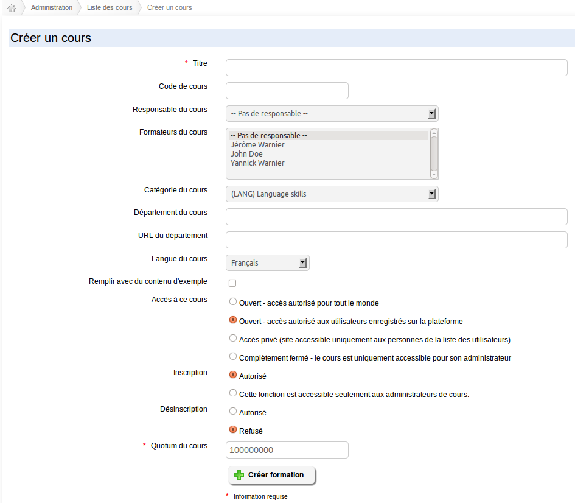

## Create a course {#create-a-course}

As an administrator, only the title is mandatory during the course creation.

Illustration 58: Course creation

Apart from this mandatory field, the following options are exclusively available to the admin:

*   assign a teacher in charge of the course

*   add one (or more) teacher(s) to the course,

*   give a _department_ and a _department URL_,

*   manage its visibility,

*   manage the registration and un-registration settings