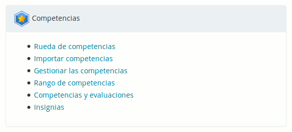
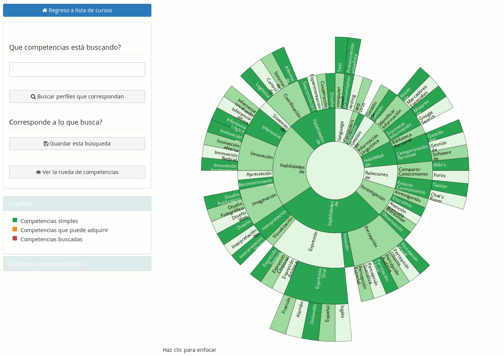

### Competencias y certificados {#competencias-y-certificados}

Chamilo 1.9 introducía un nuevo concepto en términos de gestión de competencias y extendía el concepto de certificado de aprendizaje introducido en las primeras versiones de Chamilo.

A partir de la versión 1.10, se puede hacer un uso avanzado de las funcionalidades de gestión de competencias y de certificados.

Para activar las funcionalidades correspondientes, es necesario activar las opciones de “Gestión de competencias” y de “Publicación de certificados”, las cuales se pueden encontrar fácilmente buscando “competencia” y “certificado” en la barra de búsqueda de los parámetros de configuración.

Estas funcionalidades están vinculadas profundamente con la herramienta de evaluaciones en los cursos, por lo que será necesario tener habilitados unos cursos con la posibilidad de lograr un certificado. Referirse al manual docente para esta parte.

Una vez activada la herramienta de competencias, aparecerá un bloque más en la página de administración del portal.

Al inicio, será necesario importar o generar competencias. La “Rueda de competencias” quedará vacía hasta que algunas competencias hayan sido creadas.

Para evitar tomarnos mucho tiempo elaborando una lista de competencias, podemos usar el archivo propuesto como ejemplo en la página “Importar competencias”. Bastará con darle clic al fichero CSV de ejemplo, descargarlo en nuestra máquina y seleccionarlo en el botón de selección de archivos.

Una vez este paso completado, podemos regresar a la página de administración y visualizar la rueda de competencias, que se verá algo similar a lo siguiente (en este caso hemos creado una lista de competencias en español, la lista por defecto siendo disponible únicamente en inglés).

La visualización en rueda es similar a una visualización en árbol jerárquico, doblado sobre el mismo, o como un abanico totalmente doblado sobre el mismo.

Esta rueda representa las competencias, ordenadas de manera jerárquica. Usualmente, los dos o tres primeros niveles servirán para la categorización de las competencias, y no serán competencias en sí, pero esto queda libre para el equipo de gestión de competencias decidir. Solo se muestran a primera vista los 4 primeros niveles de competencias, pero la rueda soporta cualquier cantidad de niveles.

Al dar clic en cualquier competencia de la rueda, la página se refresca para centrar la rueda sobre la competencia seleccionada y mostrar solamente sus competencias “hijas”.

Como se ve en la primera captura, existe un código de color (y su leyenda) para las competencias de la rueda. Para que un alumno pueda lograr una competencia, es necesario asociarla con una evaluación dentro de un curso.

Para hacerlo, existen dos métodos:

- la más precisa: ir al curso en cuestión y editar la evaluación para asociarla con la competencia
- la más rápida: dar clic derecho en la competencia, dar clic en “Editar” y seleccionar la evaluación asociada

Usaremos el segundo método en este caso.

En el formulario, al seleccionar alguna evaluación, se hará la asociación. Ahora, al lograr terminar el curso (o los objetivos del curso tales como ordenados en la evaluación), el alumno habrá logrado la competencia correspondiente también.

Ojo que el alumno **deberá obligatoriamente** pasar por la herramienta de evaluaciones para que se haga efectivo su logro de la competencia (tal como es el caso para los certificados).

Luego de asociar la competencia a un curso, si regresamos a la rueda de competencias, la visualizaremos con una de las competencias marcadas en naranja, simbolizando que, en este portal Chamilo, se puede lograr esta competencia a través de un curso.

Una vez los alumnos hayan empezado a lograr competencias, estas se mostrarán en el perfil de red social de cada uno. También será posible para el administrador (y el administrador de recursos humanos) hacer búsquedas sobre las competencias, como se presenta a continuación, usando el menú de la izquierda (y confirmando la selección de cada competencia en la lista antes de buscar).

En este caso (tomado desde otro portal), hemos buscado un perfil con dos competencias, una de las cuales está adquirida por el usuario Pedro Perez.

El sistema nos indica que le “falta una competencia para corresponder” a nuestra búsqueda. Me indica, no obstante, que este alumno tiene ya dos competencias, pero la segunda no corresponde a mi búsqueda.

Si esta búsqueda corresponde a un perfil que busca con frecuencia, puede guardarla con un nombre propio, y regresar luego para ver si más personas tienen el perfil buscado.