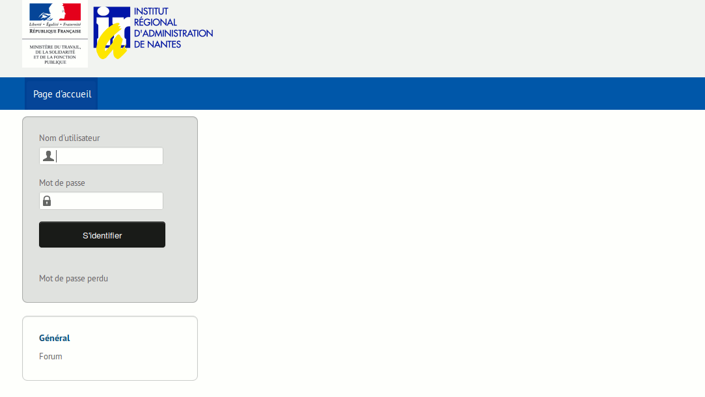
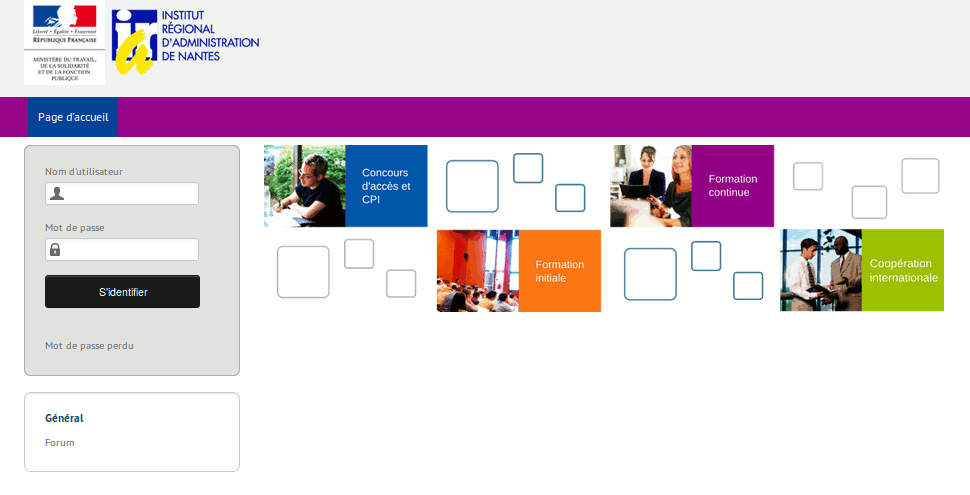

### Multi-URL {#multi-url}

Chamilo incorpora una discreta pero práctica funcionalidad pensada para el caso de que su plataforma Chamilo vaya a ser usada por varias categorías de usuarios. En este caso, puede ser necesario considerar un segundo portal con otro nombre de dominio, diferente aspecto y diferentes cursos y usuarios. En suma, se trata de varios espacios espacios independientes que comparten muchos de sus contenidos y todo su código.

#### Caso de uso – Facultades de la Universidad {#caso-de-uso-facultades-de-la-universidad}

Imagine que 12 facultades de su universidad quieren mostrar su propio portal con una apariencia distinta (logotipo de cabecera y color de fondo diferentes, ...). Cada facultad tendrá sus propios docentes, que ocasionalmente también podrán impartir sus clases en otras facultades. Con los alumnos ocurre algo parecido, pues aunque lo normal es que estén vinculados a una sola facultad, en algún caso podrán estarlo a más de una. Por último, el contenido de los cursos impartidos en las distintas facultades suele ser diferente, aunque puede haber casos específicos en los que haya cursos comunes.

#### Caso de uso – Marca corporativa {#caso-de-uso-marca-corporativa}

Imagine que su empresa ofrece cursos de salud y seguridad para varios clientes. Suponga que uno de sus clientes es Coca-Cola® y el otro es Pepsi®. Tal vez estos clientes no deseen que se muestre que están usando el mismo curso o utilizando el mismo portal para sus capacitaciones. O simplemente, para ahorrarse trabajo le gustaría volver a utilizar el mismo curso, pero sin que contenga las contribuciones de los alumnos de la otra empresa...

#### La solución {#la-soluci-n}

Para resolver estos casos le ofrecemos una solución _multi-URL_. Al permitir multi-URL, se activará el siguiente mecanismo:

- se utilizará el mismo código fuente (por lo tanto el mantenimiento es el mismo)
- se utilizará la misma base de datos (por lo tanto se evita la duplicación de los datos)
- un portal “maestro” (no usado directamente por sus clientes), permitirá definir portales “esclavos”.
- cada curso se creará dentro del portal “esclavo” y sólo será visible dentro de ese portal
- cada usuario se creará dentro de un portal “esclavo”. Sólo será visible dentro de ese portal y sólo tendrá acceso a ese portal
- cada portal esclavo usará un nombre de dominio diferente (o un subdominio diferente)
- cada portal podrá utilizar su propio estilo gráfico
- uno (o más) administradores podrán ser asignados a cada portal esclavo. Este/os administradores no tendrán acceso a la configuración global, ni a los usuarios, ni a los cursos de otros portales
- una sesión podrá utilizar un curso global, pero cada sesión no existirá en más de un portal

Utilizando la misma base de datos se beneficiará de estas &quot;características extra&quot;:

- un curso puede ser “global” y ser usado a través de sesiones en todos los portales esclavos
- un usuario (alumno, docente o administrador) puede tener acceso a otros portales si así lo configura el administrador global.

#### Instalación {#instalaci-n}

Para configurar el modo multi-URL, tendrá que:

- acceder a la configuración de su servidor web
- acceder a la definición de sus nombres de dominio
- acceder al archivo de configuración de Chamilo

El proceso de instalación es el siguiente:

- _editar el archivo main/inc/conf/configuration.php_ _quitando el marcador de comentario antes de la línea:_ _$ _configuration [&#039;multiple_access_urls&#039;] = true;_
- añadir la línea “1,1” en la tabla de _access_url_rel_user_
- añadir directivas SiteAlias dentro de su VirtualHost de Apache
- definir nombres de dominio o sub-dominio (DNS) para que apunten a su servidor
- ir a la página de administración de Chamilo y seguir el enlace múlti-URL del portal
- redefinir su URL principal (reemplace localhost) y añadir el deseado, luego agregar y habilitar un administrador para cada uno de ellos

*Ilustración 75: Administración - Multi-URLs*

El resultado de una instalación multi-URL puede quedar muy bonito si cuenta con los servicios de un diseñador profesional. Aquí presentamos un ejemplo con 3 facultades de un mismo instituto…

### 