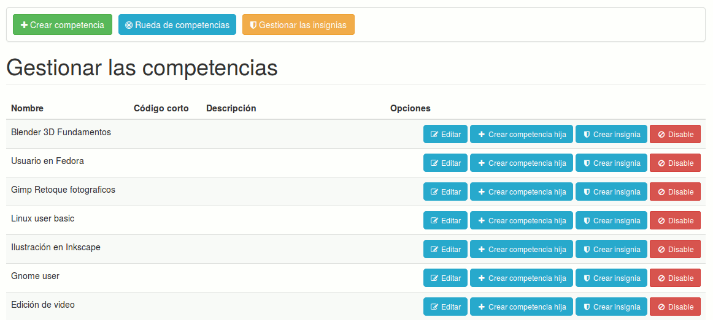
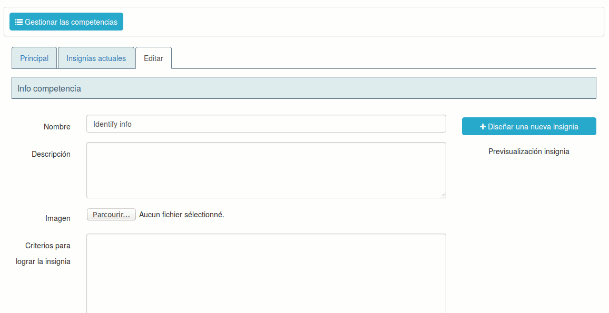

### OpenBadges {#openbadges}

OpenBadges es un estándar abierto de representación e intercambio de competencias, representadas por insignias para facilitar su entendimiento. OpenBadges funciona con un servidor de “recolección de datos” configurable en configuration.php. Por defecto, se trata del Backpack de Mozilla.

Para crear una insignia OpenBadges, necesito tener una competencia. Para ello, puedo visitar la entrada “Gestionar las competencias” en la página principal de administración, o bien puedo usar la entrada “Insignias”.

Para la competencia que quiero ilustrar, doy clic en el botón “Crear insignia”.

Esto me redirige hacia una página de edición de la insignia y la competencia, que contiene dos campos más que la competencia misma:

- _Imagen_, en el cual se subirá la imagen representando la competencia
- Criterios para lograr la insignia es un dato requerido por el estándar OpenBadges: se trata de describir cuales fueron los retos culminados para obtener esta insignia, lo que permitirá a personas externas saber cuales fueron las competencias que el usuario tuvo que demostrar

También existe un botón “Diseñar una nueva insignia”, y es que pensamos que el usuario promedio no tendrá a su disposición un diseñador que pueda trabajar sobre una base inicial de insignias.

Al dar clic en el botón de diseño, se abre una nueva ventana emergente con el servicio de MyKnowledgeMap que permite diseñar su propia insignia, descargarla, y luego volver a subira.

Una vez estas operaciones ejecutadas, podremos visualizar este badge en miniatura en la lista de badges.

Finalmente, el alumno podrá visualizar este badge en su red social, seleccionar uno de ellos, ver su ficha de logro del badge y exportar su competencia a un “Backpack” especial de OpenBadges. Por defecto, se usa el BackPack de Mozilla en [https://backpack.openbadges.org/](https://backpack.openbadges.org/)

A partir de ahí, los alumnos pueden exportar sus competencias para mostrarlas, por ejemplo, a LinkedIn.

Queda mucho por decir sobre esta herramienta, los certificados y los OpenBadges, pero esta introducción debería permitirle iniciar su uso de la herramienta. Esperamos extender esta sección en las próximas versiones.

Podrá encontrar más información sobre la generación de evaluaciones y certificados en el manual del profesor.

[^11]: http://www.chamilo.org/en/providers