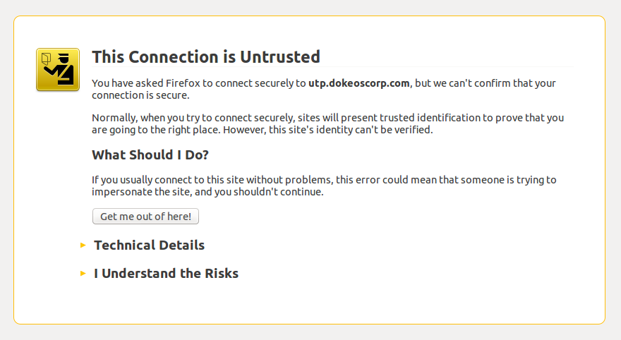
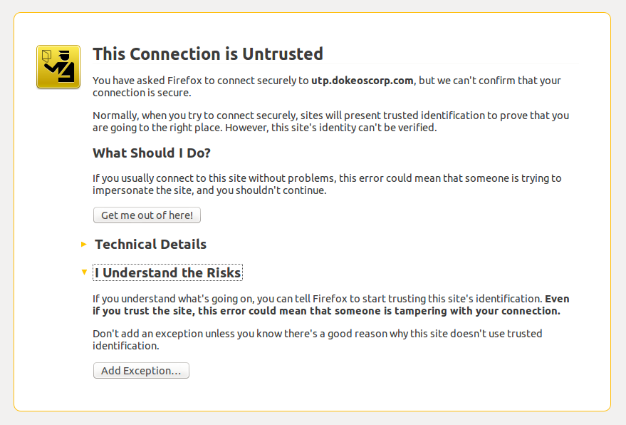
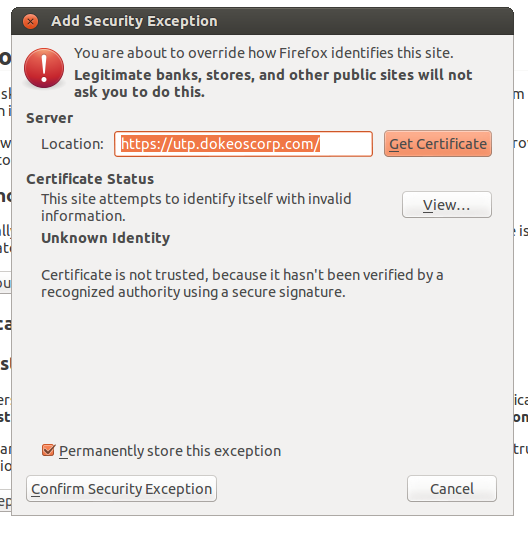

## Securing your site with SSL / HTTPS {#securing-your-site-with-ssl-https}

As Chamilo LMS has grown more popular in the last 12 months (roughly 400% increase in number of users), we have received several indications of password theft and that the security of Chamilo might be in question. Check out our Security in Chamilo LMS section (10.2) in the Appendix for more information about security in Chamilo.

The weakest link so far with our Chamilo portals has been the infrastructure, in that students can (relatively easily) steal accesses from a teacher connecting to the platform from the same computer room (due to some characteristics of network equipment). There are many ways to get to “spy” on the communication of another user with the server, and one of the most secure ways to avoid this kind of theft is to encrypt the whole communication between the user and the Chamilo server.

This can be done through SSL (or more commonly called HTTPS for the appearance of an “s” in the URL of those portals), a secure and standard way to encrypt any HTTP communication on the web.

Sadly, because of the inherent security of the system, an SSL certificate (required for the secure communication to happen) has to be “signed” (virtually) by a recognized authority, for a limited amount of time. This implies (in most cases until now) payment to said authority of a fee to sign the certificate. In other words, a certificate is not free and it is not permanent. For example, a simple (lowest-level of security) certificate, just for a single domain name, might cost between $25 and $100 a year.

You can “self-sign” your certificates, but this will show a scary screen to all users the first time they access the portal, and it will ask them to take a decision. The users will have to click a minimum of 3 times in very specific options in order to get to the site, as illustrated by the following screenshots.

Illustration 90: Browsers warn users of self-signed SSL certificates: Step 1/3: click on the “I Understand the Risks” link (example with Mozilla Firefox)

Illustration 91: Browsers warn users of self-signed SSL certificates: Step 2/3: click the &quot;Add Exception&quot; button

Illustration 92: Browsers warn users of self-signed SSL certificates: Step 3/3: click &quot;Confirm Security Exception&quot;

These rather scary three steps completed, your user will have access to your site with an encrypted connection, but the process will not work for everyone.

To avoid these messages, you will need to purchase an SSL certificate (we have had some reasonable success with _RapidSSL_ so far, but it is entirely up to you to choose the right SSL certificates provider for you).

If you&#039;d rather go for a self-signed certificate because your team will be a finite number of people using it and you know they&#039;re able to manage the 3 steps of certificate acceptance, then you can follow this article to set it up: [https://beeznest.wordpress.com/2008/04/25/how-to-configure-https-on-apache-2/](https://beeznest.wordpress.com/2008/04/25/how-to-configure-https-on-apache-2/)

There is no more secure and practical way of securing your connections than SSL, so don&#039;t try to implement your own security mechanism. If you have comments about SSL, you should contact directly with the community managing the standard.