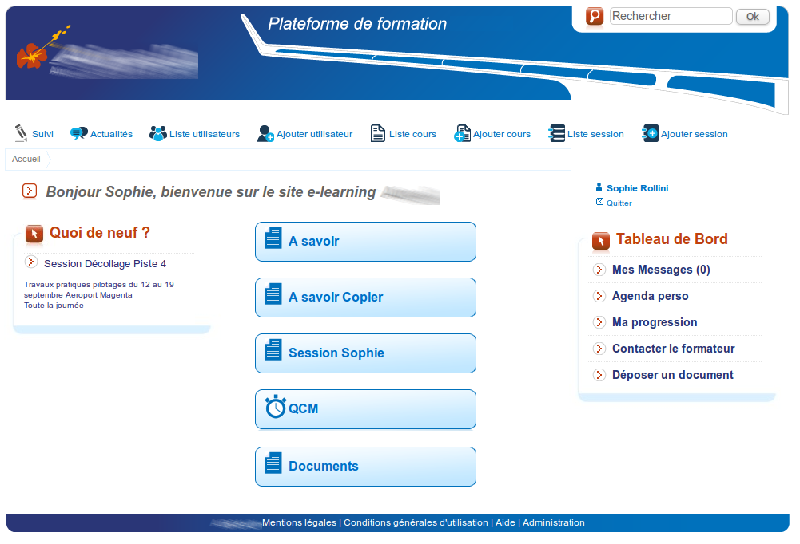

## Templates {#templates}

Since version 1.9, Chamilo uses the Twig templating system to generate parts of its visual appearance.

This means that you can now change Chamilo more easily. For example, the following screenshot is taken from a Chamilo 1.9 installation modified through templating. Although most visual changes can be done through CSS, there is a number of things that can just not be done this way, like showing new visual elements.

Illustration 89: Example portal using another template

As you can see, classical elements of Chamilo have been moved around, shown or hidden depending on the desired final appearance.

To update a theme, we recommend you start with a copy of the existing one:

cd /var/www/chamilo/main/templates/

cp -r default mytemplate

Then you can start looking into that theme. You'll find that most header and footer elements are located in the _layout_ directory. For example, the whole visible header on the page is declared in main/templates/default/layout/main_header.tpl.

Understanding the templates mechanism should be relatively easy if you have any experience with other templating systems.

Templates (ending in .tpl) will look something like this:

**Illegal HTML tag removed**:

All {{ something }} markers are prepared into other scripts or libraries. Most of the very common tags are defined in main/inc/lib/template.lib.php, with an “assign” call, like this:

$this-&gt;assign('show_footer', $status);

In order for you to be able to test your new template, you will have to change line 13 of main/inc/lib/template.lib.php to replace 'default' by the name of your new template's directory (using the example above, it would be _mytemplate_).

During the development of a new template (which we recommend you do on a separate portal, not your production portal), you should disable caching. You can do that in a series of ways, but the easiest is probably to just put your portal in “test server” mode. You can do that in the first page of the _Platform settings_ (option called _Server Type_).