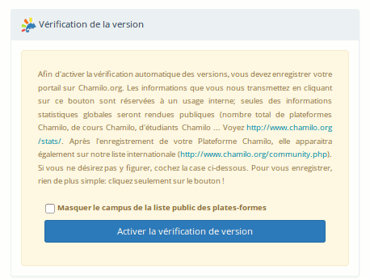

## Mise à jour de la plateforme Chamilo {#mise-jour-de-la-plateforme-chamilo}

Au cas où vous auriez déjà une installation de Chamilo et qu'une nouvelle version de Chamilo viendrait à être publiée, il est fortement recommandé de mettre à jour votre plateforme pour profiter de nouvelles fonctionnalités, mais surtout des corrections de failles de sécurité et d'anomalies détectées dans les versions antérieures.

Avant de mettre votre installation à jour, il faut **absolument** faire une **sauvegarde complète** du dossier de Chamilo et de la base de données.

En tant qu'administrateur, il est possible d'activer la notification de mise à jour de la version dans l'onglet « Administration », bloc « Chamilo.org » :

Illustration 11: Administration - Bloc Chamilo

Il suffit de cliquer sur le bouton « Activer la vérification de version » pour que l'option s'active :

Illustration 12: Administration - Bloc Chamilo \(suite\)

À chaque publication de nouvelle version, un message apparaîtra pour indiquer sa disponibilité. Notez que cette fonctionnalité transférera occasionnellement l'URL de votre portail, son nombre d'étudiants et son nombre de cours à l'Association, qui utilisera ces informations pour mieux promouvoir Chamilo.

### Télécharger la dernière version stable de Chamilo {#t-l-charger-la-derni-re-version-stable-de-chamilo}

Sur le site de [Chamilo](https://chamilo.org/fr), télécharger l'archive au format souhaité puis la décompresser dans le dossier souhaité.

### Remplacer la version précédente du dossier Chamilo par la nouvelle {#remplacer-la-version-pr-c-dente-du-dossier-chamilo-par-la-nouvelle}

Une seule méthode permet de garantir une mise à jour sans faille :

1. Ne pas effacer le dossier précédent, sinon tous les anciens fichiers de configuration seront perdus.

2. Copier simplement le nouveau dossier de Chamilo par-dessus l'ancien.

   * dans le cas de l’utilisation d’une distribution GNU/Linux, copier l'intégralité du nouveau dossier vers l'ancien, ex.:

| user@user: sudo cp -r chamilo-1.11.0/\* /var/www/chamilo/ |
| --- |

1. Ensuite, reproduire les actions réalisées lors de l'installation _cf «**2.2.2**Derniers réglages d'installation de Chamilo\_\_»_ en page 16.

2. Se connecter au site et vérifier que tout est en ordre.

