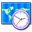

### Time zones {#time-zones}

This category defines general settings for time zones.

**Enable users time zones** will let the users define their own time zones, and thus get all times on the platform display in their own time zones. This will let them know more accurately when to submit a assignment, for example. Note that this setting has to go along with the activation of the _time zone_ field for modification by the user in the _user profile fields_ (see chapter 5.8Profiling on page 57).

**Time zone value** is used to define the time zone of the portal. This allows, in cases where the server is hosted and configured in a different time zone than the customer&#039;s, to set things right and have time values show appropriately.