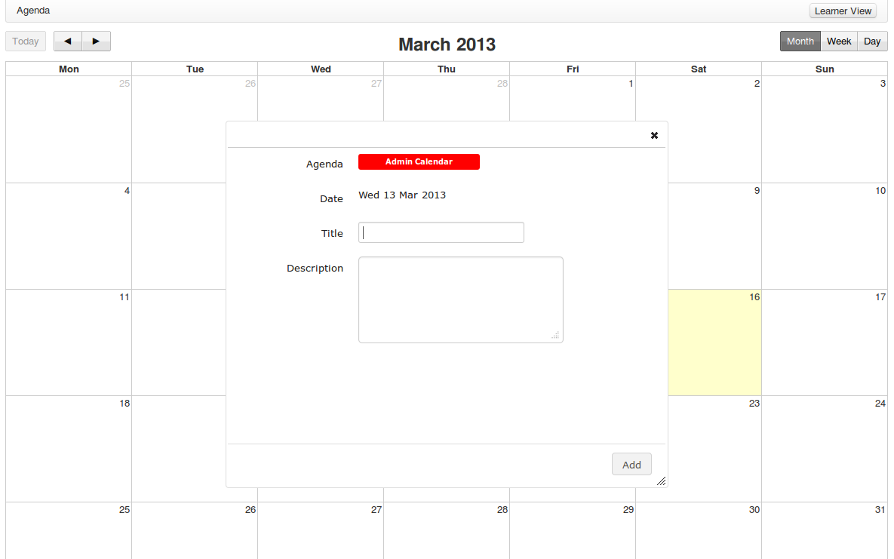

## Global agenda {#global-agenda}

The global agenda allows you to add events that will be visible from the agenda of any user of the platform.

Illustration 41: Administration – Global agenda

The feature is completely similar to the one you can find in the courses space, but the addition of an event there has a global reach, as all users will see it through their own calendar. Any event added this way is considered to be more important and will be shown in a different colour than other events.