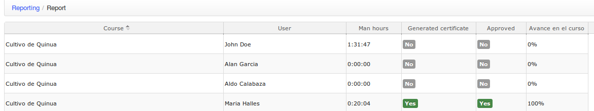

## Reports {#reports}

This section (available from Chamilo LMS 1.9.4) could be called “Executive reporting”, and gives you a special report about all users and all training hours they&#039;ve been taking inside the platform. This is particularly useful for organizations providing training to other organizations&#039; employees and having to account for that (in man*hours of training).

Assuming you&#039;ve only got one learning path and one “assessment” in each course, it will also give you the learning path progress, whether the student reached 100% progress, and whether he printed his certificate or not.

Illustration 45: Administration - Executive reporting