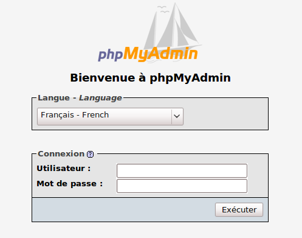
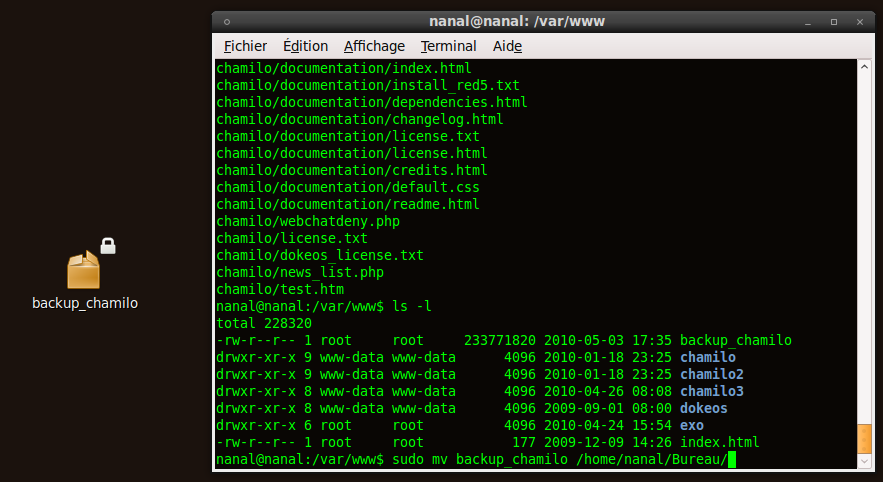

## Sauvegarde extérieure à Chamilo {#sauvegarde-ext-rieure-chamilo}

### PhpMyAdmin {#phpmyadmin}

Les bases de données peuvent être sauvegardées par l&#039;interface de [P](http://fr.wikipedia.org/wiki/PhpMyAdmin)[hpMyAdmin](http://fr.wikipedia.org/wiki/PhpMyAdmin)(ou _Adminer_[^14]_)_ en se connectant grâce à l&#039;identifiant et au mot de passe créés lors de l&#039;installation du serveur [LAMP](http://fr.wikipedia.org/wiki/LAMP) ou de bases de données, ou transmis par l&#039;hébergeur.

Illustration 13: Administration - PHPMyAdmin

Une fois dans l&#039;interface graphique de phpMyAdmin, aller à l&#039;onglet _Exporter_ et sélectionner la base de données à sauvegarder.

Il est possible de changer le format d&#039;enregistrement du fichier de sauvegarde de la base de données. Pour sauvegarder, le choix se fait en cliquant sur le format désiré en dessous des bases de données à exporter. Ici, on a choisi le format SQL.

Le nom du fichier sauvegardé peut aussi être changé en bas de la page dans « Transmettre ». Il peut être compressé en choisissant un format parmi ceux proposés. N&#039;oubliez pas de cocher la case « Transmettre », sinon le seul effet de cette opération sera d&#039;afficher la sauvegarde, ce qui ne vous aidera pas vraiment.

Il ne reste plus qu&#039;à enregistrer le fichier. Il sera sauvegardé par défaut dans votre répertoire « Téléchargements » ou sur votre bureau, en fonction de votre navigateur et de sa configuration.

L&#039;enregistrement des bases de données par _phpMyAdmin_ est terminé. Le fichier sauvegardé sera au format SQL (extension .sql) et pourra être importé ultérieurement, en cas de problème, via _phpMyAdmin_.

### Dossier racine {#dossier-racine}

Le dossier racine (dans ce contexte) est le dossier qui contient l&#039;installation de Chamilo. Pour l&#039;exemple de ce tutoriel, il a été installé en local (http://localhost/chamilo) et se trouve dans « /var/www/chamilo » (pour un serveur distant, il faudra utiliser FTP ou SSH/ sFTP).

Pour le sauvegarder, il faudra compresser le dossier par le biais du terminal en allant dans le répertoire « /var/www » :

user@user:cd /var/www

Ensuite, il faut compresser le dossier en utilisant la commande « tar » pour un tar.gz :

user@user:/var/www$ sudo tar cvf backup_chamilo chamilo/

Maintenant, déplacez cette sauvegarde à l&#039;endroit voulu. Pour cela, utilisez la commande « mv » :

user@user:/var/www$ sudo mv backup_chamilo /home/user/Bureau/

Il peut être pratique de lui donner une date visible dans le nom exemple : « 2010-05-07-backup-chamilo ». De cette manière, si vous accumulez plusieurs sauvegardes de la sorte, il vous sera facile de les trier visuellement par date.

Illustration 14: Terminal - Déplacement des fichiers

Cette sauvegarde contient toutes les informations de connexion à la base de données de Chamilo et toutes ses configurations. Elle est utile en cas d&#039;effacement des données ou d&#039;attaque du serveur. C&#039;est la seule façon fiable de reconstruire votre portail Chamilo tel qu&#039;il était avant que ne survienne un problème quelconque.

Généralement, cette sauvegarde est effectuée automatiquement par un système de planification de tâches (processus _cron_ sous GNU/Linux) sur le serveur, mais il peut être utile de la réaliser soi-même manuellement au cas où le serveur ne sauvegarderait pas correctement.

Si vous ne disposez pas d&#039;un accès par terminal, il est possible que vous deviez exécuter la sauvegarde directement via _FTP_. Cette opération (sans compression) est **nettement** plus longueet sensible à des problèmes éventuels de connectivité durant le transfert (générant des pertes de fichiers).

[^14]: http://adminer.org