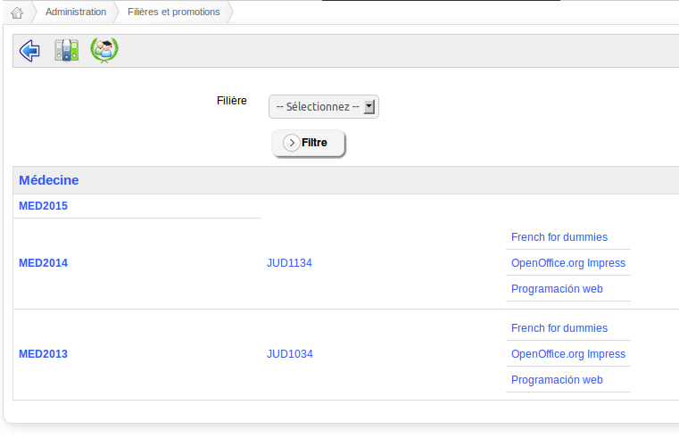

## Careers and promotions {#careers-and-promotions}

Careers and promotions are two new concepts in Chamilo 1.8.8\. They allow you to manage careers (like “Medicine” or “Software engineering”) and promotions (like “Medicine, graduation of 2017”) almost the same way you would manage them in a normal academical institution once you combine them with sessions and periods (i.e. categories of sessions).

The interface of the tool is still a bit rough on the edges, and it will take you some time at first to find your way, but it is stable and you should be able to use it easily after a few minutes of practice.

Let&#039;s see how it&#039;s done...

Illustration 70: List of careers and promotions

The first page gives us a list of careers (grey-background line), of promotions that each career contains (first column), of sessions registered to these promotions (second column) and of courses included into these sessions (last column).

