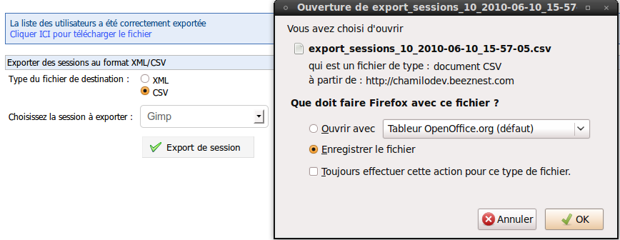

## Export sessions list {#export-sessions-list}

Chamilo allows you to export a list of some or all of the sessions defined on the platform.

Illustration 68: Administration – Exporting sessions

Choose the export format, choose a filter for the sessions, click _Export session(s)_ and download the file.