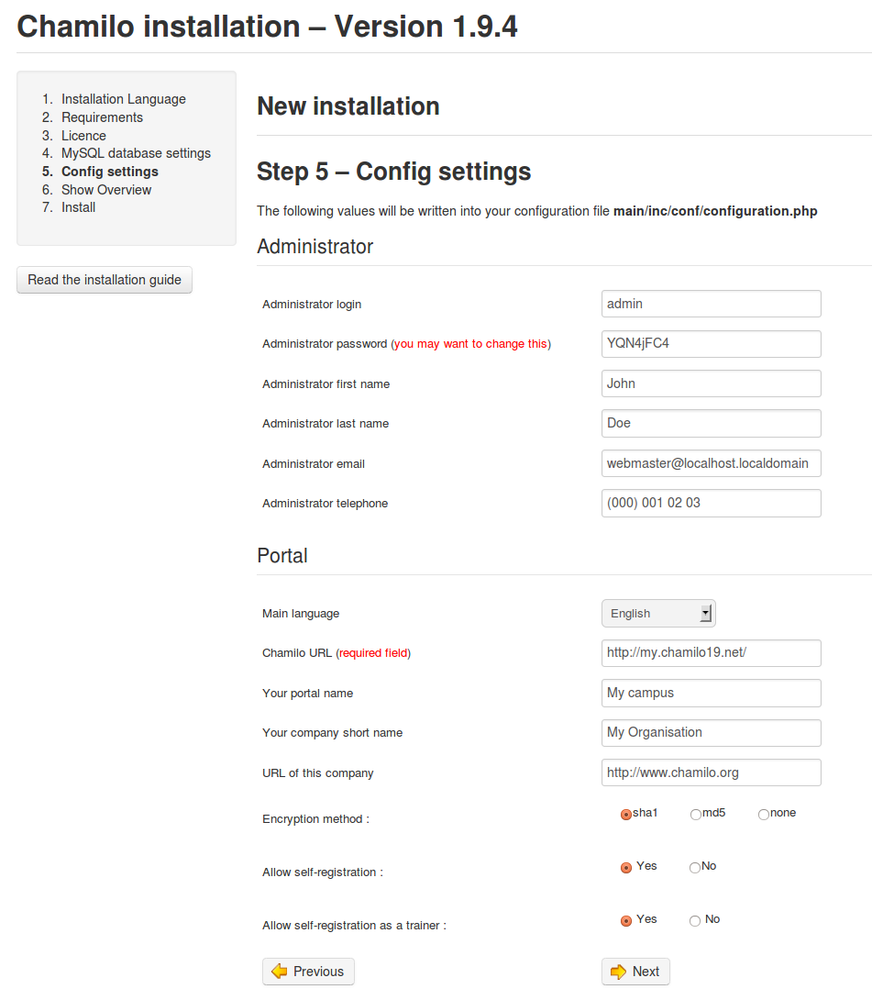
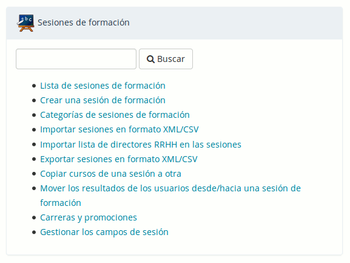
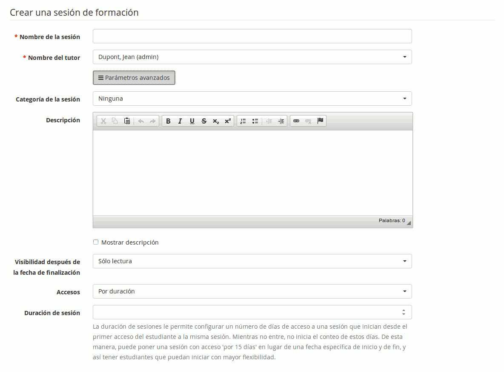
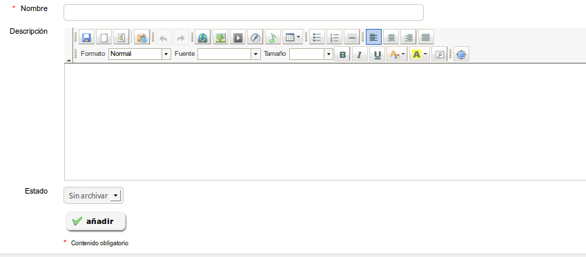
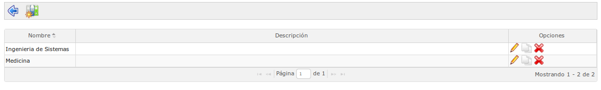
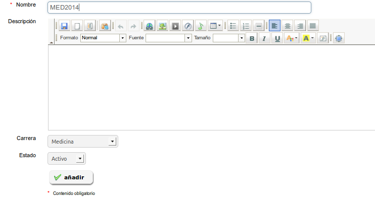
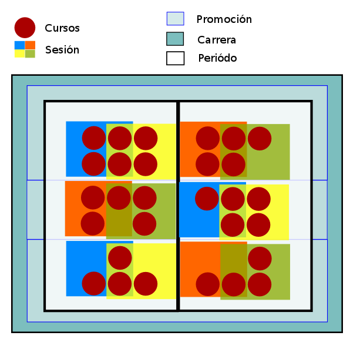

## Administración de sesiones {#administraci-n-de-sesiones}

Una sesión es un mecanismo que se aplica a uno o más cursos para permitir que varios grupos de alumnos puedan seguir este conjunto de cursos durante un mismo periodo en espacios virtuales distintos.

En una sesión se pueden agrupar cursos de diferentes categorías.

El el esquema que hemos utilizado para explicar los roles de los usuarios nos servirá para explicar las _sesiones_.

*Ilustración 61: Global - Esquema de las sesiones*

Como puede ver, la sesión se define por un _administrador de sesiones_ y un _tutor de la sesión_ o tutor general que actúa como coordinador.

Varios cursos están registrados en la sesión, siendo impartidos cada uno por uno o más _tutores de curso_ (en el esquema: tutor de sesión-curso).

Opcionalmente, se pueden establecer límites de tiempo para los tutores y alumnos de la sesión.

### Casos de uso {#casos-de-uso}

Hay varios casos donde las sesiones pueden ser un verdadero ahorro de tiempo... todos flotan sobre una gran ventaja: el reciclaje de contenidos.

#### El año académico {#el-a-o-acad-mico}

Imaginemos que usted trabaja en una universidad. Cada año los docentes desarrollan cursos nuevos, pero también hay un gran número de cursos que no cambian demasiado de un año a otro. Estos cursos del año anterior pueden ser reciclados y utilizados con un nuevo grupo de alumnos del año actual.

Esto se puede realizar de varias formas:

1.  **Sin el uso de sesiones**. Aquí también tiene dos caminos alternativos:

El primero es copiar el curso. Lo cual significa que:

*   duplicará una y otra vez los 50 MB de espacio que se reserva a cada curso
*   tal vez deberá asignarlo a otro docente
*   tendrá que pensar en un código nuevo para el curso que se adapte al hecho de que no es enteramente el mismo curso en cada uno de los casos
*   tal vez los alumnos del año anterior seguirán perteneciendo al curso porque su inscripción no ha "caducado"

El segundo es limpiar el curso. Para ello deberá:

*   eliminar todos los alumnos del curso
*   eliminar todos los foros que no mantengan su utilidad
*   eliminar todas las páginas wiki que hayan dejado de ser útiles

1.  **Con el uso de sesiones**. Para ello deberá:

*   definir una sesión que, por ejemplo, se extienda por todo el semestre de enero 2011 a julio 2011
*   asignar los cursos a la sesión
*   asignar los docentes responsables de esos cursos (tutores)
*   asignar los alumnos a la sesión

El uso de sesiones conlleva las siguientes ventajas:

*   los docentes tutores pueden agregar contenidos a los cursos de la sesión pero no pueden eliminar los contenidos base que ya están disponibles. Además, los contenidos que agreguen sólo serán visibles por sus alumnos.
*   los alumnos sólo deben inscribirse una vez
*   los alumnos tendrán acceso a estos cursos después de que, por ejemplo, el semestre haya terminado. Pero para ello, tendrán que hacerlo a través de su “historial de sesiones” que aparecerá en otra página de acceso diferente a la que han tenido durante la sesión.
*   cuando revise los resultados o los foros, usted nunca tendrá distintos grupos de alumnos de varios años mezclados en el interior de su curso

#### Tutoría personal {#tutor-a-personal}

Supongamos que usted trabaja en una universidad en la que la mayoría de los alumnos tienen derecho a la tutoría personal. Pueden seguir a su ritmo los audios del curso pregrabados y tener un tutor asignado que estará a su disposición en cualquier momento acordado previamente.

Sin sesiones, se produciría un intercambio entre varios tutores y alumnos, compartiendo cada tutor el espacio con los demás y pudiendo visualizar los resultados todos los alumnos aunque no estén a su cargo. En el peor de los casos podría llegar a modificar por error los resultados de los alumnos que no están a su cargo.

Con las sesiones, basta con definir un nuevo periodo de sesión por alumno en el que estarán definidos los cursos a los que tiene acceso y su propio tutor durante este periodo. Alumno y tutor trabajarán en un espacio virtual independiente.

#### Cursos de inducción corporativa {#cursos-de-inducci-n-corporativa}

Imagine que trabaja como gerente de recursos humanos de una empresa en la que acaban de incorporarse cinco nuevos empleados, los cuales deben seguir una “formación de inducción” que consta de 7 cursos, 4 horas de vídeo, seguidos de un examen. Una parte de los nuevos empleados trabajarán en la fábrica de harina, donde las regulaciones de seguridad no son similares a las de las oficinas; lo cual significa que algunos de los cursos serán idénticos a todos los empleados, mientras que tres de los alumnos tendrán un curso sobre “seguridad en la fábrica” y dos otro curso sobre “seguridad en la oficina”. Además supondremos que la formación también tiene que repetirse mensualmente.

Con las sesiones, como ya dispone de los cursos base diseñados, sólo tendrá que asignarles los nuevos empleados cada mes. Igualmente podrá realizar el seguimiento del progreso de todos los empleados constantemente. Para ello, habremos creado una sesión denominada “fábrica 2011-7” y otra denominada “oficina 2011-7”. Incluso puede utilizar la funcionalidad de promociones, descrita en las páginas siguientes, para copiar esta sesión cada mes.

Esto reduce la gestión, mejora la legibilidad de los resultados y permite a sus empleados acceder a los cursos de inducción siempre que lo deseen con tan sólo un clic de ratón. Más tarde, ellos podrán realizar otros cursos en otras sesiones sin que los primeros que realizaron se mantengan aún activos.

### Gestión de las sesiones {#gesti-n-de-las-sesiones}

La gestión de las sesiones se hace con iconos en su mayoría bastante conocidos ...

| Iconos | Funcionalidades |
| --- | --- |
|  | Actualiza las opciones/detalles de la sesión |
|  | Elimina una sesión |
|  | Suscribe usuarios a la sesión |
|  | Agrega cursos a la sesión |
|  | Agrega una sesión a una categoría |

Tableau : Administración – Iconos de gestión de sesiones

El bloque de sesiones aparece como sigue en la página principal de administración.

### Crear una sesión de formación {#crear-una-sesi-n-de-formaci-n}

Para agregar una sesión:

*   ir a _administración_
*   _sesiones de formación_ → "Crear una sesión de formación"
*   dar nombre a la sesión
*   asignar un tutor que tendrá permisos para entrar y seguir todos los cursos y alumnos en esta sesión
*   opcionalmente, dar una categoría de sesiones
*   en su caso, definir un tiempo límite de caducidad
*   definir la visibilidad de una sesión, una vez expirada:
*   _sólo lectura,_ posibilita que se siga accediendo a los recursos pero no realizar exámenes, ni participar en los foros, etc.
*   _accesible,_ implica que la sesión se mantendrá plenamente accesible a través del enlace al historial de sesiones de la lista de cursos
*   no accesible
*   dar clic en siguiente elemento

*Ilustración 62: Administración - Creación de sesiones*

A partir de la versión 1.10, es posible definir sesiones por duración o por fechas.

En el caso de definirlas por duración, la duración se cuenta en número de días y corre desde el primer acceso del alumno a cualquiera de los cursos de la sesión.

En el caso de definirlas por fechas, existen 3 grupos de fechas que definir (solo el primero es necesario):

1.  Fechas de inicio y fin de acceso para los estudiantes
2.  Fechas de inicio y fin que se mostrarán en las listas, “oficialmente”, asociadas con la sesión
3.  Fechas de inicio y fin de acceso para los tutores

El segundo paso requiere que se agregue cursos a la sesión. Seleccione uno (o más) curso(s) y haga clic en la flecha azul para añadir o eliminar cursos en la sesión, luego haga clic en el botón _Siguiente elemento_ para continuar.

**Registro individual** permite no perderse dentro de los cursos que existen en la plataforma. Usted debe escribir el comienzo del título del curso dentro del campo de búsqueda y los cursos que comiencen por ese texto aparecerán en el listado.

*Ilustración 63: Administración – Agregando cursos a una sesión*

El último paso le permite suscribir a los alumnos a la sesión. Otros tutores se pueden asignar más tarde, ahora sólo estamos inscribiendo alumnos.

Elegir a los usuarios y añadirlos con la flecha azul, de forma similar a la que lo hemos hecho con los cursos.

**Registro individual** permite la búsqueda de un usuario a partir de sus apellidos

**Matrícula por clases**permite agregar a los alumnos a la sesión de clases. Las clases se tratarán más adelante en este capítulo.

*Ilustración 64: Administración - Suscripción de los estudiantes a las sesiones*

Debido al funcionamiento especial de las herramientas de un curso cuando éste se utiliza a través de sesiones, hemos escrito un informe técnico sobre cómo deberían comportarse en el contexto de una sesión en nuestro wiki técnico:

[http://support.chamilo.org/projects/chamilo-18/wiki/Tools_and_sessions](http://support.chamilo.org/projects/chamilo-18/wiki/Tools_and_sessions)

### Categorías de sesiones (Periodos) {#categor-as-de-sesiones-periodos}

Las categorías de sesiones permiten organizar las sesiones en función de cualquier variable. En nuestra experiencia, la mayoría de sesiones se forman como grupos por periodos de tiempo (por ejemplo, _el primer semestre de 2011_). Lógicamente, el tipo de periodos de tiempo depende de la organización: trimestral, semestral, mensual, anual.

La gestión de categorías de sesiones es muy similar a la gestión de categorías de cursos, así que no entraremos en más detalles. Si bien, hay que hacer presente que la fecha de las categorías de las sesiones son puramente informativas y no tienen ningún significado en términos de comportamiento de la plataforma.

### Importar sesiones en formato XML/CSV {#importar-sesiones-en-formato-xml-csv}

Chamilo permite exportar una lista de todas o de algunas de las sesiones que se hayan definido en la plataforma.

*Ilustración 65: Administración - Exportar sesiones*

Elija el formato de exportación, luego seleccione las sesiones que desea exportar, haga clic en _Exportar sesión_ y descargue el archivo.

### Importar lista de directores RRHH en las sesiones {#importar-lista-de-directores-rrhh-en-las-sesiones}

En caso se tenga que hacer un procedimiento masivo para la asignación de directores de recursos humanos a sesiones, esta opción permite hacerlo rápidamente

### Exportar sesiones en formato XML/CSV {#exportar-sesiones-en-formato-xml-csv}

Similar a la función de importación, pero al revés.

### Copiar cursos de una sesión a otra {#copiar-cursos-de-una-sesi-n-a-otra}

Teniendo en cuenta la posibilidad de definir el contenido de una sesión a través de un curso y dado que este contenido sólo será visible en esa sesión, a veces tendrá que copiar contenidos específicos de un curso de una sesión a otra.

Para realizar la copia es necesario tener una sesión de origen y otra de destino en la que queramos que también esté el mismo curso y todos sus contenidos.

*Ilustración 66: Copiar un curso de una sesión a otra*

Una vez que se cumplen estas condiciones, sólo tendrá que seleccionar primero la sesión y curso de origen y luego la sesión y curso de destino, tras lo cual deberá decidir si desea que se copien todos los contenidos del curso o sólo una parte de ellos.

**Nota**: esta herramienta todavía está en versión beta. Le recomendamos que la use con cautela.

### Mover los resultados de los usuarios desde/hacia una sesión {#mover-los-resultados-de-los-usuarios-desde-hacia-una-sesi-n}

En el caso de que usted quiere cambiar de un modelo de cursos a un modelo de sesiones de formación, es posible que excepcionalmente desee mover los datos seguimiento de un conjunto de alumnos de un curso a una sesión. Esta herramienta todavía está en versión beta.

El interfaz es complejo pero bastante auto-explicativo. Le recomendamos que actúe con cautela al utilizarla y que realice copias de seguridad. Si tiene dudas puede contactar con un proveedor oficial de Chamilo.

### Carreras y promociones {#carreras-y-promociones}

Las carreras y promociones son dos conceptos que aparecen en Chamilo 1.8.8\. Permiten administrar las carreras (como “Medicina” o “Ingeniería de software”) y promociones (como “Medicina, la graduación de 2017”), casi de la misma manera que su gestión en una institución académica normal, una vez que se combinan con sesiones y periodos (categorías de sesiones).

La noción de “Carreras”, en particular en español, no tiene que ser confundida con la noción de carrera profesional, de tal manera que se pueda generar un “plan de carrera”. No, aquí solo tratamos carreras académicas.

La interfaz de la herramienta es elemental y puede que al principio le lleve algún tiempo hacerse con ella, pero es estable y acabará usándola con facilidad tras unos minutos de práctica.

Veamos como se hace...

*Ilustración 67: Lista de carreras y promociones*

La primera página nos da una lista de las carreras (tablas con cabecera en fondo gris), y las promociones que cada carrera contiene (primera columna), las sesiones correspondientes a estas promociones (segunda columna) y los cursos incluidos en estas sesiones (última columna).

#### Carreras {#carreras}

Para añadir una nueva carrera, haga clic en el icono tricolor de los archivadores. Aparecerá la página siguiente.

*Ilustración 68: Creación de carreras*

Sólo el nombre de la carrera es obligatorio. Añadir una nueva carrera (por ejemplo, Medicina) y guardar. La carrera que acaba de crear aparecerá en la lista de carreras.

Ilustración 69: Lista de carreras

Cada fila de la lista corresponde a una carrera. A la derecha de la fila un icono de doble página en blanco le permitirá copiar una carrera completa para crear otra nueva. La copia de una carrera también copia toda la estructura subyacente de promociones, sesiones y cursos, lo cual convierte a esta herramienta en una poderosa ayuda para la administración.

Para entender mejor la estructura de las carreras y las promociones las representaremos en un esquema:

*Ilustración 70: Cursos, sesiones, promociones y carreras*

Las entidades aquí en juego están organizadas por periodos (categorías de sesiones) y sumándose en el mismo nivel las promociones (conjunto de sesiones de un grupo). Si saca los periodos fuera del esquema, éste será más fácil de entender.

#### Promociones {#promociones}

Las promociones representan los grupos que potencialmente se graduará de una cierta carrera en un determinado momento. La mejor manera de representar una promoción, si estamos en el 2015 y hablamos de un grupo que inicia una carrera de 5 años, será de hablar de la “Promoción 2020”, por ejemplo.

En las promociones forman parte de las carreras y a diferencia de en las carreras pueden incluir sesiones de forma directa

*Ilustración 71: Creación de promociones*

La creación de promociones debe ser seguida por la asignación de sesiones a esas promociones, usando el icono sesiones para cada promoción del listado. Entonces se obtiene una lista similar a la siguiente.

*Ilustración 72: Lista de carreras y promociones*

En esta página, vemos las carreras de _Medicina_ y de _Ingeniería de Sistemas_, con sus respectivas promociones, las cuales contienen una sesión (salvo la del _10mo ciclo)_ y la lista de cursos de cada sesión. Cada elemento es un enlace al recurso correspondiente.

#### Copia de carreras y promociones {#copia-de-carreras-y-promociones}

Copiar carreras o promociones se realiza usando las listas de carreras y promociones, mediante el uso de un icono que representa dos papeles superpuestos.

**Nota:** Por ahora, la copia de cursos es una **copia dura**, lo que significa que perderá espacio en disco cuando copie una carrera entera. Más adelante Chamilo habilitará un modo de **copia suave** de los cursos a través de las sesiones.

#### Caso de uso {#caso-de-uso}

Imaginemos que su institución ofrece dos carreras: medicina y veterinaria. Ambas con 5 años de duración. Usted se encuentra en el mes de agosto de 2011 preparando la organización de la estructura de las clases que comenzarán el próximo mes.

Si estamos en el 2016, crearemos una promoción 2021 para medicina (PROMMED2021) y otra promoción 2021 para veterinaria (PROMVET20121).

Volvamos al esquema anterior como referencia:

*Ilustración 73: Cursos, sesiones, promociones y carreras*

Las dos promociones será el resultado de 5 años de estudio, que serán acordes con el periodo mínimo de cursos de un año. De este modo tendrá 5 **periodos** de un año cada uno que en conjunto forman la promoción 2021.

Los periodos son fijos, por lo que pueden ser compartidos entre las dos carreras. En su plataforma, se trata de categorías de sesiones, que se le llamarán, respectivamente, _2016-2017_, _2017-2018_, _2018-2019_, _2019-2020_ y _2020-2021_. Por supuesto, usted puede darles otros nombres según su necesidades.

Dentro de cada periodo, los docentes impartirán sus clases. Algunos cursos son comunes a la carrera de medicina y a la carrera de veterinaria, por ejemplo: el curso de Biología general (BIOGEN); pero los docentes tutores de estos cursos podrán ser diferentes y realizarán su labor en dos aulas separadas de alumnos, una por carrera.

El curso se imparte desde hace varios años casi sin modificación y sin guardar los resultados de cada año en el historial del curso. El interés principal está en tener una visión clara de los alumnos inscritos este año.

Esta necesidad nos lleva al uso de una sesión. Esta sesión se extiende durante un año académico a los alumnos de la promoción 2021 de veterinaria (PROVET2021), durante el periodo 2016-2017. Durante la misma los alumnos seguirán entre otros los cursos de _biología canina_, _ética médica_ y _leyes médicas_.

Los pasos para establecer toda la estructura serían los siguientes:
1.  crear una carrera (VET)
2.  crear una promoción (PROMVET2021)
3.  crear un periodo (2016-2)
4.  crear o seleccionar los cursos para esta promoción en el 2016 (BIOGEN, BIOCAN, ETHMED, DROMED)
5.  crear una sesión que contenga estos cursos (VET2016-2-AAA)
6.  asignar un tutor de sesión que se ocupe de la coordinación
7.  asignar un tutor de curso para que se ocupe de cada curso-aula. En nuestro caso, tendrán un especial papel de ayuda en las prácticas
8.  finalmente, suscribir a los alumnos en la sesión

De esta manera, sus alumnos tendrán acceso a los cursos actuales, y más tarde también a su historial de cursos según haya configurado usted la visibilidad de las sesiones.

Desde el punto de vista administrativo, tiene organizada la estructura académica general y será capaz de reproducir toda la promoción con un solo clic de ratón a comienzos del curso académico siguiente.

### Clases {#clases}

En la versión 1.10, las clases han sido unidas a los grupos y ubicadas en el bloque de usuarios.

Tenga en cuenta que, como dicta la lógica de sesiones, **una clase nunca debe estar suscrita a la vez a un curso y a una sesión que contenga ese curso**, de lo contrario podría terminar confundiendo a docentes y alumnos con accesos duplicados dentro y fuera de la sesión.

### Gestor de campos de sesiones {#gestor-de-campos-de-sesiones}

A partir de la versión 1.10, es posible registrar campos extra para todas las sesiones, como era el caso en versiones anteriores para los usuarios.

Sin embargo, estos campos se usarán principalmente en combinación con plugins existentes y no tienen un gran impacto sobre el comportamiento normal de la plataforma.