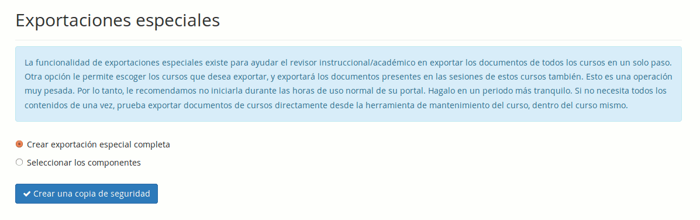

## Administración del sistema {#administraci-n-del-sistema}

### Exportaciones especiales {#exportaciones-especiales}

La funcionalidad de exportaciones especiales ha sido diseñada para ayudar al inspector académico. Le permite exportar todos los documentos de todos los cursos en una sola – y pesada - operación . Una segunda opción permite escoger los documentos de los cursos que quiera.

*Ilustración 74: Administración - Exportaciones especiales*

### Información del sistema {#informaci-n-del-sistema}

Esta página le dará información sobre el sistema detrás de Chamilo. Es particularmente útil en caso de investigación para encontrar un error, cuando un proveedor de alojamiento en la nube no le proporciona información sobre los módulos instalados.

### Rellenar datos {#rellenar-datos}

Esta opción aparecerá únicamente si su portal fue instalado en base a una versión de desarrollo de Chamilo. La opción permite insertar datos de prueba para realizar pruebas del sistema.

### Limpieza del directorio archive {#limpieza-del-directorio-archive}

A partir de la versión 1.9 de Chamilo, existe la posibilidad de limpiar una carpeta de datos temporales directamente desde la página de administración de Chamilo.

En la versión 1.10, esta opción se vuelve más importante para los diseñadores de portales, ya que permite asegurar que no permanecen datos en caché que podrían impedir la visualización de un nuevo diseño.

### Secuencialización de recursos {#secuencializaci-n-de-recursos}

La secuencialización de recursos es una nueva funcionalidad en 1.10\. Se puede considerar en beta, ya que no tuvo el periodo de aprobación suficiente hasta ahora para confirmar su adecuación a los múltiples usos que se le podría dar.

En esta versión, la herramienta permite únicamente la secuencialización de sesiones. A futuro, se considera la posibilidad de añadir la gestión de otros recursos en secuencia. De ahí el nombre de la herramienta.

Una vez distintas sesiones creadas, se pueden definir secuencias de sesiones, gracias a las cuales los estudiantes podrán identificar los requerimientos (en términos de otras sesiones) para acceder a una sesión deseada, y cuales son las sesiones a las cuales pueden acceder al completar una sesión existente.

La interfaz de configuración de secuencias de sesiones se encuentra en la página de administración, en el panel “Sistema”.

Dar clic en el enlace “Secuencialización de recursos”.

La página resultante ofrece distintas secciones útiles descritas a continuación.

Para entenderla, necesitamos revisar unos términos de vocabulario…

| Término | Descripción |
| --- | --- |
| Curso | El curso base que se sigue durante la sesión |
| Materia | Tema genérico de un conjunto de cursos (ej. Marketing, Ventas, SEO, ...) |
| Sesión | Entidad de uso del curso dentro de un periodo determinado de tiempo |
| Secuencia | Entidad que define la secuencia (a través de pre-requisitos) de sesiones que se sugiere que el estudiante siga para terminar una materia por completo |
| Referencia | La sesión de referencia para analizar la secuencia. Tomando una sesión como referencia, se pueden visualizar los requisitos directos y las sesiones a las cuales estos requisitos permiten acceder. |

En la página de configuración de las secuencias, el primer paso es la selección o la creación de una secuencia.

Sugerimos que las secuencias tengan títulos que corresponden a la materia común de todos los cursos en las sesiones de la secuencia.

En esta primera captura, hemos seleccionado la secuencia llamada “Mechanical”.

Al seleccionar la secuencia “Mechanical” y la sesión de referencia (lista a la izquierda en el segundo bloque), aparece la secuencia de manera visual en la sección “Vista previa de la secuencia”.

Para modificar la sesión de referencia, se puede volver a seleccionar una sesión en la lista desplegable de sesiones y dar clic en “Usar como referencia”, o simplemente dar clic en el número sobre fondo rojo de la sesión.

Aquí otro ejemplo de secuencia.

El efecto de la configuración de una sesión dentro de una secuencia es doble:

*   Modifica la información presentada en la ficha de descripción de la sesión (“Sesiones requeridas”) en caso haya activado el _Catálogo de sesiones_

*   Bloquea los estudiantes para que no puedan inscribirse a una sesión hasta completar los pasos previos en la secuencia (el botón “Inscribirme” solo aparece luego de completar todos los requerimientos)

