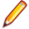

## Profiling {#profiling}

This tool allows you to add extensions to the profile of all users. Each field created through this tool gives you a series of options:

*   _Visibility_ allows you to decide whether the field must appear on the _extended profile_ page of the user (so that he can see – and maybe update - it himself)

*   _Modifiable_ lets you decide if the field can be updated by the user himself, or if the admin will assign a specific value for this field for all users

*   _Filter_ allows you to decide whether the field can be used as a filter and if it can be exported through exercises results exports

Usually, you can create fields of which the user has no knowledge but which are useful administratively to organise or synchronise the system with other systems (common unique identifier, for example). Other fields are submitted to the user, like his date of birth, country, mother tongue, etc., which will later allow you to generate better statistics depending on the age, culture, previous knowledges, etc.

For users familiar with Drupal, this is equivalent to a mini CCK module for Chamilo.

Illustration 56: Administration – User profile fields list

| Icons | Features |
| --- | --- |
|  | Update/Delete field |
|  | Make modifiable / non modifiable or enable/disable filter |
|  | Organise the fields |
|  | Show/hide a field to the user |

Tableau 2: Administration – Profile fields management icons