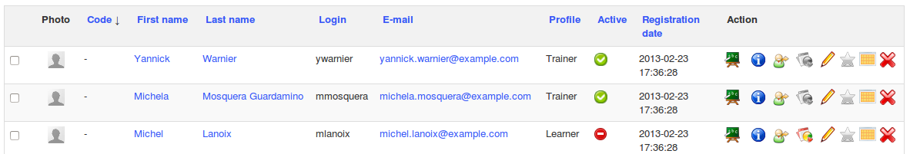
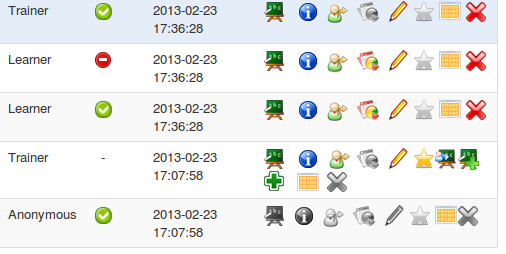

## Users list {#users-list}

Here the administrator can manage all users in a simple click on an icon that we have seen previously.

Illustration 48: Administration – Users list

In order to visualise the users list in a clearer way, here is a reduced list of roles and types of options of which the administrator has access to regarding each of these roles.

Illustration 49: Administration – Users – Options by role