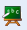

### Learner {#learner}

*   **Active/Inactive** : a learner can be enabled/disabled at wish

*   **Courses list** : a learner can be subscribed to several courses

*   **Login as...** enabled for the learner

*   **Statistics** : the learner is the only user role that can be tracked

*   **Edition** : the learner account can be edited by the admin

*   **Administration** : the learner can never be the administrator

*   **Free/busy calendar** : shows the availability of the learner

*   **Removal** : the learner account can be removed