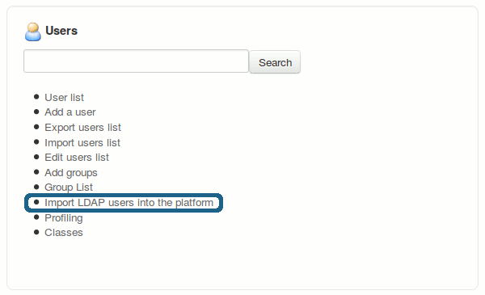
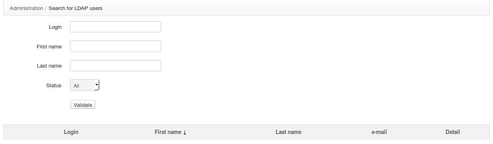

## LDAP

El sistema de autenticación LDAP en Chamilo ha sido sometido a varios cambios profundos durante
tiempo, y la situación actual es algo confusa y siempre requiere algún tipo de manual actualizar.

Un parche de Eric Marguin en la versión 1.10.0 solucionó una serie de problemas de versiones anteriores,
relacionado con las secuencias de comandos de importación que no utilizan el archivo de configuración para LDAP (main/inc/conf/auth.conf.php).

### Configuración LDAP

Para configurar LDAP, verifique las variables LDAP en main/inc/conf/auth.conf.php.

Por defecto, vendrá así (más o menos), donde los elementos se adaptarán a su el propio servidor LDAP y la configuración han sido coloreados en rojo:

```
/**
 * LDAP
 */
/**
 * Array of connection parameters
 **/
$extldap_config = array(
    //base dommain string
    'base_dn' => 'DC=cblue,DC=be',
    //admin distinguished name
    'admin_dn' => 'CN=admin,dc=cblue,dc=be',
    //admin password
    'admin_password' => 'pass',
    //ldap host
    'host' => array('1.2.3.4', '2.3.4.5', '3.4.5.6'),
    // filter
    // 'filter' => '',
    // no () arround the string
    //'port' => ,default on 389
    //protocol version (2 or 3)
    'protocol_version' => 3,
    // set this to 0 to connect to AD server
    'referrals' => 0,
    //String used to search the user in ldap. %username will ber replaced
    // by the username.
    //See extldap_get_user_search_string() function below
    // 'user_search' => 'sAMAccountName=%username%',
    // no () arround the string
    'user_search' => 'uid=%username%',
    // no () arround the string
    //encoding used in ldap (most common are UTF-8 and ISO-8859-1
    'encoding' => 'UTF-8',
    //Set to true if user info have to be update at each login
    'update_userinfo' => true
);
/**
 * Correspondance array between chamilo user info and ldap user info
 * This array is of this form :
 * '<ldap_>' =><ldap_field>
 *
 * If <ldap_field>is "func", then the value of <chamilo_field>will be
 * the return value of the function
 * extldap_get_<chamilo_field>($ldap_array)
 * In this cas you will have to declare the extldap_get_<chamilo_field>
 * function
 *
 * If <ldap_field>is a string beginning with "!", then the value will be
 * this string without "!"
 *
 * If <ldap_field>is any other string then the value of<chamilo_field>
 * will be
 * $ldap_array[<ldap_field>][0]
 *
 * If <ldap_field>is an array then its value will be an array of values
 * with the same rules as above
 **/
$extldap_user_correspondance = array(
    'firstname' => 'givenName',
    'lastname' => 'sn',
    'status' => 'func',
    'admin' => 'func',
    'email' => 'mail',
    'auth_source' => '!extldap',
    //'username' => ,
    'language' => '!english',
    'password' => '!PLACEHOLDER',
    'extra' => array(
        'title' => 'title',
        'globalid' => 'employeeID',
        'department' => 'department',
        'country' => 'co',
        'bu' => 'Company'
    )
);
```

Una vez que haya configurado ese archivo, tendrá que cambiar configuration.php antes de algunas cosas
se agregan a su interfaz de administración.

Si observa app/config/configuration.php y busca «ldap», encontrará estas 3 líneas:

```
// -> Uncomment the two lines bellow to activate LDAP AND edit main/auth/external_login/ldap.conf.php 
// for configuration
// $extAuthSource["extldap"]["login"] = $_configuration['root_sys']. $_configuration['code_append']."auth/external_login/login.ldap.php";
// $extAuthSource["extldap"]["newUser"] = $_configuration['root_sys'].$_configuration['code_append']."auth/external_login/newUser.ldap.php";
```

Descomente para habilitar algunos scripts adicionales.

Cuando descomente, verá aparecer el siguiente elemento en el panel de administración.



Esto le dará acceso a una lista de búsqueda de usuarios en el servidor LDAP y opciones para importar esos usuarios. Sin embargo, las versiones 1.9.x de Chamilo LMS podrían haber tenido un pequeño problema con eso, por lo que es realmente imposible buscar desde esta pantalla.



Para solucionarlo, debe ir y editar las funciones ldap_get_users en main/auth/external_login/ldap.inc.php. Allí, verá que no importa qué mapeo haya dado en ***$extldap_user_correspondance_variable*** en auth.conf.php, no se tiene en cuenta. Actualízalo para que la búsqueda funcione.

Tenga en cuenta que esto debe solucionarse en Chamilo LMS 1.10.x.

### Ejecutar sincronizaciones

Algunos mecanismos de sincronización están hechos para ejecutarse automáticamente (a través de CRON). Para encontrar estos, mire más profundamente en la carpeta main/auth/external_login/.

El script _ldap_import_all_users.php_, por ejemplo, se puede ejecutar para insertar automáticamente todos
usuarios de LDAP (siguiendo criterios específicos definidos en ldap.inc.php) en Chamilo. tenga en cuenta
que, una vez más, en la versión 1.9.x, esto solía estar ligeramente roto, lo que requería una revisión del
Funciones ldap.inc.php para trabajar.