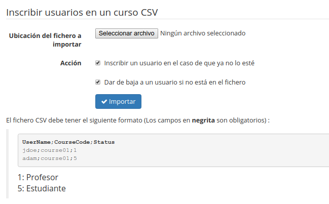

## Administración de los cursos {#administraci-n-de-los-cursos}

**Los cursos son espacios** en los que el profesorado genera contenidos y los pone a disposición de sus alumnos para facilitar su aprendizaje. Para ello cuenta con más de 20 herramientas que le ayudarán a conseguir una experiencia multimedia entretenida y dinámica.

Los cursos, en muchos casos, son utilizados como recursos permanentes, pero también pueden insertarse dentro de un contexto regulado cronológicamente mediante el uso de sesiones (ver Capítulo 6 Administración de sesiones en la página 69).

Unos iconos facilitan la gestión de cursos, algunos ya nos son conocidos:

| Iconos | Funcionalidades |
| --- | --- |
|  | Suministra toda la información sobre el uso del curso y sus usuarios |
|  | Ofrece un seguimiento detallado de los usuarios, del curso y un informe de los recursos |
|  | Permite modificar los parámetros o detalles del curso |
|  | Elimina el curso |
|  | Genera o importa una copia de seguridad |
|  | Facilita ir a la página principal del curso |

Tableau 3: Administración – iconos de administración de cursos

### Lista de Cursos {#lista-de-cursos}

Esta herramienta permite visualizar los cursos de la plataforma.

Ilustración 54: Administración - Lista de cursos

Esta lista nos da mucha información sobre los cursos. Preste atención al color del círculo que precede al título de cada curso, pues representan el tipo de visibilidad del curso:

*   azul: público. Sus contenidos son accesibles por cualquier persona aunque no esté registrada en la plataforma

*   verde: abierto. Sus contenidos son visibles por cualquier usuario registrado en la plataforma

*   anaranjado: privado. Sus contenidos sólo son accesibles a los usuarios de ese curso. Los usuarios normalmente son suscritos por los docentes o por el administrador

*   rojo: cerrado. Sus contenidos no serán accesibles más que por el administrador de la plataforma y los docentes del curso. Este estatus suele utilizarse para labores de mantenimiento o por expiración del curso.

Por otro lado, la lista de cursos presenta en el lado derecho un conjunto de iconos que permiten ciertas acciones.

#### Modificar la configuración de un curso {#modificar-la-configuraci-n-de-un-curso}

Para actualizar la configuración o los detalles de un curso, haga clic en el icono lápiz. Como administrador, podrá cambiar la misma información que puede cambiar el profesor/creador del curso. Además, puede modificar el espacio en disco permitido para el curso y marcarlo como un curso especial; en este último caso, se presentará a todos los usuarios de la plataforma en la parte superior de la lista de cursos.

#### Seguimiento y copias de seguridad {#seguimiento-y-copias-de-seguridad}

Aquí, el seguimiento y las copias de seguridad se realizan de la misma forma por un administrador o por un docente (ver guía del docente).

Estos iconos son atajos que llevan al administrador a la pestaña Mis cursos.

### Creación de un curso {#creaci-n-de-un-curso}

Cuando un administrador crea un curso sólo está obligado a rellenar el título.

Ilustración 55: Creación de un curso

Además de este campo obligatorio, hay otras opciones disponibles exclusivamente para el administrador:

*   Asignar un docente responsable del curso

*   Añadir uno (o más) docentes al curso

*   Asignarlo a un departamento y cumplimentar la URL del departamento

*   Configurar la visibilidad del curso

*   Gestionar los ajustes de inscripción y cancelación de la misma

### Exportar Cursos {#exportar-cursos}

Esta característica le permite exportar los detalles de algunos o todos los cursos de la plataforma en el formato CSV.

Ilustración 56: Administración - Exportar cursos

### Importar cursos {#importar-cursos}

Esta funcionalidad le permite crear una serie de cursos a partir de la importación de una lista de cursos en formato CSV. Si utiliza las categorías e importa los cursos desde otra instalación de Chamilo, entonces tendrá que asegurarse de que los códigos de las categorías sean iguales (existan) en ambos portales.

Ilustración 57: Administración - Importar cursos

Una vez importado, sólo tendrá que rellenar las lecciones.

### Categorías de cursos {#categor-as-de-cursos}

Puede crear, actualizar o eliminar categorías de cursos a través de iconos de acción. Es posible crear numerosas categorías y subcategorías.

Ilustración 58: Administración - Categorías de cursos

También es posible organizar estas categorías gracias a los iconos en forma de flecha. El texto de estas categorías no se ha internacionalizado, por lo que si se utiliza un portal multilingüe asegúrese de que el nombre o la clasificación de los cursos sea fácil de entender por todos los usuarios.

### Suscribir usuarios a los cursos {#suscribir-usuarios-a-los-cursos}

El administrador puede suscribir a cualquier usuario a un curso. Para ello:

*   seleccione uno o varios usuarios en la lista de la izquierda (use CTRL o SHIFT),

*   elija el curso o cursos en los que desea inscribirlos

*   haga clic en _Añadir a este (estos) curso(s)_

Ilustración 59: Administración - Suscribir usuarios a los cursos

### Suscribir usuarios a los cursos desde un fichero {#suscribir-usuarios-a-los-cursos-desde-un-fichero}

Esta característica le permite suscribir un listado de usuarios en un curso mediante un archivo CSV o XML. Por ejemplo, con ciertas modificaciones podremos inscribir directamente en un curso, un listado de usuarios que hayamos exportado previamente de otro.

Ilustración 60: Administración - Suscribir usuarios a los cursos

La importación tiene dos acciones opcionales que permiten afinar el resultado de la operación.

### Gestor de campos de cursos {#gestor-de-campos-de-cursos}

A partir de la versión 1.10, es posible registrar campos extra para todos los cursos, como era el caso en versiones anteriores para los usuarios.

Sin embargo, estos campos se usarán principalmente en combinación con plugins existentes y no tienen un gran impacto sobre el comportamiento normal de la plataforma.