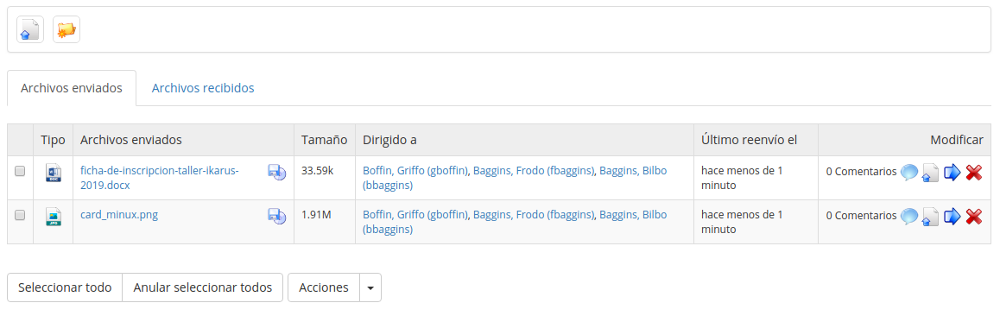

# Compartir documentos (dropbox) {#compartir-documentos-dropbox}

La herramienta _Compartir_ _documentos_ (o dropbox)  provee un lugar en donde los usuarios pueden dejar archivos para el uno el otro, para que estén descargados cuando sea conveniente, evitando pesadas descargas por correo electrónico. Los archivos pueden ser “soltados” ahí por el profesor para que los recuperen los alumnos, por alumnos para otros alumnos (si permitido por el administrador), o por alumnos para el profesor (aunque en este caso probablemente sea más conveniente usar la herramienta de Tareas).

Mientras el concepto básico de esta herramienta es similar a la de herramientas populares como Dropbox o Google Drive, ante-fecha considerablemente estas herramientas modernas y no funciona de una manera muy parecida. Por ejemplo, cuando unos usuarios trabajan juntos sobre un archivo, en lugar de abrir el archivo “compartido” para verlo y editarlo directamente, los usuarios simplemente descargan el archivo compartido, trabajan sobre este, y vuelven a subirlo a la herramienta (con sus cambios). Por defecto, los archivos modificados no sobre-escribirán la versión original aun si el nombre de archivo es el mismo, lo cual hace más fácil la gestión de “versiones” de un documento, diferenciadas por fecha/hora de subida.

Todos los usuarios tienen la posibilidad de comentar dentro de la ventana de esta herramienta sobre cualquier archivo que les fue compartido, nuevamente como una herramienta útil para cualquier trabajo colaborativo serio. Por ejemplo, permite a un profesor hacer una nota simple sobre cada contribución de estudiante.

Ilustración 158: Compartir documentos – archivos enviados