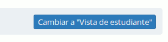

# Encontrando el camino en Chamilo {#encontrando-el-camino-en-chamilo}

La mayoría de las páginas son rápidamente accesibles a través de las pestañas de la parte superior de la ventana:

Ilustración 9: Encabezado de Chamilo

Las “pestañas” (elementos del menú superior), permiten acceder a la página de inicio, la relación de cursos, tu agenda, la página de informes/seguimiento, la red social y (si tienes la suerte de ser el administrador del portal) al panel de control y la administración. La última parte (más a la derecha) muestra la cantidad de mensajes no leídos en el buzón, el nombre de usuario (de forma que puedes comprobar que no estás accediendo por error con otra cuenta) que sirve como menú desplegable para acceder a la red social, y un enlace para salir del sistema (desconectarse) en un solo clic.

A partir de la versión 1.9, este menú se comporta de manera “responsive” (término usado para expresar la adaptabilidad de la interfaz frente a cambios de tamaño de pantalla, como para el uso de tabletas y smartphones), reduciéndose para dar más espacio al contenido.

Dentro de un curso, se muestra la barra de navegación que encontrarías en cualquier otro software.

En Chamilo, esta barra es conocida como navegación en _miga__ja__s de pan,_ (una referencia al cuento popular _Pulgarcito_[^4]que salvó la vida de sus hermanos dejando un rastro de migas de pan en el bosque para poder encontrar el camino de vuelta a casa). Este tipo de navegación permite al usuario encontrar el camino de regreso a su punto de partida.

El primer enlace de “migajas de pan”, en la izquierda, muestra el nombre del curso, y permite al usuario regresar a la página de inicio del curso directamente. Los enlaces a la derecha de este punto, dirigen a los elementos del curso en los que el usuario se encuentre situado.

Ilustración 10: Navegación de Migas de Pan

Dentro de un curso, la _Vista de estudiante_ permite al profesor ver el curso como un alumno. El enlace entonces cambia a _Vista de profesor_. Haciendo clic en el nuevo enlace se regresa a la vista normal del docente:

Ilustración 11: Vista de estudiante

[^4]: O “Le petit Poucet” en Francés, ver http://fr.wikipedia.org/wiki/Le_Petit_Poucet
