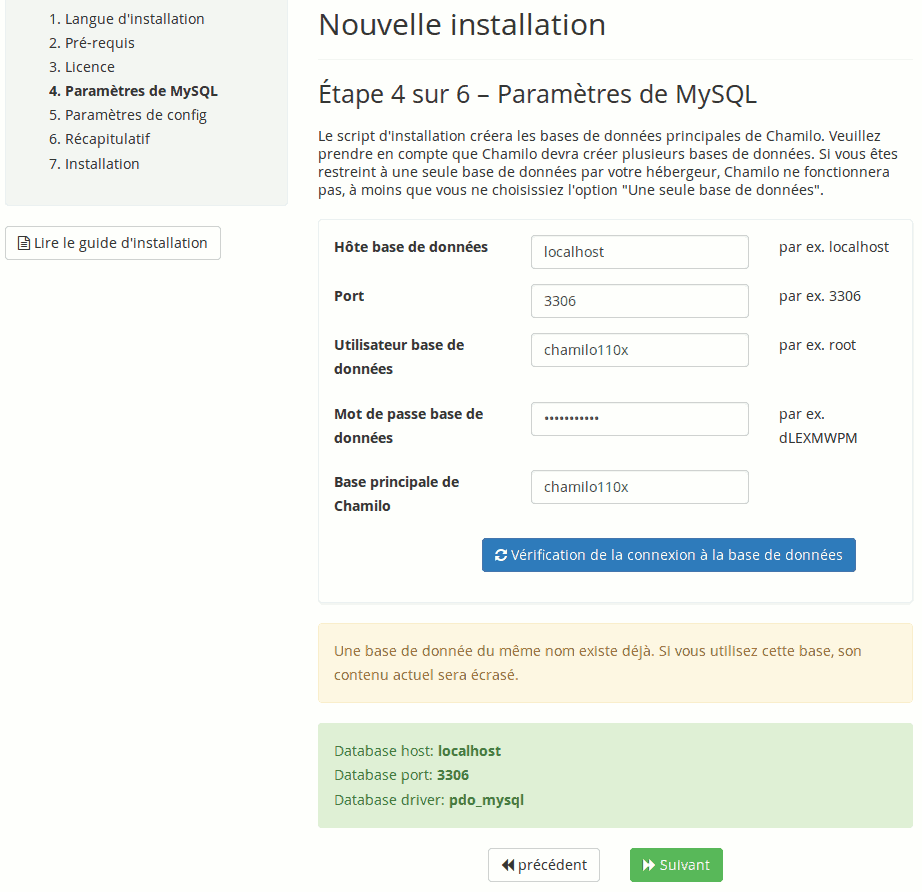

## Assistant d&#039;installation {#assistant-d-installation}

Téléchargez la source sur la page de téléchargement de [Chamilo](https://chamilo.org/fr/chamilo-lms/)[^9]et décompressez-la (avec un outil de décompression tel que 7-zip[^10] sous Windows ou _tar_ sous Linux/MacOS).

*   Si le serveur est distant (c&#039;est-à-dire que vous n&#039;êtes pas directement connecté à la machine par un clavier et un écran), envoyez l&#039;archive grâce au client FTP (ou en [SSH](http://fr.wikipedia.org/wiki/Secure_Shell)) vers l&#039;espace en ligne (transférez tous les fichiers qui se trouvent dans le dossier _chamilo –_ attention, parfois le transfert de fichiers par FTP est interrompu et l&#039;installation ne peut alors s&#039;effectuer correctement, veillez à vérifier que tous les fichiers ont bien été transférés en les envoyant une seconde fois en marquant l&#039;option _Ne pas écraser les fichiers existants_).

*   Si c&#039;est une installation locale, il suffit de copier les fichiers dans le dossier web de votre serveur (sur notre Ubuntu, dans /var/www).

Ex: user@user:(sudo) mv /home/_user_/Bureau/chamilo /var/www

**Note** : Il peut être utile de renommer le dossier une fois décompressé.

Chamilo peut être installé dans n&#039;importe quel répertoire. Choisissez la racine du site pour que la plateforme soit directement accessible à l&#039;adresse « http://www.mondomaine.com/ », par exemple.

Le dossier où copier les fichiers de Chamilo doit être accessible en écriture par l&#039;utilisateur système du serveur Web (soit « www-data » sur notre Ubuntu, ou _httpd_ ou encore _nobody_ sur d&#039;autres systèmes Linux). À distance, il faut pouvoir changer les permissions (droits) sur les dossiers et les fichiers à travers un accès [FTP](http://fr.wikipedia.org/wiki/FileZilla), [SSH](http://fr.wikipedia.org/wiki/Secure_Shell) ou autre.

### Lancement de l&#039;assistant d&#039;installation {#lancement-de-l-assistant-d-installation}

Une fois les fichiers de Chamilo copiés sur le serveur, allez à l&#039;adresse « http://www.mondomaine.com/chamilo » ou, en local, à l&#039;adresse « http://localhost/chamilo », selon le répertoire où a été déposé le dossier.

Si vous avez pu configurer un hôte virtuel (ou VirtualHost[^11] en anglais), il faudra probablement charger directement « http://www.hotevirtuel.com/ » sans le suffixe _chamilo._

Illustration 1: Installation - Écran d&#039;accueil

Vous devrez ensuite suivre une série d&#039;étapes pour préciser les différents paramètres de la plateforme. Ces étapes sont quasiment identiques qu&#039;elles soient effectuées en local ou à distance.

Gardez en mémoire qu&#039;à chaque étape de l&#039;installateur, vous pouvez abandonner le processus et consulter le guide d&#039;installation. Merci de vous référer au guide d’utilisation si vous avez le moindre doute ou problème au moment de l&#039;installation. Cela évitera de demander de l&#039;aide inutilement à l&#039;équipe de développement, et lui permettra de ne pas se déconcentrer avec des problèmes récurrents et dont les solutions sont déjà documentées.

#### Étape 1 sur 6 : Langue d’installation {#tape-1-sur-6-langue-d-installation}

Cet écran vous propose le choix de la langue pour l&#039;installation de Chamilo.

Depuis la version 1.8.8, votre langue est détectée automatiquement via les paramètres de votre navigateur, et cet écran vous demande simplement de confirmer que la langue détectée est correcte.

Attention, ceci n&#039;est **pas** la langue dans laquelle sera configurée votre plateforme Chamilo, mais bien la langue du processus d&#039;installation, rien de plus.

Illustration 2: Installation - Choix de la langue

#### Étape 2 sur 6 : Pré-requis {#tape-2-sur-6-pr-requis}

Cette étape permet de vérifier si votre serveur dispose bien de tous les éléments pour une installation correcte et complète de Chamilo:

Illustration 3: Installation – Pré-requis d&#039;extensions

Notez que les pré-requis déjà couverts par votre système sont notés en **_vert_**, ceux qui sont obligatoires mais absents sont notés en **_rouge_**, et ceux qui ne sont pas présents mais pas non plus obligatoires sont notés en **_orange_**.

Presque tous les pré-requis concernent l&#039;installation de PHP et proposent un lien vers plus de détails. Les paramètres recommandés représentent des variables que vous pouvez modifier dans votre fichier de configuration de PHP (_php.ini_[^12]) ou dans la configuration de votre hôte virtuel.

Illustration 4: Installation - Pré-requis de configuration

À la fin des pré-requis, vous retrouverez une section _Permissions sur les répertoires et fichiers_.

Illustration 5: Installation - Pré-requis (suite et fin)

Par défaut, sous GNU/Linux, l&#039;écriture n&#039;est pas autorisée sur les dossiers. Il faut changer les droits d&#039;accès aux fichiers pour optimiser la sécurité et donner les droits suffisants à l&#039;utilisateur correspondant au serveur Web. Cela sert à confiner les droits lors de l&#039;exécution d&#039;un service (en l&#039;occurrence le serveur Web) et éviter qu&#039;un pirate ne prenne trop facilement le contrôle de votre serveur. Sous Windows, c&#039;est généralement plus simple par défaut (mais beaucoup moins sûr) et les permissions sont déjà suffisantes (mais trop permissives). En d&#039;autres mots, la procédure est inversée : on part de quelque chose de peu sûr et on restreint les droits, alors que sous Linux on part de quelque chose de sûr et on étend les droits selon les besoins.

**Note** : Chamilo est régulièrement révisé (une fois par an) pour éviter les failles de sécurité qui mettraient en danger votre serveur. Vous pouvez être tenu au courant des dernières failles de sécurité rencontrées et corrigées en vous abonnant à notre liste de courriels de sécurité: [http://lists.chamilo.org/listinfo/](http://lists.chamilo.org/listinfo/security)[security](http://lists.chamilo.org/listinfo/security) ou sur [http://support.chamilo.org/projects/chamilo-18/wiki/Security_issues](http://support.chamilo.org/projects/chamilo-18/wiki/Security_issues). Alternativement, vous pouvez suivre notre fil d&#039;information Twitter : [http://twitter.com/chamilosecurity](http://twitter.com/chamilosecurity)

En local, sous Ubuntu, allez dans le répertoire où se trouve le dossier « Chamilo ». Donnez les permissions suffisantes à l&#039;utilisateur « www-data » (il s&#039;agit de l&#039;utilisateur en charge du serveur Web Apache HTTPd) et rafraîchissez votre navigateur. Si vous utilisez un autre système d&#039;exploitation, adaptez la procédure selon les règles de celui-ci.

Ex: user@user:/var/www$ chown -R www-data:www-data chamilo/

Cliquer sur « + Nouvelle installation ».

**_Note_** : si vous exécutez la mise à jour d&#039;une version antérieure de Chamilo, ce chapitre n&#039;est pas totalement adéquat. Consultez plutôt le chapitre 2.3 : Mise à jour de la plateforme Chamilo. Nous vous recommandons également la lecture du manuel d&#039;installation et de mise à jour de Chamilo, en anglais (traduction disponible partiellement en français), présent dans le répertoire _documentation/__de votre paquet Chamilo._

#### Étape 3 sur 6 : Licence {#tape-3-sur-6-licence}

Ici, on vous explique que «Chamilo est un logiciel libre distribué sous la licence GNU General Public Licence ([GPL](http://en.wikipedia.org/wiki/GNU_General_Public_License)) » (dans sa version 3) et qu&#039;une partie de son **contenu** est publiée sous la licence [BY-SA](http://creativecommons.org/licenses/by-sa/3.0/deed.fr) [Creative Commons](http://creativecommons.org/licenses/by-sa/3.0/deed.fr)[.](http://creativecommons.org/licenses/by-sa/3.0/deed.fr)

Pour passer à l&#039;étape suivante, vous devez lire la licence et l&#039;accepter. Vous trouverez d&#039;autres versions (dans votre langue) de la licence si vous le désirez, en vous connectant au site de la Free Software Foundation[^13], qui est l&#039;organisme officiel édictant cette licence. Si vous avez déjà eu l&#039;occasion de lire la licence GNU/GPLv3 et que vous êtes familier avec _Creative Commons_ et que vous êtes d&#039;accord avec les termes de ces licences, vous pouvez immédiatement cocher la case et passer à l&#039;étape suivante. Ces licences n’ont en rien été modifiées.

Illustration 6: Installation - Licence

Une section facultative est disponible au-dessous du bloc d&#039;approbation de la licence. Le formulaire qui s&#039;y trouve nous permettra de vous contacter au cas où l&#039;Association Chamilo organiserait un événement près de chez vous, ou pour vous annoncer qu&#039;un nouveau fournisseur officiel est disponible dans votre pays (au cas où vous auriez besoin de services professionnels). Ceci n&#039;est pas obligatoire, mais nous utiliserons vos données de contact avec respect et elles nous aideront de toute façon à promouvoir les activités de l&#039;Association Chamilo.

#### Étape 4 sur 6 : Paramètres de base de données MySQL {#tape-4-sur-6-param-tres-de-base-de-donn-es-mysql}

Dans cette étape, on vérifie que le système de gestion de bases de données (SGBD) fonctionne correctement:

Illustration 7: Installation - Paramètres MySQL

Pour cette vérification il vous faudra compléter les différents champs proposés. Ces éléments vous sont donnés lors de la location de l&#039;hébergement ou, s&#039;il est installé localement, vous les avez définis lors de la mise en place du serveur [LAMP](http://fr.wikipedia.org/wiki/LAMP).

*   _Hôte base de données :_ le nom du serveur de base de données SQL. Si c&#039;est une installation locale, le serveur MySQL est probablement lui aussi local, et son nom sera par défaut : « localhost ».

*   _P__ort :_ optionnel, représente le port TCP/IP au travers duquel se fera la connexion à la base de données sur le hôte donné

*   _Utilisateur base de données :_ le nom de l&#039;utilisateur de votre base de données. Si c&#039;est une installation locale, le nom sera par défaut « root », mais nous vous recommandons la création d&#039;un autre utilisateur pour votre base de données Chamilo, car utiliser « root » pourrait générer de grands risques de sécurité inutiles.

*   _Mot de passe base de données :_ le mot de passe qui a été donné/créé lors de la création/location de la base de données, en même temps que l&#039;utilisateur. En local, le mot de passe par défaut est généralement vide mais ce n&#039;est pas une situation recommandée.

*   _Base principale de Chamilo__:_ ici, il est possible de changer le nom de la base de données qui sera visible sur PhpMyAdmin.

**Remarque** : Dans les versions antérieures à la 1.9.0, il était possible de choisir l’installation en utilisant une ou plusieurs bases de données. Aucune de ces deux options n&#039;était idéale cependant : l&#039;option de multiples bases de données connaissait parfois de sérieux problèmes d&#039;efficacité, mais occasionnait toujours d&#039;importants maux de têtes aux développeurs. Depuis la version 1.9, tout a été simplifié et ordonné, de sorte qu&#039;il ne soit plus nécessaire de poser cette question lors de l&#039;installation.

Vérifiez les données puis cliquez sur « vérification de la connexion à la base de données ». Si cela ne fonctionne pas, le mot de passe est peut-être incorrect.

Une fois que tout est vérifié et correct, passez à l&#039;étape suivante.

**Remarque** : Si un message sur fond orange apparaît comme dans la capture d&#039;écran ci-dessus, c&#039;est qu&#039;il existe déjà une base de données portant ce nom, et que l&#039;utilisateur de la base de données indiqué dispose des permissions suffisantes pour l&#039;éliminer. Soyez prudent avec cette option. Elle pourrait très bien vous amener à supprimer une base de données qui a réellement de la valeur !

#### Étape 5 sur 6 : Paramètres de configuration {#tape-5-sur-6-param-tres-de-configuration}

Tous les paramètres de cette étape seront modifiables via l&#039;interface d&#039;administration de Chamilo, à l&#039;exception de la _Méthode d__e cryptage_. Cette dernière est d&#039;ailleurs pratiquement impossible à modifier après l&#039;installation. Veillez à la sélectionner avec soin.

Illustration 8: Installation - Paramètres de configuration généraux

*   _I__dentifiant_ _et Mot de passe de l&#039;administrateur :_ **_IMPORTANT_** _- ces informations permettront de se connecter en tant qu&#039;administrateur dans Chamilo. Une solution est de mettre un compte administrateur générique, non nominatif et non personnel, mais cela supprimerait la possibilité d&#039;identifier les activités d&#039;un des administrateurs. Il est possible, après l&#039;installation, de définir d&#039;autres administrateurs distincts aux pouvoirs identiques._

*   _Prénom et Nom de l&#039;administrateur :_ seront affichés en bas à droite de votre Chamilo avec son adresse de courriel. Il est aussi possible d&#039;ajouter une autre information, comme « Équipe de support technique ». Chacun fait à sa convenance.

*   _Courriel_ _de l&#039;administrateur :_ l&#039;adresse de contact de l&#039;administrateur.

*   _Langue principale :_ la langue qui sera utilisée par défaut sur votre portail Chamilo.

*   _URL de Chamilo :_ l&#039;adresse de votre portail Chamilo (si en local : http://localhost/chamilo; si distant : http://www.mondomaine.com/chamilo).

*   _Nom du portail_ et _Nom abrégé de l&#039;organisation :_ ces informations seront visibles, dans certains styles graphiques, en haut à gauche du portail Chamilo et sur toutes les pages.

*   _Méthode d__e cryptage_ _:_ ce sont des fonctions cryptographiques qui permettent de sécuriser l&#039;enregistrement des mots de passe des utilisateurs. Nous recommandons l’algorithme disponible le plus sûr : _b__crypt_. Cette valeur étant pratiquement impossible à modifier par la suite, veillez à la choisir avec soin.

*   _Auto inscription :_ à mettre à _Non_ou _Après approbation_ pour une installation non publique.

*   _Auto inscription en tant que créateur de cours :_ à modifier en fonction des besoins.

**Note** : L&#039;utilisateur défini à cette étape aura les droits d&#039;administration de la plateforme. Certaines informations pourront être modifiées plus tard.

#### Étape 6 sur 6 : Dernière vérification avant installation {#tape-6-sur-6-derni-re-v-rification-avant-installation}

Ici, il faut vérifier les valeurs qui ont été introduites. Il est conseillé d&#039;imprimer cette page pour conserver le mot de passe et les autres paramètres (dans un endroit sûr). Si une erreur est constatée, il est toujours possible de revenir en arrière. Si tout est correct, cliquez sur « Installer Chamilo».

Illustration 9: Installation - Récapitulatif

Une fois l&#039;installation terminée, il suffit de se rendre sur le site en suivant le lien proposé et de se connecter avec l&#039;identifiant défini précédemment.

### Derniers réglages d&#039;installation de Chamilo {#derniers-r-glages-d-installation-de-chamilo}

Une fois Chamilo installé, un dernier message d&#039;avertissement apparaît:

Illustration 10: Installation - Rapport d&#039;installation

Il est possible de changer les droits d&#039;accès au répertoire « app/config/ » en utilisant « chmod » :

user@user:/var/www/chamilo$ sudo chmod -R 0555app/config/

Lorsque cette manipulation est faite, l&#039;utilisation de Chamilo peut commencer en toute sécurité en cliquant sur « Aller directement sur votre nouveau portail » ou, par le navigateur, à l&#039;adresse « localhost/chamilo » en local et « http://www.mondomaine.com/chamilo » à distance.

[^9]: https://chamilo.org/fr/chamilo-lms/

[^10]: http://www.7-zip.org/

[^11]: http://httpd.apache.org/docs/current/vhosts/

[^12]: http://php.net/manual/en/ini.core.php

[^13]: http://www.fsf.org/