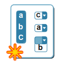

## Créer une question {#cr-er-une-question}

Une fois le test créé, choisir le type de la première question parmi les sept proposés. Si le test existe déjà, et qu&#039;il faut rajouter une (ou plusieurs) question(s), procéder de la même façon. Il est possible de rendre le test plus dur à faire en affectant un score négatif à une réponse fausse, ce qui fait davantage réfléchir le participant. L&#039;exercice peut faire intervenir plusieurs types de réponses pour briser la monotonie et répondre à différents besoins d’évaluation.

Illustration 41: Exercices - Types de questions

### Type 1 : Question à choix multiples – réponse unique {#type-1-question-choix-multiples-r-ponse-unique}

Le QCM classique est celui où une seule proposition sera considérée comme valide. Il est possible de rendre le test plus dur en affectant un score négatif à une réponse fausse, ce qui fait davantage réfléchir le participant et le fait hésiter à répondre « au hasard ».

*   compléter le titre de la question – attention, ceci n&#039;est **pas** la question elle-même,

*   saisir le niveau de difficulté de la question,

*   cliquer sur le lien « Enrichir la question » pour ajouter la question en elle-même, illustrée de divers médias, à l’aide de l’éditeur interne,

*   ajouter ou diminuer le nombre de réponses proposées en cliquant sur « + de réponses » ou « - de réponses »,

*   saisir les réponses proposées aux apprenants (une mise en forme succincte et l’ajout d’un média de type son sont rendus possible en cliquant sur la flèche noire, en haut à gauche de la zone de réponse),

*   cocher la bonne réponse,

*   saisir les commentaires (feedback) associés aux réponses (une mise en forme succincte et l’ajout d’un média de type son est rendu possible en cliquant sur la flèche noire, en haut à gauche de la zone de réponse). Garder à l’esprit que le commentaire associé à une réponse fausse peut constituer un début de remédiation, et que le commentaire associé à la bonne réponse peut constituer un début de renforcement de l’apprentissage,

*   affecter un score (positif, négatif ou nul) à chaque réponse proposée,

*   cliquer sur le bouton « Ajouter la question au test » pour sauvegarder la question.

### Type 2 : Question à choix multiples - réponses multiples {#type-2-question-choix-multiples-r-ponses-multiples}

Ce QCM est une variante du type précédent. Il permet d’affecter plusieurs réponses valides. Là encore, les scores positifs et négatifs ainsi que la pondération sont possibles.

*   compléter l’intitulé de la question,

*   saisir le niveau de difficulté de la question,

*   cliquer sur le lien « Enrichir la question » pour ajouter des médias à l’aide de l’éditeur interne,

*   ajouter ou diminuer le nombre de réponses proposées en cliquant sur « + de réponses » ou « - de réponses »,

*   saisir les réponses proposées aux apprenants (une mise en forme succincte et l’ajout d’un média de type son sont rendus possible en cliquant sur la flèche noire, en haut à gauche de la zone de réponse),

*   cocher la bonne réponse,

*   saisir les commentaires (feedback) associés aux réponses (une mise en forme succincte et l’ajout d’un média de type son sont rendus possible en cliquant sur la flèche noire, en haut à gauche de la zone de réponse). Garder à l’esprit que le commentaire associé à une réponse fausse peut constituer un début de remédiation, et que le commentaire associé à la bonne réponse peut constituer un début de renforcement de l’apprentissage,

*   affecter un score (positif, négatif ou nul) à chaque réponse proposée,

*   cliquer sur le bouton « Ajouter la question au test » pour sauvegarder la question.

### Type 3 : Remplissage de blancs {#type-3-remplissage-de-blancs}

Il s&#039;agit du texte à trous. Le but est de faire inscrire par l’utilisateur des mots préalablement retirés du texte. C’est le type d’exercice utilisé couramment par les professeurs de langue, au début de

l’apprentissage.

*   compléter l’intitulé de la question,

*   saisir le niveau de difficulté de la question,

*   cliquer sur le lien « Enrichir la question » pour ajouter des médias à l’aide de l’éditeur interne,

*   saisir le texte à compléter en plaçant les mots ou les expressions attendus entre crochets,

*   affecter un score (positif, négatif ou nul) à chaque réponse proposée,

*   cliquer sur le bouton « Ajouter la question au test » pour sauvegarder la question.

Depuis la version 1.10, l&#039;enseignant peut sélectionner 4 nouvelles options par rapport aux versions antérieures :

*   le type de marqueur pour les espaces blanc (le symbole [] est utilisé par défaut mais certains enseignants pourraient avoir besoin précisément des ces symboles dans le texte de sa question)

*   des alternatives de réponse, séparées par une barre verticale « | » (dans ce cas, la première réponse est la réponse correcte et elles apparaissent désordonnées pour l&#039;apprenant)

*   des alternatives de réponses correctes au cas où il y a plusieurs réponses possibles, séparées par une double barre verticale « || »

*   la dimension du champ de réponse, pour pouvoir donner un indice de plus à l&#039;apprenant au sujet de la réponse espéré (boutons + et – pour redimensionner correctement le champ)

### Type 4 : Apparier (Correspondance) {#type-4-apparier-correspondance}

Ce type de réponse peut être choisi pour créer une question où l’utilisateur devra relier des éléments d&#039;un ensemble de propositions P1 avec les éléments d&#039;un second ensemble de propositions P2\. Il peut également être utilisé pour demander à l’utilisateur de trier des éléments dans un certain ordre.

*   compléter l’intitulé de la question,

*   saisir le niveau de difficulté de la question,

*   cliquer sur le lien « Enrichir la question » pour ajouter des médias à l’aide de l’éditeur interne,

*   ajouter ou diminuer le nombre d&#039;éléments proposés (en haut n°) et de correspondance (en bas lettres) en cliquant sur « - élément » ou « + élément »,

*   saisir les éléments proposés et leur correspondance,

*   compléter la colonne « Correspond à » en associant les bonnes réponses aux éléments proposés,

*   affecter un score (positif, négatif ou nul) à chaque réponse proposée,

*   cliquer sur le bouton « Ajouter la question au test » pour sauvegarder la question.

### Type 5 : Questions ouvertes {#type-5-questions-ouvertes}

Ici, la réponse de l&#039;apprenant sera rédigée librement. Cette réponse ne sera pas évaluée immédiatement, car l&#039;évaluation demande l&#039;intervention du professeur. Le score final sera attribué par le professeur, à l&#039;issue de la correction.

*   compléter l&#039;intitulé de la question (version courte de la question),

*   saisir le niveau de difficulté de la question,

*   cliquer sur le lien « Enrichir la question » pour y placer une version complète de la question,

*   affecter un score (positif, négatif ou nul) à la question,

*   cliquer sur le bouton « Ajouter la question au test » pour sauvegarder la question.

### Type 6 : Expression orale {#type-6-expression-orale}

Ce type de question requiert l&#039;activation par l&#039;administrateur de l&#039;option d&#039;enregistrement audio Nanogong. Il s&#039;agit d&#039;un type de question similaire à la question ouverte, mais l&#039;apprenant peut y répondre par oral en enregistrant sa réponse au travers du micro.

C&#039;est un type de question très utile pour les cours de langue, qui peut être d&#039;une grande aide pour animer les apprenants à présenter des travaux par oral en leur permettant d&#039;améliorer leurs capacités de communication.

Note: Ce type de question demande que l&#039;apprenant ait installé le support d&#039;applications Java dans son navigateur web. Ce module peut être téléchargé de manière gratuite sur[www.java.com](http://www.java.com/). S&#039;il n&#039;en dispose pas, l&#039;apprenant pourra tout de même enregistrer sa réponse depuis son ordinateur en utilisant un programme d&#039;enregistrement audio séparé et en envoyant le fichier audio correspondant sur la plateforme au format MP3.

Étant donnés les prérequis additionnels pour l&#039;utilisation de ce type de question, il est recommandé de vous assurer que vos apprenants disposent du nécessaire sur leur ordinateur pour répondre à une question de type oral. Vous devriez aussi prévoir qu&#039;ils pourraient avoir besoin de plus d&#039;une tentative pour répondre, ou de plus de temps au cas où ils auraient à installer tout le nécessaire durant l&#039;examen. Rappelez-vous que ce type de question peut être une activité stressante pour un apprenant. Veillez donc à éviter de lui compliquer la tâche.

Pour répondre à une question audio, l&#039;apprenant aura simplement à cliquer sur un bouton « Enregistrer la réponse ». Une fenêtre émergente s&#039;ouvrira avec l&#039;enregistreur (boutons typiques). Après avoir enregistré sa réponse, il cliquera encore sur « Envoyer la réponse ».

### Type 7 : Zones sur image (hotspot) {#type-7-zones-sur-image-hotspot}

Dans ce type de question, l&#039;apprenant sera amené à identifier des zones (en cliquant dessus) dans une image pour répondre à la question posée par le professeur.

Dans ce type de question, l&#039;apprenant doit cliquer sur une ou plusieurs zones d&#039;une image qui est préalablement mise à sa disposition sur le serveur. La conception d’une question de type zone sur image demande un travail sur deux écrans successifs.

*   compléter l’intitulé de la question,

*   saisir le niveau de difficulté de la question,

*   cliquer sur le lien « Enrichir la question » pour ajouter des médias à l’aide de l’éditeur interne,

*   cliquer sur le bouton « Parcourir » pour importer une image (format .jpg, .png ou .gif) depuis le disque dur ou le réseau,

*   cliquer sur le bouton « Aller à la question »,

*   décrire la première zone que l&#039;apprenant doit identifier et ajouter un commentaire pour le « feedback » (une mise en forme succincte et l’ajout d’un média de type son sont rendus possible en cliquant sur la flèche noire, en haut à gauche de la zone de commentaire) ,

*   sélectionner, parmi les quatre formes disponibles (rectangle, ellipse, polygone ou délinéation), celle qui sera la mieux adaptée à la zone à identifier. Pour refermer un polygone ou une délinéation, un clic droit appelle le menu contextuel qui présente une commande dédiée à la fermeture de ses surfaces,

*   affecter un score (positif, négatif ou nul) à la première zone à identifier,

*   cliquer sur le bouton « Ajouter une zone » si l&#039;apprenant doit identifier plusieurs zones sur la même image et procéder comme précédemment pour la seconde zone, etc.,

*   cliquer sur le bouton « Ajouter la question au test » pour sauvegarder la question.

Différence notoire pour ce type de question par rapport aux versions précédant la 1.10.2, nous avons éliminé totalement la dépendance à Flash pour ce type de question. Veuillez noter que, dans la version 1.10.0, ce type de question était hors service. Il est de retour dans la 1.10.2\.

### Type 8 : Combinaison exacte {#type-8-combinaison-exacte}

Dans ce dernier type d&#039;exercice, si la combinaison comprend une erreur, elle ne seras pas acceptée.

*   compléter l’intitulé de la question,

*   saisir le niveau de difficulté de la question,

*   cliquer sur le lien « Enrichir la question » pour ajouter des médias à l’aide de l’éditeur interne,

*   ajouter ou diminuer le nombre de réponses proposées en cliquant sur « + réponses » ou « - réponses »,

*   saisir les réponses proposées aux apprenants (une mise en forme succincte et l’ajout d’un média de type son sont rendus possible en cliquant sur la flèche noire, en haut à gauche de la zone de réponse),

*   cocher la (ou les) bonne(s) réponse(s),

*   saisir les commentaires associés aux réponses (une mise en forme succincte et l’ajout d’un média de type son sont rendus possible en cliquant sur la flèche noire, en haut à gauche de la zone de réponse). Garder à l’esprit que le commentaire associé à une réponse fausse peut constituer un début de remédiation, et que le commentaire associé à la bonne réponse peut constituer un début de renforcement de l’apprentissage,

*   affecter un score (positif, négatif ou nul) à chaque réponse proposée,

*   cliquer sur le bouton « Ajouter la question au test » pour sauvegarder la question.

### Type 9 : Réponse unique + « ne sais pas » {#type-9-r-ponse-unique-ne-sais-pas}

Dans certains cas, l&#039;enseignant souhaite que l&#039;apprenant indique s&#039;il ne connaît pas la réponse à une question, au lieu d&#039;essayer de deviner la réponse correcte. Ce type de question est similaire à celui de réponses multiples, mais il réserve la dernière possibilité pour l&#039;option « Ne sais pas », qui est toujours évaluée à 0 points. Si l&#039;enseignant le considère opportun, les apprenants peuvent être pénalisés avec un score négatif s&#039;ils tentent de deviner la réponse (sans succès).

### Type 10 : Réponse multiple Vrai/Faux/Ne sais pas {#type-10-r-ponse-multiple-vrai-faux-ne-sais-pas}

Il s&#039;agit d&#039;un autre format de combinaison qui inclut une option de type « Ne sais pas » et de valeur 0, comme dans l&#039;option de question antérieure, mais qui utilise Vrai/Faux au lieu de questions à réponses multiples. De nouveau, il est possible d&#039;assigner un score négatif pour éviter les tentatives aléatoires et suggérer aux apprenants de répondre honnêtement.

### Type 11 : Combinaison Vrai/Faux/Ne sais pas {#type-11-combinaison-vrai-faux-ne-sais-pas}

Cette option offre une ponctuation unique qui couvre une ou plusieurs questions. Le formulaire offre une apparence similaire à celui de réponse à combinaison exacte, mais la question se montre à l&#039;étudiant d&#039;une façon différente (sous forme de tableau).

### Type 12: Réponse globale multiple {#type-12-r-ponse-globale-multiple}

Ce format de question combine le format de réponses multiples avec une ponctuation unique tout en évitant l&#039;accumulation de valeurs négatives dans les scores. Il s&#039;agit un peu d&#039;un type « réponse multiple » pour les paresseux, vu qu&#039;il ne demande aucune répartition de ponctuation entre les différentes questions. Il suffira d&#039;indiquer lesquelles sont correctes et lesquelles ne le sont pas.

### Type 13 : Question calculée {#type-13-question-calcul-e}

Ce type de question, encore considéré en mode Beta (ce qui signifie qu&#039;il ne devrait pas être utilisé comme partie d&#039;un examen critique) permet l&#039;élaboration de questions du type énoncé, comme par exemple : « _Julie a_ _7 pommes dans son panier. Elle veut les distribuer de manière égale et seulement par pommes entières à ses 4 frères. Combien de pommes recevra chaque frère ?_ ».

Une fois l&#039;énoncé de base élaboré, on remplace les valeurs numériques par des variables et on établit une formule qui permet de calculer la réponse. Par exemple : « _Julie a_ _[x] pommes dans son panier. Elle veut les distribuer de manière égale et seulement par pommes entières à ses [y] frères. Combien de pommes recevra chaque frère ? »_ avec la formule [x]/[y] qui permet d&#039;obtenir la réponse attendue de la part de l&#039;apprenant.

Les champs à remplir sont :

*   le texte de l&#039;énoncé où les valeurs sont remplacées par des variables contenues dans des crochets : _[x], [y], etc_

*   un rang de valeurs pour chaque valeur variable (par exemple : de 3 à 7, de 6 à 20, etc)

*   une formule qui permet de calculer la réponse attendue par l&#039;apprenant

*   un score à attribuer à l&#039;apprenant s&#039;il résout correctement le problèmes

*   une quantité de variations à générer pour le problème (par exemple « 5 »)

À partir de ces données, chaque utilisateur qui doit répondre à la question aura une des 5 variations de la même question.

Il est possible de jouer sur de nombreuses variations, et un lien en-dessous des rangs de valeurs indique toutes les fonctions mathématiques qui peuvent être utilisées.

Note : il est important de ne pas se tromper par rapport à la zone de texte dans laquelle on introduit l&#039;énoncé. Une erreur commune est de mettre le texte à crochet dans la partie de description de la question, qui explique le contexte (dans «_Paramètres avancés »_). Dans ce cas, les variables ne seront pas mises en évidence.

Une autre erreur commune est de reproduire la formule « telle quelle ». L&#039;exemple affiché dans le formulaire utilisant « sqrt() » représente la formule de la racine carrée. Il ne s&#039;agit **pas** d&#039;un préfixe obligatoire. C&#039;est juste un exemple.

La fonction « modulo » (le reste d&#039;une division) n&#039;apparaît que dans la version 1.10.4 de Chamilo.

### Type 14 : Réponse unique sur image {#type-14-r-ponse-unique-sur-image}

Ce type de question permet de donner une sélection d&#039;images à l&#039;apprenant et de lui demander de sélectionner la réponse correcte parmi celles-ci. Il s&#039;agit d&#039;un type de question très attrayant visuellement pour l&#039;apprenant, mais il demande une préparation plus importante de la part de l&#039;enseignant (pour la préparation des images).

Le système recommande l&#039;utilisation d&#039;images de 200 pixels de large sur 150 pixels de haut pour que le résultat soit le plus esthétique possible. Voici un petit exemple de formulaire (interface en espagnol dans ce cas) pour élaborer ce type de question.

Illustration 42: Exercices: Réponse unique sur image

Pour l&#039;apprenant, le résultat est visuellement plus plaisant, comme on peut l&#039;observer dans la capture d&#039;écran suivante. La sélection faite par l&#039;apprenant se marque directement avec un fin bord bleu.

Illustration 43: Exercices: Visualisation par l&#039;apprenant du type sélection d&#039;image

### Type 15 : Réordonner des mots {#type-15-r-ordonner-des-mots}

Ce type de question permet de demander à l&#039;apprenant de réordonner correctement les mots dans une phrase. Son élaboration est similaire à celle de la correspondance, mais elle demande simplement de mettre des termes dans l&#039;ordre (au lieu de les faire correspondre entre eux).

L&#039;apprenant verra d&#039;abord la question avec des boutons glissables et des zones numérotées qui reflètent l&#039;ordre.

Finalement, l&#039;apprenant verra les termes dans les cases numérotées avec un bouton d&#039;annulation.

### Type 16 : Correspondance par glisser-déplacer {#type-16-correspondance-par-glisser-d-placer}

Ce type de question permet de faire correspondre des propositions avec leurs réponse correspondante. Il se génère de manière identique au type 4 (correspondances) mais sa visualisation pour l&#039;apprenant est différente.

À la différence du type 4, les réponses de ce type doivent contenir la même quantité de propositions que de réponses, et il ne peut y avoir de redondance.

Une fois que l&#039;apprenant aura relié les points de la partie gauche avec leurs correspondances à droite, tous les liens apparaîtront à l&#039;écran.

