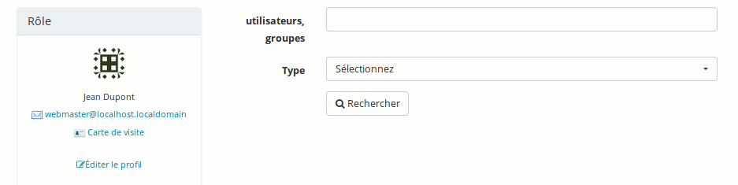

## Rechercher des utilisateurs ou des groupes {#rechercher-des-utilisateurs-ou-des-groupes}

L&#039;option de recherche permet également de chercher des utilisateurs ou des groupes sur la plate-forme.

Illustration 210: Réseau social - Recherche

Notez que l&#039;utilisation d&#039;un tag dans le profil utilisateur enrichit considérablement cette recherche, puisqu&#039;au lieu de chercher un utilisateur par nom, prénom ou e-mail, il vous est à présent possible de le chercher par centre d&#039;intérêt (« chimie », par exemple).

Pour cela, l&#039;administrateur doit avoir configuré le champ de profil utilisateur de type « Tags utilisateurs » et rendu son édition possible par les apprenants. Les apprenants devront eux-mêmes indiquer leurs centres d&#039;intérêts et, à partir de là, il sera possible de former des réseaux d&#039;intérêts communs. À découvrir en collaboration étroite avec votre administrateur...