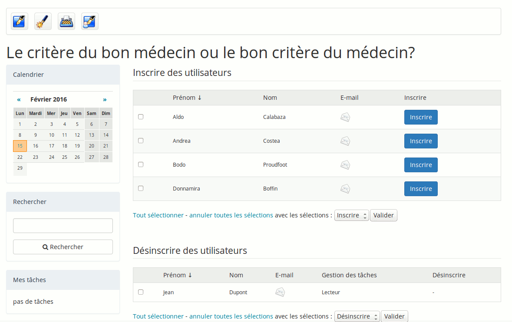

## Inscrire les apprenants participant au blog {#inscrire-les-apprenants-participant-au-blog}

Chamilo permet de gérer plusieurs projets au sein d’un même cours. Il faut donc sélectionner les apprenants qui interviennent sur un projet particulier.

Pour inscrire des apprenants à un projet, depuis la page d’accueil de ce projet :

*   cliquer sur le lien « Gestion des utilisateurs »,

*   cocher les cases qui correspondent aux apprenants à associer au projet,

*   cliquer sur le bouton « Valider ».

Illustration 178: Blogs - Interface générale - Liste d&#039;utilisateurs