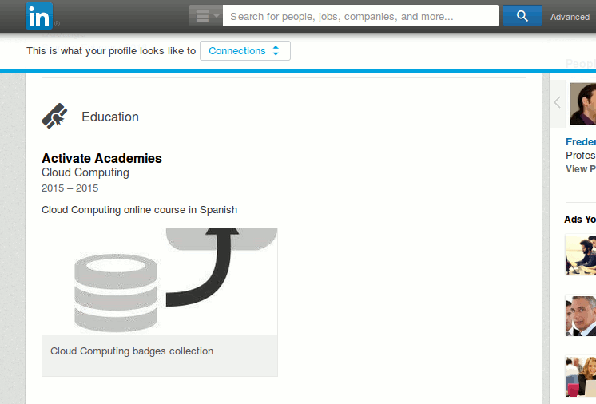

## Compétences {#comp-tences}

Si l&#039;administrateur a activé la gestion des compétences sur ce portail Chamilo, l&#039;option de compétences apparaîtra dans le formulaire de création et d&#039;édition du cahier de notes (ou des catégories au sein du cahier de notes).

Illustration 119: Cahier de notes - Formulaire d&#039;édition - Compétences activées

Les compétences sont à présent profondément ancrées dans Chamilo et offrent une grande compatibilité avec le standard ouvert OpenBadges®, ce qui signifie que chaque apprenant peut exporter ses compétences sous formes de badges visuels vers le Mozilla Backpack (serveur de badges indépendant) et, de là, vers LinkedIn ou d&#039;autres sites professionnels qui supportent ce standard.

En tant qu&#039;enseignant, il est seulement possible de sélectionner la (ou les) compétence(s) qui est obtenue au travers du cahier de note (ou plutôt de l&#039;acquisition des objectifs du cours). Cela dit, l&#039;administrateur et l&#039;administrateur des ressources humaines ont tous les deux accès à la gestion complète de l&#039;arbre des compétences et coordonneront avec les enseignants pour l&#039;adoption de nouvelles compétences. Ce sont toutefois les responsables officiels de l&#039;élaboration des compétences et d&#039;établir des conventions d&#039;utilisation de ces compétences entre tous les enseignants du portail.

Pour sélectionner une compétence au sein du cahier de notes, tapez au moins 3 lettres successives du titre de cette compétence. Une liste de correspondances (voir capture ci-dessus) apparaîtra afin de sélectionner celle qui convient. En sélectionnant une compétence, vous la liez au cahier de notes, et tous les apprenants atteignant la note minimum configurée obtiendront automatiquement cette compétence.

Les règles d&#039;obtention des compétences sont donc les mêmes que celles des certificats : l&#039;apprenant devra charger la page principale de l&#039;outil de cahier de notes pour que la compétence correspondante soit réellement attribuée. Ce petit détail a été corrigé dans la version 1.10.4 de Chamilo, mais il est important de ne pas l&#039;oublier au cas où vous auriez le coup.

Si l&#039;outil de compétences a été activé, si une compétence a été configurée, si l&#039;apprenant a obtenu le score minimum nécessaire et si le réseau social n&#039;a pas été désactivé, les compétences s&#039;afficheront automatiquement sur le profil de l&#039;utilisateur dans le réseau social.

Illustration 120: Réseau social - Vue personnelle

Illustration 121: Réseau social - Profil partagé

En cliquant sur un badge, on peut visualiser les détails de l&#039;obtention de la compétence mentionnée. Ici nous avons indiqué peu de détails, mais on peut voir qu&#039;il est possible d&#039;indiquer des critères d&#039;obtention. Cette page est publique et peut être référencée depuis n&#039;importe quel site professionnel.

Illustration 122: Compétences - Fiche de délivrance

Notez que l&#039;image en soi contient des métadonnées permettant de retrouver de nombreux détails au sujet du badge, à qui il a été attribué, à quelle date, etc. C&#039;est pratiquement un certificat en soi.

Sur LinkedIn, il sera dès lors possible (moyennant quelques étapes intermédiaires) d&#039;afficher quelque chose comme ceci dans la section « Éducation » :

Illustration 123: Profil sur LinkedIn montrant un OpenBadge

Si vous êtes intéressé par cette procédure, consultez la [vidéo en espagnol](https://www.youtube.com/watch?v=uAuycQVvEZc) (à défaut de mieux) de BeezNest, l&#039;un des fournisseurs officiels de Chamilo et principal éditeur de ce guide.