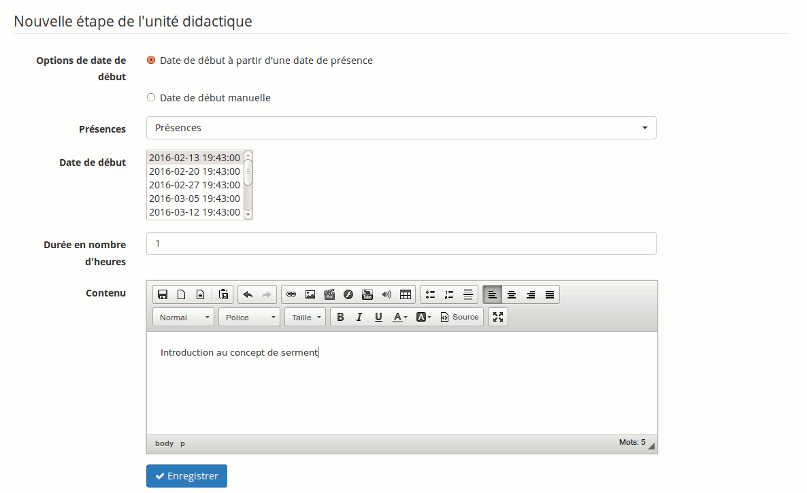

## Créer les étapes de progression du cours {#cr-er-les-tapes-de-progression-du-cours}

Les étapes (ou avancement thématique) sont des dates auxquelles vous donnerez le cours (en particulier le contenu de la section définie antérieurement).

Illustration 148: Progression du cours - Création d&#039;étapes

Il est possible, pour la définition des dates de séances de cours, de récupérer des dates définies antérieurement dans l&#039;outil de présences (voir Chapitre 24\. -L&#039;outil « Présences » en page 137). Si ce n&#039;est pas souhaité, l&#039;introduction d&#039;une nouvelle date (et heure) à la main est également possible.