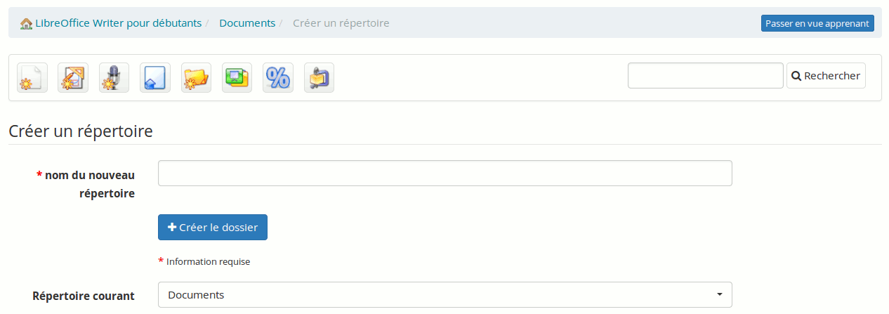

## Créer un répertoire {#cr-er-un-r-pertoire}

Pour obtenir une structure plus claire, Chamilo propose de créer des répertoires et des sous-répertoires.

Illustration 25: Documents - Création de répertoire

Pour créer un répertoire :

*   cliquez sur « Créer un répertoire» (cinquième icône de l&#039;Illustration 25: Documents - Création de répertoire),

*   saisissez le nom du répertoire,

*   cliquez sur « Créer le dossier ».

Voilà, vous avez réellement créé un répertoire dans l&#039;arborescence.