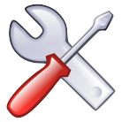

## Modifier un parcours {#modifier-un-parcours}

Aller dans « Mes cours », choisir un cours et cliquer sur l&#039;outil « Parcours » :

Illustration 82: Parcours - Liste

La colonne de droite comprend les outils utiles à la modification. Il comprend :

| Icônes | Fonctionnalités |
| --- | --- |
|  | Modifier les paramètres du parcours |
|  | Supprimer un parcours |
|  | Accéder à l&#039;outil « construire » pour retravailler le parcours |
|  | Afficher / cacher le parcours |
|  | Masquer / montrer aux apprenants |
|  | Exporter le parcours au format .zip, réintégrable en SCORM |
|  | Autoriser / interdire plusieurs tentatives aux apprenants |
|  | Mettre le parcours en vue « plein écran » ou en vue « normal » |
|  | Réorganiser la position des parcours |
|  | Exporter le parcours complet sous forme d&#039;un document PDF |
|  | Copier/répliquer un parcours |

Dans la version 1.10.0, deux nouvelles options font leur apparition dans les outils de gestion des parcours. La première apparaîtra toujours et permet, grâce à l&#039;icône de rapports (), d&#039;accéder à une page de rapports sur le progrès, pour ce parcours en particulier, de tous les apprenants. Elle permet de comparer tous les apprenants du cours. Dans les versions précédentes, il était possible uniquement d&#039;obtenir ce rapport apprenant par apprenant, sur des pages individuelles, ou la moyenne de tous les apprenants d&#039;une fois.

La deuxième option apparaît seulement si l&#039;administrateur a décidé d&#039;activer le mode de “gamification” ou ludification dans les paramètres de configuration.

Dans ce cas, et uniquement si le parcours a été configuré dans ce mode en utilisant l&#039;icône de gamification dans la liste des parcours (), le progrès au sein du parcours se montrera également sous la forme de 4 étoiles, dont l&#039;affichage est basé sur les règles suivantes:

*   1 étoile pour atteindre la moitié du parcours (comprendre 50% de progrès dans le parcours)

*   1 étoile quand le score moyen des exercices du parcours (de tous les chapitres) &gt;= 50%

*   1 étoile quand le score moyen des exercices du parcours (de tous les chapitres) &gt;= 80%

*   1 étoile quand le score de l&#039;exercice final &gt;= 80% (comprendre le dernier exercice du parcours)

Évidemment, cela demande que plusieurs exercices aient été placés dans le parcours (nous recommandon un minimum de 4 exercices), c&#039;est pourquoi nous vous suggérons de faire des tests en suffisance avant de lancer le parcours au grand public.

Le score qui apparaît (sous forme de “points”) reflète le score total (absolu) de la somme des dernières tentatives aux exercices passés dans ce parcours.

Ce mode est légérement distinct de ce qui se voit normalement dans un parcours, et il s&#039;agit d&#039;une petite partie d&#039;un effort généralisé dans Chamilo pour augmenter le succès des cours pour les apprenants. Dans une version ultérieure, le score total de tous les parcours de tous les cours pourra être utilisé comme score global dans le profil de l&#039;apprenant, comme une espèce de progrès global et de comparatif vis-à-vis des autres apprenants.
