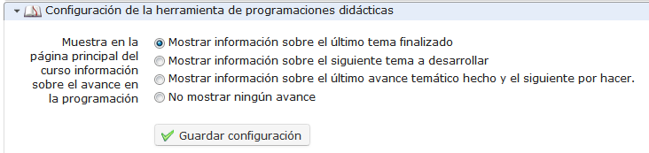

## Configuración de las programaciones didácticas {#configuraci-n-de-las-programaciones-did-cticas}

La sección de _Configuración de la herramienta de programaciones didácticas_  te permite elegir qué opciones de _Progreso del curso_ será visible en la página principal del curso (a la derecha de la sección de introducción).

Ilustración 190: Configuración del curso – Progreso del curso

Estas opciones requieren una adecuada comprensión de la herramienta de progreso o avance en la programación de curso. El resultado de la tercera opción, por ejemplo, será similar al mostrado en la imagen que aparece a continuación).

Ilustración 191: Progreso del curso – Mostrado en la página de inicio del curso