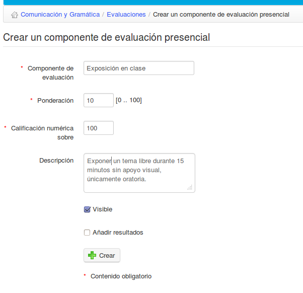

## Crear un componente de evaluación presencial {#crear-un-componente-de-evaluaci-n-presencial}

Un componente de evaluación presencial se refiere a cualquier actividad no desarrollada dentro de la plataforma Chamilo. Es posible añadir como “presencial” cualquier tipo de actividad evaluable de manera que pase a formar parte de la evaluación global del curso. Para ello, necesitarás, claro está, añadir manualmente los principales detalles a la evaluación. Para hacer esto, en la página principal del apartado de Evaluaciones, haz clic en el icono de _Añadir componente de evaluación presencial_ en la barra de herramientas.

Ilustración 125: _Evaluaciones – componente presencial_

Es necesario cumplimentas el nombre, ponderación y puntuación máxima del componente, y el profesor puede también elegir si hacer la actividad visible y si desea calificar a los estudiantes.

Sólo podrás añadir resultados de componentes presenciales para estudiantes inscritos en tu curso. Calificar este tipo de actividades es sencillo – clic en la actividad correspondiente en la página principal del apartado de _Evaluaciones_ y después, bien en el icono de _editar_ o en la lista de estudiantes en la barra de herramientas para calificar a un grupo de estudiantes:

Ilustración 126: Evaluaciones – Componentes presenciales – Cumplimentar resultados

Las calificaciones serán añadidas a los datos de evaluación e incluidas en el libro de evaluaciones de cada estudiante.