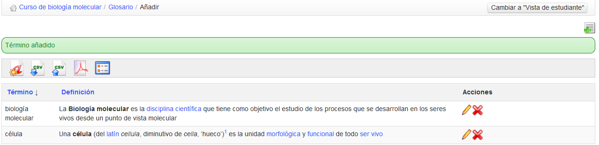

# Glosario {#glosario}

Chamilo incluye una herramienta de glosario  para permitir al profesor definir términos o expresiones en la misma forma que un diccionario. No hay palabras definidas por defecto – es responsabilidad del docente el definir aquellos términos que considere importantes.

Ilustración 139: Glosario – Vista de tabla