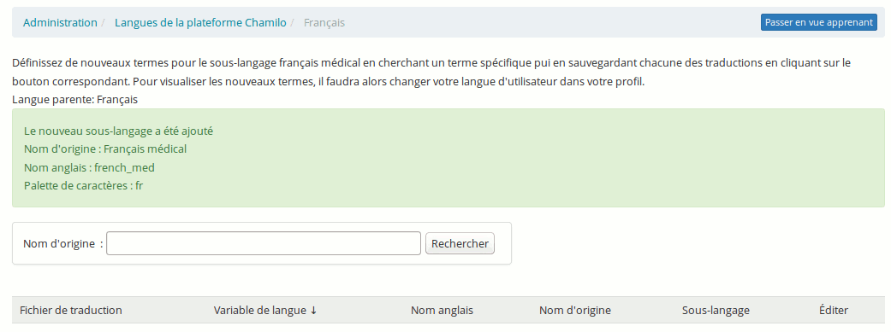
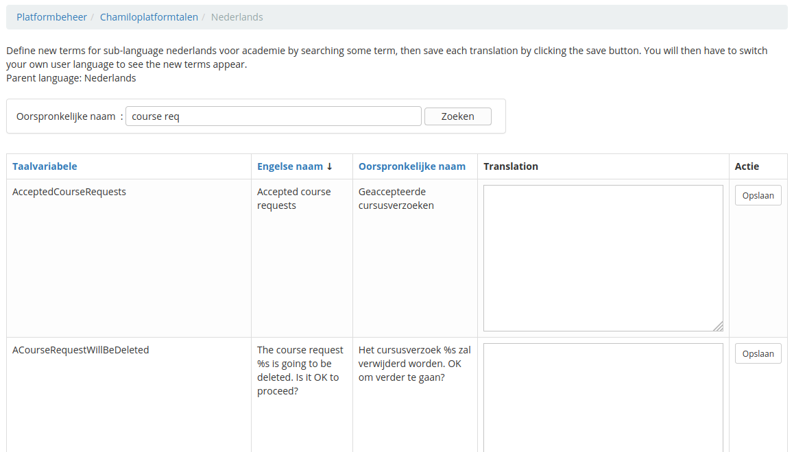
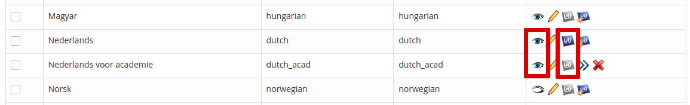

# Administrer la plateforme

Illustration : Administration - Bloc plateforme

Cette configuration se fait via l'onglet « Administration ».

## Paramètres de configuration de Chamilo 

Ces paramètres regroupent plusieurs catégories, partiellement reprises dans la capture d'écran ci-dessous :

Illustration : Administration - Catégories de paramètres d'administration

Chamilo propose une configuration par défaut, qui n'est pas forcément celle souhaitée par les utilisateurs de la plateforme. Même si toutes les options méritent d'être expliquées, car un administrateur doit connaître parfaitement son environnement, nous allons aborder ici celles qui sont plus spécifiques et qui ont besoin d'être modifiées par rapport à la configuration d'origine. Vous trouverez, en annexe, une liste complète des options disponibles avec leurs explications.

### Plateforme 

Cet onglet permet de configurer, entre autres, les informations qui seront visibles par tous les utilisateurs sur la plateforme d'une manière générale, l'inscription des utilisateurs ou encore des options qui n'entrent dans aucune autre catégorie. Ces informations peuvent être cachées ou montrées \(ne pas compléter les champs ou désactiver une option\).

**Inscription** : permet d'autoriser ou non la création d'un compte par un utilisateur, ou de laisser à l'administrateur de la plateforme le choix d'accepter ou non l'inscription, ce qui peut donner un travail superflu à l'administrateur \(ou l'éviter\).

**Inscription en tant qu'enseignant** : donne le droit à n'importe quel utilisateur qui s'enregistre de se donner le statut d'enseignant et de créer le cours qui en découle \(il est très rare de souhaiter cette option pour un portail privé\).

**Activer la vue étudiant** : permet, au sein d'un cours, de visualiser les écrans comme si l'enseignant était un étudiant, et ainsi s'assurer que les éléments apparaissent comme il le souhaite.

**Page d'accueil des utilisateurs identifiés :** pointe par défaut sur l'onglet « Mes cours », mais en fonction des besoins peut être changée a « Page d'accueil ».

**Autoriser les utilisateurs non-administrateurs à créer des cours** : cette option autorise les enseignants \(non administrateurs\) à créer des cours dans le portail.

**Accès des apprenants au catalogue de formations** : voir ou non le catalogue de cours afin de s'y inscrire si cela est autorisé.

**Activer les termes et conditions** :active la page des termes et conditions. Cette page permet d'introduire un aspect légal à l'usage du campus. Ces termes et conditions peuvent être édités à partir de la page d'administration \(par langue\) et pourront être affichés aux utilisateurs selon les options sélectionnées \(Administration → Plateforme → Configuration de la page d'inscription → Éditer l'avis\).

### Cours 

Cet onglet permet de configurer de nombreuses options liées aux cours, que ce soit en rapport avec l'utilisateur du cours, son créateur ou les options techniques du cours. Adaptez-les en fonction de vos besoins.

Concernant l'ergonomie de la plateforme, des choix sont possibles comme celui de la **Vue de la page d'accueil** ou l'ajout d'un **Raccourcis vers les outils**.

**Catégories de** **groupe\*\***s :\*\* permet aux administrateurs de cours de créer des catégories dans le module "groupes".

**Quota par défaut des documents** : le quota par défaut de l'outil documents est de 100.000.000 [octets](http://fr.wikipedia.org/wiki/Octet)\(environ 95 Mio\). Il est possible de passer outre ce paramètre pour des cours spécifiques \(Administration → Cours → Modifier\).

**Quota par défaut des groupes** : son quota est de 5.000.000 [octets](http://fr.wikipedia.org/wiki/Octet), modifiable \(environ 4.7 Mio\).

**Vue par défaut du forum** : pour choisir la vue par défaut du forum, modifiable par les administrateurs de cours pour chaque forum.

**Autoriser thème graphique par** **cours** : ici, il faut choisir de laisser aux apprenants la liberté de choisir le thème graphique. Cela dépend du profil d’apprenants utilisant la plateforme.

**Montrer les termes du glossaire dans les documents** : ici, il faut définir la façon d'afficher les liens vers le glossaire à partir des documents. Trois choix sont possibles :

* aucun lien \(entre le document et le glossaire\),
* manuellement : montre une icône de glossaire dans l'éditeur en ligne pour marquer les termes qui s'y trouvent,
* automatiquement : ajoute des liens automatiquement vers tous les termes du glossaire trouvés dans le document.

**Autoriser les formateurs à éditer le contenu des sessions de cours** : pour autoriser les enseignants à éditer le contenu des sessions de cours \(modifier les documents, parcours, exercices, liens, etc\).

**Afficher les termes du glossaire dans les outils extra :** afficher les termes du glossaire dans les outils de parcours et exercices. Attention, afficher les termes du glossaire dans un examen où l'on demande aux apprenants de définir un terme peut-être contre-productif...

### Sessions 

Comme son nom l'indique, cette section permet de modifier les options liées aux sessions. Les sessions sont expliquées plus loin dans ce guide et représentent un mécanisme puissant mais complexe pour gérer les cours dans le temps.

### Langue 

Dans cet onglet, il est possible de changer la langue de la plateforme et d’autoriser l’utilisation d’un sous-langage.

**Autoriser la définition et l'usage de sous-langages** : cette option rend possible la définition de variations pour chacun des termes de langage utilisé dans l'interface de la plateforme, sous la forme d'un langage basé sur et étendant un langage existant. Cette option se trouve dans la section des langues du panneau d'administration, sous la forme d'une icône d'ajout.

### Utilisateurs 

Dans cet onglet, on règle les propriétés du compte utilisateur et ses informations.

**Mise à jour du profil** : pour définir quelle partie du profil sera modifiable. Par défaut, l'adresse de courriel n'est pas cochée.

**Agenda perso** : permet aux utilisateurs d'ajouter des évènements dans leur agenda personnel. Cette fonctionnalité est désactivée par défaut.

### Outils 

Dans cette section, il est possible de configurer les propriétés des outils au sein des cours.

**Outils actifs à la création du cours** : ce sont les outils qui sont visibles par défaut lorsqu'un cours est créé.

**Les fichiers supprimés ne pourront être restaurés** : si un fichier est supprimé dans l'outil documents, il le sera définitivement. Par défaut, il n'est pas supprimé définitivement et une sauvegarde peut être récupérée sur le serveur par l'administrateur \(un suffixe _DELETED_ est ajouté au fichier sur le disque\).

**Partage de fichiers: taille maximale des documents** : la taille maximale que peut avoir un document dans la section de partage de fichiers. Elle est autorisés à 100.000.000 octets par défaut, ce qui fait environ 95,4 Mio. Attention, l'envoi de fichiers sur le serveur est également conditionné par des variables de configuration de PHP. En particulier, les variables _post\_max\_size_ et _upload\_max\_filesize_ dans votre _php.ini_ limitent le volume des fichiers envoyés sur le serveur.

**Partage de fichier: autoriser l'envoi par courriels** : la fonctionnalité d'envoi par courriel, permet d'adresser un document personnel à chaque utilisateur.

**Activer l'éditeur d\*\***e courriel ****en ligne\*\* : cette option permet l’ouverture de l’éditeur en ligne par un simple clic sur une adresse de courriel.

### Éditeur WYSIWYG 

**Gestionnaire de fichiers avancé pour l'éditeur WYSIWYG** : permet d'activer le gestionnaire de fichiers avancé pour l'éditeur WYSIWYG \(ou éditeur en ligne\). Attention : cette option ajoutera un nombre considérable d'options au gestionnaire de fichiers s'ouvrant en fenêtre pop-up lors de l'envoi d'un fichier sur le serveur.

WYSIWYG est une abréviation de _What You See Is What You Get_, ou _Ce que vous voyez est ce que vous obtenez_, une autre manière de dire que l'éditeur nous permet de visualiser directement à l'écran ce que nous éditons au format HTML.

**Éditeurs mathématiques** : MimeTeX, ASCIImathML ou ASCIISVG: ce sont trois options séparées, mais qui permettent toutes les trois d'activer un éditeur de formules et caractères mathématiques. Pour les essayer, c'est très simple, activez un éditeur et dirigez-vous vers l'outil documents de n'importe quel espace de cours. Là, utilisez l'icône de l'éditeur activé \(en général un symbole de racine carrée\).

### Sécurité 

**Type de filtrage sur l'envoi de documents** : il existe un choix entre deux filtrages, la blacklist ou la whitelist :

* Blacklist : La liste noire \(_blacklist_\), est un mode de filtrage qui permet d'éliminer les fichiers dont les extensions figurent dans la liste. Les fichiers sans extension sont acceptés d'office. La casse \(majuscule/minuscule\) n'a pas d'importance.
* Whitelist : La liste blanche \(_whitelist_\), est un mode de filtrage qui permet d'éliminer \(ou de renommer\) les fichiers dont les extensions ne figurent **pas**dans la liste. Cette méthode est généralement considérée comme plus sûre mais plus contraignante que la blacklist. Les fichiers sans extension sont acceptés d'office. La casse \(majuscule/minuscule\) n'a pas d'importance.

**Permissions des nouveaux répertoires** : cette option définit les permissions allouées aux nouveaux répertoires et permet d'augmenter la sécurité contre les attaques de pirates envoyant des contenus dangereux sur le serveur.

_**Attention** :_ la valeur par défaut est « 0777 » suite à une série de problèmes rencontrés par des utilisateurs avec des permissions plus restrictive. Cette valeur garantit une plus grande portabilité, mais dans certains cas \(hébergements bon marché\), une valeur aussi permissive n'est pas autorisée. Le problème se manifeste sous la forme d'une erreur sur la page de cours juste après sa création. Essayez de faire varier cette valeur entre 0777, 0775, 0755 et 0750.

**Permettre l'enregistrement d'utilisateurs par les coaches** : autorise les coaches à ajouter des utilisateurs dans le portail et à les inscrire dans une session.

**Donner des droits étendus au coach** : par défaut, cette option n'est pas autorisée. Elle donne aux coaches les mêmes droits qu'à l'enseignant sur les outils de production.

**Étendre les droits des coaches sur les enquêtes** : par défaut autorisée, cette option donne aux coaches le droit de créer et de modifier les enquêtes.

**Autoriser l'inscription d'utilisateurs aux cours par l'administrateur du cours** : cette option autorise l'administrateur du cours à inscrire des utilisateurs au sein de son cours. Cette option est généralement désactivée sur les portails pour lesquels une équipe d'administrateurs ou un système tiers se charge des inscriptions des étudiants manuellement ou automatiquement.

### Améliorations des performances 

 **Diviser le répertoire de téléchargement des utilisateurs** : cette option est définie sur la page correspondante et permet de passer au-delà de 100.000 utilisateurs mais requiert une modification manuelle du répertoire _main/upload/users/_.

Depuis la version 1.8.8.4, vous disposez aussi d'un fichier _documentation/optimization.html_

### Cahier de notes 

Les paramètres du cahier de notes de la page d'administration sont des paramètres globaux, redéfinissables \(dans la plupart des cas\) au niveau du cours.

**Coloration des notes :** active la coloration des notes. Il est également nécessaire de définir quelles notes seront affichées en rouge, par exemple.

**Affichage paramétrable des scores** : active le paramétrage des scores. Il est nécessaire de sélectionner quels scores seront donnés pour quels points obtenus.

**Limite de couleur des notes** : c'est le pourcentage limite sous lequel les notes seront colorées en rouge. Par défaut, à **50**.

**Affichage de la limite supérieure** : permet d'activer l'affichage de la limite supérieure des notes.

**Nombre de décimales** : permet de configurer le nombre de décimales autorisées dans les scores, par défaut « 0 ».

### LDAP 

Cette section permet de configurer la synchronisation avec un serveur LDAP. Elle contient une longue série de paramètres qui requièrent une bonne connaissance de LDAP.

Pour plus d'information, consulter un guide spécifiques à LDAP. Notez qu'un serveur ActiveDirectory peut être utilisé comme serveur LDAP, moyennant son activation du mode de compatibilité LDAP.

### Fuseaux horaires 

**Utiliser les fuseaux horaires utilisateurs :** permet d'activer ou désactiver la gestion des fuseaux horaires pour les utilisateurs. Activer les fuseau horaires permet

* d'héberger des portails pour des clients répartis sur plusieurs fuseaux horaires sur un seul serveur
* d'afficher les délais de remise de devoirs ou l'agenda précis d'évènements tels qu'une réunion par vidéoconférence, selon le fuseau horaire dans lequel se trouve chaque utilisateur

**Fuseau horaire :** permet de définir le fuseau horaire utilisé par défaut sur le système.

### Suivi 

Cette section permet la configuration d'éléments globaux importants au niveau SEO et analytique de votre portail Chamilo, notamment la configuration des en-tête et pied de page pour y placer des widgets de suivi au travers de _Google Analytics_, par exemple.

### Recherche 

La recherche full-text permet d'indexer les textes des documents importés dans Chamilo. Cette fonctionnalité était initialement réservée à la version médicale. Elle requiert l'installation, au niveau du serveur, du module Xapian de PHP et d'une série de librairies d'extraction de texte depuis des formats de documents variés, ce qui est rarement possible sur un hébergement mutualisé non spécifique à Chamilo.

N'hésitez par à faire appel aux fournisseurs officiels de Chamilo pour un hébergement spécialisé ou des services d’accompagnement.

### Feuilles de style 

 Les feuilles de style permettent de définir le style visuel global de la plateforme.

Illustration : Administration - Configuration des feuilles de style

Depuis la version 1.8.7, il vous est possible de créer vos propres feuilles de style et de les envoyer sur le serveur. Pour cela, récupérez une copie de l'un des styles existants dans _chamilo/app/Resources/public/css/themes_ \(ou, dans les versions antérieures à la 1.10, dans _chamilo/main/css/_\) et changez le nom du répertoire récupéré \(sur votre ordinateur, pas sur le serveur\). Modifiez le style à votre goût. Une fois satisfait, envoyez le répertoire au serveur sous forme d'un fichier .zip et donnez-lui un nom propre à votre portail. Ensuite, sélectionnez le style dans la liste déroulante. S'il vous convient, cliquez sur _Enregistrer les paramètres_ pour l'appliquer comme style par défaut sur votre portail.

### Modèles 

 Les modèles de documents permettent d'accélérer la création de contenu dans Chamilo. Créer de nouveaux modèles dans cette partie de la plateforme l’impactera globalement.

Créer, éditer et supprimer des modèles est très simple, et se rapproche fort de l'édition de documents d'un cours. N'hésitez pas à faire un essai sous forme d'un nouveau modèle \(vous pourrez toujours le supprimer par la suite\).

### Plugins 

 Cet onglet permet d'activer les plugins présents sur le serveur, dans le dossier « plugin ».

Illustration : Administration - Installation de plugins

Le plugin appelé _BigBlueButton_, une fois activé, vous permet de connecter votre portail Chamilo à un serveur de vidéoconférence. Toutefois, l'installation du serveur de vidéoconférence n'est pas incluse dans Chamilo. Il vous faudra donc l'installer par vous-même ou faire appel à l’un des fournisseurs officiels.

> **Note** : Afin d'éviter une dépendance forte par rapport aux services de nos fournisseurs, nous avons opté pour un système de vidéoconférence facile à installer \(30 minutes à peine sur un serveur adapté\). Un service de vidéoconférence pose toutefois un problème à un autre niveau : il s'agit d'un service coûteux à maintenir, puisqu'il demande un serveur dédié \(ou presque\) qui soit en ligne à tout moment, disposant d’une bonne bande passante \(puisqu’il doit transférer de la vidéo en temps réel\), et surveillé par du personnel compétent. C'est la raison de sa non-inclusion au sein Chamilo et de la possibilité mise en avant de faire appel à un fournisseur officiel.

Notez qu'un connecteur vers _OpenMeetings_ est également disponible au besoin.

### LDAP 

La section correspondante à LDAP donne simplement une série d'instruction afin de faciliter à l'administrateur système la configuration d'un back-end LDAP pour les processus d'authentification des utilisateurs de Chamilo.

### CAS 

 Cette section permet de configurer des serveurs d'authentification CAS. Il est possible que certaines modifications de fichiers soient nécessaires étant donné que les serveurs CAS peuvent proposer des configurations très spécifiques. À lire avec attention.

### Shibboleth 

 Cette section permet de configurer des serveurs d'authentification [Shibboleth](https://shibbolet.net/). Il est possible que certaines modifications de fichiers soient nécessaires étant donné que les serveurs Shibboleth peuvent proposer des configurations très spécifiques. À lire avec attention.

### Facebook 

Cette section permet de configurer des serveurs d'authentification Facebook. Il est possible que certaines modifications de fichiers soient nécessaires étant donné que les serveurs Faceook peuvent proposer des configurations très spécifiques. Dans le cas de Facebook, la génération d'une « application » Facebook sera nécessaire pour pouvoir profiter de l'authentification partagée. À lire avec attention.

### Crons 

Cette section permet de configurer les paramètres des processus planifiés qui doivent être exécutés à des moments prédéterminés. Ceux-ci requièrent la configuration de fichiers sur le système d'exploitation du serveur Chamilo. À lire attentivement.

## Langues 

Cet outil permet de définir quelles langues seront visibles par les utilisateurs lors de leur inscription sur la plateforme.

Illustration : Administration - Gestion des langues

Au travers de l'activation des sous-langages, cet outil permet également de redéfinir certains termes de l'interface du portail. Pour cela, activez l'option dans la page de configuration des langues \(voir 4.1.1.4 Langue \).

Illustration : Option de sous-langages dans les paramètres de configuration

Ensuite, ouvrez la page de configuration des langues. Vous y trouverez une icône supplémentaire, qui permet d'ajouter un « sous-langage » à n'importe quel langage existant.

Illustration : Liste des langages avec option de sous-langages

La définition d'un sous-langage est assez simple : il vous suffit d'indiquer le nom du sous-langage, son code ISO et son nom anglais \(le nom du répertoire\).

Disons que vous voulez redéfinir certains termes de l'interface de Chamilo parce que vous utilisez un jargon professionel \(ex. : médical, technique\) ou local \(ex. : en école primaire\), et que les termes français proposés par défaut ne vous conviennent pas. Par exemple, vous trouvez que le terme « Cours » ne convient pas, et qu'il doit se nommer « Formation ».

Attention : il est toujours plus facile de définir un sous-langage préalablement à la création de cours utilisant un langage imprécis.

Voici comment procéder…

### Création du sous-langage 

 Cliquez sur l'icône de création de sous-langage à l'extrême droite de la ligne de langue française.

Compléter le formulaire en indiquant un nom commun pour le langage ainsi qu'un nom sans espaces, ni ponctuation, ni accents pour le « nom anglais » et un code ISO de deux lettres qui doit correspondre au langage de base que vous déclinez ici \(_fr_ dans ce cas-ci\).

Cochez _Visibilité_ et cliquez sur _Créer sous-langage_. Le message de confirmation vous propose de retourner à la liste des langages actifs. Cliquez sur la barre de navigation horizontale pour retourner sur la liste de langues.

Illustration : Message de confirmation de création d'un sous-langage

La page de listing affiche une ligne un peu différente. Cliquez sur l'icône de double flèche pour définir vos propres termes.

Illustration : Administration - Liste des langages, avec sous-langage

### Définir ses propres termes linguistiques 

La nouvelle page est une page de recherche. Si vous voulez modifier les termes « Cours » en « Formation », lancez d'abord une recherche sur « Cours ».

Illustration : Administration - Redéfinition des termes d'un sous-langage

Une fois la recherche effectuée, redéfinissez chacun des termes apparaissant dans la colonne _Nom d'origine_ en le réécrivant \(modifié\) dans la colonne _Sous-langage_. Une fois satisfait, cliquez sur _Enregistrer._ Veillez à sauvegarder chacun des nouveaux termes progressivement. Notez que pour le terme « Cours », on retrouve 814 occurrences, ce qui peut prendre un certain temps à corriger...

### Assigner le nouveau sous-langage 

Finalement, vous avez défini entièrement votre sous-langage, il ne vous reste plus qu'à l'assigner par défaut à tous les nouveaux utilisateurs et nouveaux cours. Pour cela, retournez dans la liste des langues, et désactivez toutes les autres langues.

Illustration : Administration - Sous-langages - Visibilité et usage par défaut

Pour votre sous-langage, cliquez sur la troisième icône pour en faire la langue par défaut de la plateforme. Ça y est, votre plateforme est personnalisée selon votre secteur, votre industrie ou votre institution !

**Attention** : Dans certains cas, la désactivation d'une langue ou d'un sous-langage \(ou l'activation par défaut d'une autre langue ou d'un autre sous-langage\) peut générer l'apparition d'un message en haut de la liste des langues, qui demande confirmation pour la désactivation. Veillez, dans ces cas-là, à bien réviser le dessus de la liste pour vous assurer que ce message ne bloque pas l'activation.

> **Note** : Cette fonctionnalité avancée répond à une double demande de la part de nos utilisateurs et des clients de nos fournisseurs officiels :
>
> * permettre l'édition, à partir de l'interface Web, des termes de l'interface
> * permettre la réutilisation de ces termes, sans perte, après une mise à jour, et sans affecter les paquets de langues par défaut

## Plugins 

L'entrée « Plugins » du bloc d'administration de la plateforme est simplement un raccourci vers la section correspondante de la première entrée, mentionnée plus haut.

## Régions 

Les régions sont les zones de l'écran dans lesquelles peuvent apparaître les sorties visuelles des plugins. Jusqu’à la version 1.11 incluse, cette fonctionnalité est relativement inutile, mais certains plugins \(comme celui de tour guidé\) exigent l'assignation d'une région spécifique pour fonctionner.

## Annonces du système 

Permet d'ajouter une annonce globale sur la page principale de la plateforme \(et au-dessus de la liste de cours\).

Illustration : Formulaire de création d'annonce du système

Il est possible de choisir la visibilité/invisibilité de l'annonce \(par date de début et date de fin\), les rôles auxquels cette annonce est dirigée, ainsi que d'envoyer l'annonce par courriel.

Cet outil est particulièrement pratique pour envoyer une annonce de maintenance ou de mise à jour du portail ou un changement de conditions d'utilisation.

La version 1.10 a ajouté une série de paramètres de configuration à cette fonctionnalité :

* Envoyer courriel permet à l'administrateur de décider si l'annonce s'enverra par courriel ou pas. Attention, pour les portails de dizaines de milliers d'utilisateurs, cette annonce pourrait prendre plusieurs heures \(voir plusieurs jours\) à s'envoyer, en particulier lorsque le portail Chamilo est connecté à un serveur de courriels SMTP Office365, particulièrement lent pour ce genre d'actions massives. Les courriels peuvent également être envoyés après la création de l'annonce, en éditant celle-ci et en marquant cette option avant de sauvegarder.
* Ajouter au calendrier permet de rajouter l'annonce comme un événement global \(voir section suivante\) qui apparaîtra dans le calendrier de tous les utilisateurs de la plateforme
* M'envoyer un courriel à des fins de test est une option permettant d'envoyer une simulation du courriel final uniquement à l'administrateur qui est occupé à préparer l'annonce.

Notez que, dans le cas de la préparation d'une annonce pour une date ultérieure, sélectionner l'option d'envoi de courriel en enverra bien immédiatement. Celui-ci n'attendra pas la date de début pour s'envoyer.

## Agenda global 

L'agenda global permet d'ajouter des événements visibles depuis l'agenda de tous les utilisateurs de la plateforme.

Illustration : Administration - Agenda global

La fonctionnalité est en tous points similaire à celle que l'on retrouve dans l'espace de cours, mais l'ajout d'un événement y a une portée globale puisque tous les utilisateurs en seront conscients grâce au positionnement dans leur calendrier.

## Configurer la page d'accueil 

Dans cette configuration, il est possible de modifier plusieurs informations :

* éditer la page d'accueil,
* éditer les catégories \(de cours\),
* insérer des liens et éditer l'avis

Illustration : Administration - Configurer la page d'accueil

Notez que cette fonctionnalité est propre à la langue choisie. Si vous définissez une page d'accueil en français, celle-ci ne sera visible que si le français a été sélectionné. Cela vous permet de configurer des messages d'accueil différents selon vos utilisateurs.

Quelques options supplémentaires sont disponibles depuis la version 1.9 :

* la possibilité de créer des liens qui apparaissent sous forme d'onglets du menu principal
* la possibilité de demander la création de la même page d'accueil pour toute une série de langues disponibles

## Configuration de la page d'inscription 

Cette fonctionnalité permet d'ajouter un avis multimédia en haut de page d'inscription. Par exemple, vous pouvez enregistrer une vidéo expliquant comment s'enregistrer et quelles sont les conditions d'utilisation du portail, et la placer dans cette section d'introduction.

Les champs du formulaire d'inscription sont configurables dans la section _Utilisateurs_ des paramètres de configuration de la plateforme.

## Statistiques 

Cet outil permet de générer des graphiques statistiques pour quatre catégories de données:

* cours,
* utilisateurs,
* système,
* social.

Illustration : Administration - Statistiques globales

Bien que les données statistiques affichées par défaut par Chamilo soient assez sommaires, elles permettent d'obtenir une bonne idée générale de l'utilisation de la plateforme ainsi que des possibilités de cette fonctionnalité, et sont aisément extensibles à toutes les données présentes dans la plateforme. Si nécessaire, n’hésitez pas à faire appel à l’un des fournisseurs officiels pour vous assister à l’extension de ces statistiques à vos besoins particuliers.

Les _Activités importantes_ regroupent les actions d’administration du portail : création et suppression de cours, d'utilisateurs et de sessions, édition de paramètres de configuration et quelques autres activités importantes.

