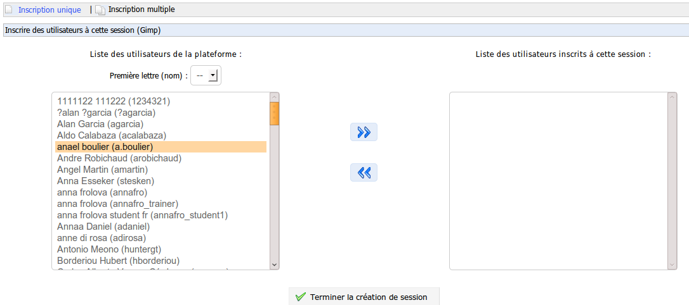
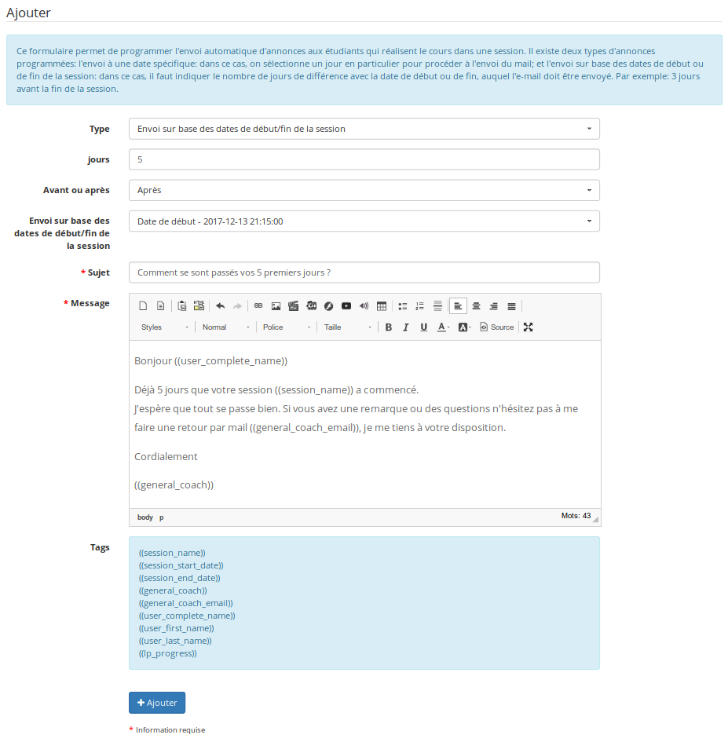

# Administrer les « Sessions de formation »

Une session est un dispositif qui se place « par-dessus » un ou plusieurs cours et permet de former des groupes d'apprenants qui pourront suivre les mêmes cours simultanément, dans des _espaces virtuels_ séparés.

Les sessions peuvent regrouper différents cours de différentes catégories.

Le schéma suivant a déjà été utilisé dans la section utilisateurs, mais nous nous intéresserons ici plus au cadre nommé _Session_.

_Général - Diagramme des sessions_

Comme on peut le voir, la session est définie par un administrateur de sessions \(ou un administrateur global\), et possède un tuteur général de session qui surveille le bon déroulement de celle-ci, dans laquelle se déroulent plusieurs cours dictés par des tuteurs de cours.

Bien que ce ne soit pas visible sur ce schéma, les sessions permettent d'établir des limites temporelles pour les tuteurs et apprenants de cette session.

## Administrer les « Sessions »

La gestion des sessions se fait avec des icônes connues, et d'autres un peu plus spécifiques.

| Icônes | Fonctionnalités |
| :--- | :--- |
|  | Modifier les paramètres/informations d'une session |
|  | Supprimer \(après demande de confirmation\) une session |
|  | Inscrire des utilisateurs à une session |
|  | Ajouter des cours à une session |
|  | Ajouter une session ou une session à catégorie |

Tableau 1: Administration - Icônes de gestion des sessions

## Ajouter une session

Pour ajouter une session :

* Administration,
* Session → « Ajouter une session »,
* Compléter les champs.

1. Il faut alors:

* donner un nom à la session,
* mettre un « coach » qui aura tous les droits et privilèges pour tous les cours appartenant à la session,
* donner une catégorie de session,
* définir s'il y a une limite de temps ou non ; si oui, définir la date de début et de fin,
* donner ou non un accès au « coach » avant et après la session,
* définir la visibilité de la session une fois la formation terminée :
  * lecture seul : une fois la session terminée \(la date de fin dépassée\) l'apprenant peut encore rentrer dans les cours qui la composent, mais ne peut pas réaliser d'exercice, ni enregistrer d'avancement dans les parcours. Il peut seulement visualiser les éléments du cours. C'est l'option par défaut car typiquement un apprenant qui a réalisé un cours, plusieurs mois après avoir fini peut avoir besoin de revenir à ce qu'il avait appris pour s'en rappeler, mais on ne veut pas qu'il réalise les exercices car sa formation est terminé et donc on en veut pas qu'il puisse modifier ses résultats.
  * accessible : Une fois la session terminée \(la date de fin dépassée\) l'apprenant peut continuer à rentrer dans les cours qui la composent dans les mêmes conditions que quand il a réalisé la session, au niveau de l'accès à la session c'est la même chose que s'il n'y avait pas de date de fin \(sauf que la session n'apparaît plus sur la page Mes cours, mais dans l'historique\).
  * non accessible : Une fois la session terminée \(la date de fin dépassée\) l'apprenant n'a plus accès à la session, il ne peut plus rentrer dans le cours, l'accès lui est refusé.
* Étape suivante

_Administration - Création de session_

Depuis la version 1.10, différentes options sont disponibles pour les dates :

* Accès par durée
  * Permet la configuration d'un délai \(en nombre de jours\) durant lequel l'apprenant aura accès à la session, depuis le moment où il y entre pour la première fois
* Accès par dates
  * Permet de définir des dates de début et/ou de fin d'accès fixes durant lesquelles un apprenant aura accès à la session
  * À partir de la version 1.10, il est possible de configurer 6 dates :
    * Date de début d'accès \(applicable aux apprenants\)
    * Date de fin d'accès \(applicable aux apprenants\)
    * Date de début à afficher \(simple champ informatif utilisé dans le catalogue\)
    * Date de fin à afficher \(simple champ informatif utilisé dans le catalogue\)
    * Date de début d'accès pour les coaches \(applicable aux tuteurs\)
    * Date de fin d'accès pour les coaches \(applicable aux tuteurs\)

2. L'étape suivante demande d'ajouter des cours dans la session :

Choisissez un \(ou plusieurs\) cours et cliquez sur la flèche bleue pour l'ajouter \(ou l'enlever\).

**Inscription unique :** permet de ne pas être envahi par le nombre de cours existant sur la plateforme. Il faut écrire le début du titre du cours dans le champs de recherche et les cours correspondants apparaissent.

_Administration - Assigner des cours à une session_

Suite à une série de difficultés liées à la gestion des cahiers de notes dans les sessions, nous avons ajouté une option pour permettre l'importation dans la session de la structure du cahier de notes tel que défini dans le cours de base. Il suffit, pour cela, de sélectionner l'option \(case à cocher\) indiquée pour que tous les cours voient leur cahier de note copié dans la session.

3. La dernière étape permet d'enregistrer les utilisateurs qui utiliseront la session.

Choisissez les utilisateurs et, comme pour les cours, ajoutez-les avec la flèche bleue.

**Inscription unique :** permet de retrouver un seul utilisateur en mettant son nom ou son prénom dans le champs de recherche d'où ressort une liste.

_Administration - Assigner des utilisateurs à une session_

## Résumé de session

À partir de la page de liste de session, quand on clique sur le nom de la session on arrive sur une page qui permet de voir toutes les informations concernant la session. Les informations générales en premier avec la gestion des annonces programmées en bas, puis la gestion de la liste des cours de la session et enfin les apprenants inscrits à la session.

_Administration - Résumé d'une session_

## Annonces programmées

Cette fonctionnalité permet de programmer l'envoi automatique d'annonces aux étudiants qui réalisent le cours dans une session. Elle est disponible depuis la version 1.11.6 de chamilo.

Pour l'activer il faut rajouter dans le fichier app/config/configuration.php la ligne suivante :

```text
$_configuration['allow_scheduled_announcements'] = true;
```

Et appliquer un changement à la base de données:

```text
CREATE TABLE scheduled_announcements (id INT AUTO_INCREMENT NOT NULL, subject VARCHAR(255) NOT NULL, message LONGTEXT NOT NULL, date DATETIME DEFAULT NULL, sent TINYINT(1) NOT NULL, session_id INT NOT NULL, c_id INT DEFAULT NULL, PRIMARY KEY(id)) DEFAULT CHARACTER SET utf8 COLLATE utf8_unicode_ci ENGINE = InnoDB;
```

Ensuite depuis la page de résumé de session vous pouvez accéder à la programmation des annonces. On arrive sur une page qui liste les annonces.

Administration - Session - Liste des annonces programmées

On retrouve en haut 2 boutons d'actions connus :

| Icônes | Fonctionnalités |
| :--- | :--- |
|  | Pour ajouter une nouvelle annonce |
|  | Pour lancer manuellement le cron de vérification des annonces en attente |

_En cliquant sur + on ouvre une nouvelle page avec le formulaire de création d'annonce._

Il existe deux types d'annonces programmées: l'envoi à une date spécifique: dans ce cas, on sélectionne un jour en particulier pour procéder à l'envoi du mail; et l'envoi sur base des dates de début ou de fin de la session: dans ce cas, il faut indiquer le nombre de jours de différence avec la date de début ou de fin, auquel l'e-mail doit être envoyé. Par exemple: 3 jours avant la fin de la session.

_Administration - Session - Annonces programmées_

## Catégories de sessions ou Périodes

Les catégories de sessions sont à considérer comme n'importe quel type de catégorisation, mais dans de nombreux cas elles permettent d'introduire la notion de période \(trimestre, semestre, année\) durant laquelle plusieurs sessions se déroulent simultanément.

La gestion des catégories de sessions est fort similaire à la gestion de catégories de cours. Nous ne rentrerons pas dans les détails ici. La seule chose à savoir est que les dates de catégories de sessions sont purement informatives et n'ont aucune influence sur la visibilité des sessions.

## Exporter des sessions

Chamilo permet d'exporter la liste de tout ou partie des sessions présentes sur la plateforme.

_Administration - Export de sessions_

Choisissez le format de l'export, choisissez une session particulière ou toutes les sessions, « Export de de session », puis téléchargez le fichier en cliquant sur le lien.

## Copie d'un cours d'une session à une autre session

Étant donnée la possibilité de créer du contenu dans un cours au travers d'une session, contenu qui ne sera visible qu'au sein de cette session, la nécessité peut survenir de récupérer ce contenu propre à une session pour le placer « par dessus » le même cours dans une **autre** session.

C’est exactement ce que fait cet outil.

Pour l'utiliser, il est nécessaire de disposer d'une session d'origine et d'une session de destination dans lesquelles on puisse retrouver le même cours, depuis et vers lequel on désire copier le contenu de la session.

_Copie de sessions, cours vers cours_

Une fois ces conditions remplies, il suffit de sélectionner la session d'origine, la session de destination, le cours d'origine, le cours de destination, puis décider si on veut copier tous les contenus de la session ou seulement certaines sections.

Note : cet outil est encore en version beta. Veuillez le traiter avec prudence et bien vérifier que son comportement est valide par rapport à vos attentes.

## Déplacer les résultats utilisateurs dans/vers une session

Dans le cas où vous passeriez d'un mode sans sessions vers un mode avec sessions, vous pourriez \(dans certains cas exceptionnels\) vouloir récupérer, dans une session, des résultats d'étudiants précédemment enregistrés dans un cours \(hors session\). Cet outil \(toujours instable\) a été développé exactement pour ça.

Son interface est complexe mais relativement auto-explicative. Si vous avez un doute, nous vous conseillons d'agir prudemment et de toujours travailler sur base d'un système sauvegardé quelques moments auparavant.

## Filières et promotions

La gestion de filières \(ou carrières\) et de promotions \(ou années de sortie\) se fait de manière pratiquement identique à la gestion académique classique de toute institution éducative, une fois combinées avec les périodes \(ou catégories de sessions\).

Voyons ci-dessous de quoi elle est composée :

_Liste de filières et promotions_

La première page nous donne une liste des filières \(lignes grisées avec titre de carrière en bleu\), des promotions de chaque filière \(première colonne\), des sessions de chacune de ces promotions \(seconde colonne\) et des cours de chacune de ces sessions.


### Filières

Pour ajouter une nouvelle filière, cliquez sur l'icône de classeurs tricolores. La page suivante apparaît.


_Formulaire de création de filière_

Seul le nom de la filière est obligatoire. Insérez une nouvelle filière \(par exemple, _Médecine_\) et sauvegardez.

La liste de filières apparaîtra différemment.

Liste de filières

Celle liste met en évidence une icône \(double feuille blanche\) permettant de copier une filière sous forme d'une nouvelle filière. La copie d'une filière copiera également toutes ses promotions \(individuellement\) ainsi que toutes ses sessions et cours.

Pour mieux comprendre la structure complète, incluant les filières et promotions, aidons-nous du schéma suivant :


_Hiérarchie de cours, sessions et filières_

### Promotions

La seule différence entre promotions et filières est qu'une promotion peut être rattachée à une filière. La création de promotions est dès lors très simple une fois que vous aurez créé une filière.


_Formulaire de création de promotion_

La création de promotions est suivie de l'enregistrement, dans ces promotions, de sessions, en utilisant l'icône de sessions pour chaque promotion, dans la liste des promotions.

On obtient alors une liste similaire à l'illustration suivante \(déjà présentée plus haut\).

_Liste de filières et promotions_

Sur cette page, nous retrouvons, outre la filière _Médecine_ et ses trois promotions, une session dans chaque promotion antérieure à 2015 et la liste de cours de chaque session. Chaque élément est un lien vers la ressource correspondante.

### Copie

La copies de promotions ou de filières se fait à partir des listes de filières \(icône de classeurs tricolores\) ou de promotions \(icône de feuilles de laurier\), en utilisant une icône de double feuille blanche.

### Cas pratique

Imaginons que votre institution dispose de deux filières : médecine et vétérinariat. Ces deux filières durent 5 ans et nous sommes en 2011. Dès la première année, nous enregistrons donc la promotion 2016 pour médecine \(PROMMED2016\) et la promotion 2016 pour vétérinariat \(PROMVET2016\).

Reprenons le schéma de distribution de filières à cours comme référence :


_Structure de filières à cours_

Ces deux promotions seront le résultat de 5 années d'études, divisées chacune en 2 semestres de cours. On aura donc 10 **périodes** de 6 mois qui mènent à la promotion en 2016.

Ces périodes sont fixes et peuvent donc être partagées par les deux filières. Dans le système, ce sont des _catégories de sessions_, que l'on nommera respectivement 2011-2 \(deuxième semestre de 2011\), 2012-1, 2012-2, 2013-1, 2013-2, 2014-1, 2014-2, 2015-1, 2015-2 et 2016-1. Bien entendu, on peut leur donner d'autres noms selon que cela convient mieux. Les périodes \(ou catégories de sessions\) sont simplement des classifications basées sur le temps. Rien de plus. Elles ne servent d'ailleurs pour aucun tri en particulier en dehors de l'affichage même de l'écran de périodes.

Au sein de chaque période, vous dicterez des cours. Certains cours sont communs à la filière de médecine et à la filière de vétérinariat, comme le cours de biologie générale \(BIOGEN\), mais les assistants qui enseignent le cours le font par groupes séparés, selon la filière.

Même si ce cours est donné plusieurs années de suite sans presque aucun changement, il n'empêche que nous ne désirons pas voir les résultats des élèves de l'année dernière s'accumuler dans l'historique du cours. Nous voudrions avoir une vue claire sur l'année de cours actuelle.

Nous mettons donc le cours dans le contexte d'une **session\*\***_._\*\* Cette session d'exemple s'étale sur un semestre et regroupe les étudiants de la promotion 2016 de vétérinariat durant la période 2011-2. Ces étudiants suivront également les cours de _biologie canine_, d'_éthique médicale_ et de _droit médical_. C'est pourquoi je voudrais réutiliser cette structure de session pour les autres cours.

J'ai donc tous les composants pour établir ma structure complète :

1. je crée une filière \(VET\)
2. je crée une promotion \(PROMVET2016\)
3. je crée une période \(2011-2\)
4. je crée ou je sélectionne les cours que ce groupe d'étudiants suivra \(BIOGEN, BIOCAN, ETHMED, DROMED\)
5. je crée une session qui contient ces cours \(VET2011-2-AAA\)
6. j'inscris un tuteur de session, qui s'occupera de la coordination
7. j'inscris des tuteurs assistants qui se chargeront des travaux pratiques pour ces cours
8. enfin, j'inscris les étudiants à la session

De cette manière, je permets à mes étudiants d'avoir accès à leurs cours actuels, et également d'avoir accès à un historique des cours antérieurs \(selon la configuration de chaque session\).

Du côté administratif, je dispose de toute la structure et pourrai répliquer d'un clic toute la hiérarchie d'une promotion l'année prochaine...

## Gérer les champs pour les sessions

Cette fonctionnalité est similaire à la gestion des champs de profil des apprenants. Bien que les champs additionnels de sessions n'aient pas d'utilité immédiate dans une installation Chamilo de base, ils représentent un atout très puissant pour l'implémentation de nouveaux plugins ou l'utilisation de plugins existants qui étendent les fonctionnalités de sessions.

