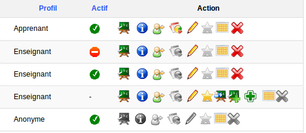
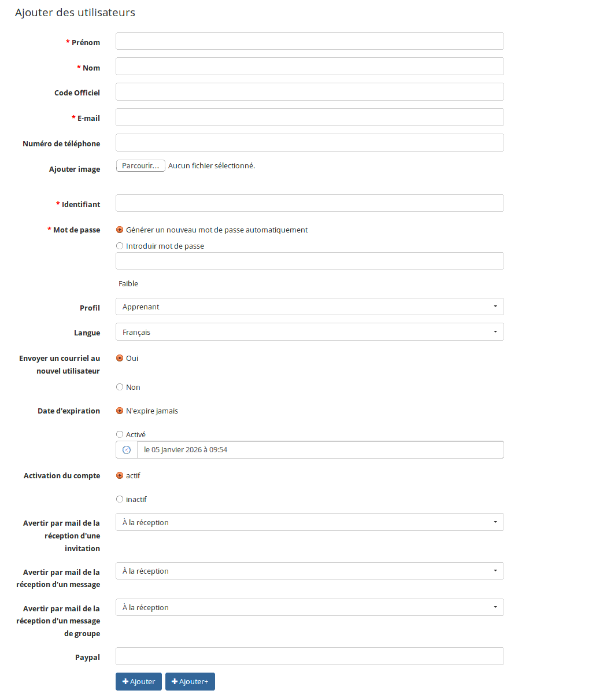
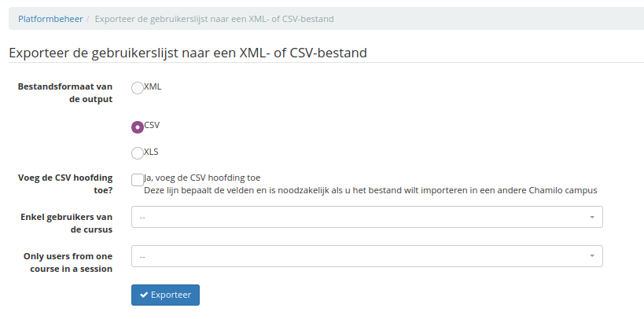
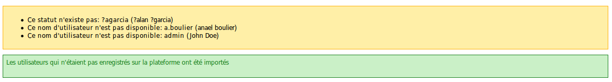
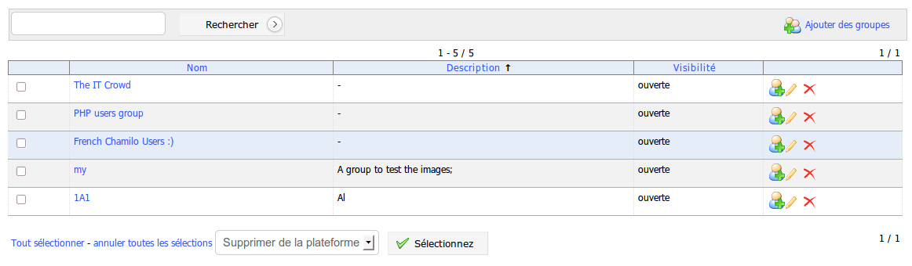

# Administrer les « Utilisateurs »

La gestion des utilisateurs se fait par des icônes génériques connues, et d'autres plus spécifiques.

| Icônes | Fonctionnalités |
| :--- | :--- |
|  | Modifier le statut de l'utilisateur en cliquant sur l'icône \(inactive si panneau interdit\) |
|  | Afficher la liste des cours auxquels l'utilisateur est enregistré |
|  | _Se connecter en tant que..._ permet à l'administrateur de prendre l'identité d'un utilisateur pour vérifier un problème qu'il rencontre sur la plateforme \(ou pour faire une démonstration rapide de la différence entre plusieurs rôles\) |
|  | Assigner des formations à l'utilisateur \(enseignant et superviseur\) |
|  | Assigner des sessions de formation \(enseignant, superviseur et administrateur de session de formation\) |
|  | Donne toutes les informations sur un utilisateur, la liste des sessions, ses formations, ses cours ; possibilité d'accéder au suivi |
|  | Assigner des utilisateurs \(enseignant et supervision\) |
|  | Donne le suivi détaillé de l'utilisateur |
|  | Éditer les paramètres d'un utilisateur |
|  | Montrer le calendrier « _free/busy »_ de l'utilisateur |
|  | Supprimer \(après demande de confirmation\) un utilisateur |
|  | Voir d'un coup d'œil si l'utilisateur est administrateur ou pas. Seuls les comptes administrateurs et administrateurs de sessions disposent d'une étoile colorée de jaune. Les autres utilisateurs affichent une étoile grise |

_Tableau 1: Administration - Icônes de gestion utilisateurs_

## Rôles utilisateurs

Les rôles d'utilisateurs constituent une part fondamentale de la gestion d'un portail Chamilo, et leur bonne compréhension permet d'aller au-delà d'un usage simple vers une gestion académique complète où chacun a sa place et ses responsabilités.

Il apparaîtra à l'administrateur commun que Chamilo dispose de 4 rôles : ceux qui apparaissent directement dans le formulaire de création d'utilisateurs de la page d'administration. Toutefois, certains de ces rôles disposent de sous-rôles dont l'on ne s'aperçoit qu'à l'usage plus poussé de la plateforme.

Afin de nous guider dans la découverte des rôles, nous utiliserons comme référence le schéma suivant, représentant à la fois la plupart des rôles et la notion de sessions \(que nous verrons plus loin dans ce guide\).


Illustration : Rôles et sessions

Dans ce schéma, nous retrouvons l'administrateur principal, l'administrateur de sessions, le coach de session, le coach de cours, le prof, l'apprenant, le responsable des ressources humaines et le supérieur d'apprenant. Sur le schéma, on distingue aussi, sur fond vert, le « triangle doré », une représentation de la relation la plus simple entre cours, professeur et apprenants. Les sessions s'utilisent dans des cas plus complexes, mais nous avons voulu y inclure ce triangle doré pour une question de simplicité de visualisation.

Dans la table ci-dessous, la ligne « Disponibilité » indique « Globale » dans le cas où ce rôle est disponible dans le formulaire de création de l'utilisateur \(en y accédant depuis l'interface d'administration\), et « Contextuelle » dans le cas où ce rôle dépend de l'appartenance de l'utilisateur à un certain contexte.

Dans la capture suivante, nous mettons en évidence les rôles disponibles de manière « globale », c'est-à-dire à la création d'un nouvel utilisateur par l'administrateur.

 

Illustration : Rôles disponibles à la création d'un utilisateur

La ligne « Accès » indique où l'on peut trouver l'interface nécessaire à l'attribution de ce rôle.

Révisons ensemble ces rôles, en partant du moins influent et en terminant par l'administrateur global.

### L'apprenant \(ou étudiant\)

| Item | Détails |
| :--- | :--- |
| Description | L'apprenant est le rôle typique de celui qui suit un ou plusieurs cours. Il a accès aux contenus des cours auxquels il s'est inscrit \(si cela lui était possible\) ou auxquels on l'a inscrit. |
| Disponibilité | Globale |
| Accès | Formulaire de création dans l'administration |
| Droits dans un cours | De base, il peut : |
| Droits globaux | De base, il peut : |

### L'assistant de cours

| Item | Détails |
| :--- | :--- |
| Description | L'assistant est un rôle étendu d'apprenant. Il s'agit en tous points d'un apprenant, mais l'enseignant peut lui assigner le rôle d'assistant dans un de ses cours via l'édition de l'utilisateur dans l'outil de liste d'utilisateurs du cours \(case à cocher « tuteur »\). |
| Disponibilité | Contextuelle : disponible uniquement au sein d'un cours |
| Accès | Liste d'apprenants dans un cours \(icône d'édition\) |
| Droits dans un cours | De base, il peut : |
| Droits globaux | De base, il peut : |

### Le responsable des ressources humaines \(ou Supervision\)

| Item | Détails |
| :--- | :--- |
| Description | Le responsable des ressources humaines est un rôle attribué à la création de l'utilisateur \(ou postérieurement au travers de l'écran d'édition de l'utilisateur\). C'est un rôle exclusif \(il ne peut pas être combiné avec un autre rôle\). Le but de ce rôle est de suivre des utilisateurs, cours ou sessions en particulier, comme le ferait un responsable des ressources humaines avec un employé dont il est le responsable. |
| Disponibilité | Globale |
| Accès | Formulaire de création dans l'administration |
| Droits dans un cours | Aucun |
| Droits globaux | De base, il peut : |

### Le tuteur \(ou coach\)

| Item | Détails |
| :--- | :--- |
| Description | Le tuteur \(ou coach\) de cours est un enseignant qui donne un cours sur base d'un contenu générique que d'autres ont préparé, mais sur lequel il peut développer son propre contenu. |
| Disponibilité | Contextuelle : Seulement disponible pour les enseignants dans le contexte d'un cours dans une session |
| Accès | Formulaire d'édition de session \(administration\) |
| Droits dans un cours | De base, il peut : |
| Droits globaux | De base, il peut : |

### Le tuteur de session \(ou coach de session\)

| Item | Détails |
| :--- | :--- |
| Description | Le tuteur de session est un enseignant qui a un rôle de coordinateur au sein d'une session. Il communique avec les autres tuteurs de la session et peut naviguer au sein de tous les cours de la session pour y observer les résultats des utilisateurs et prendre de meilleures décisions sur base d'une information plus complète. |
| Disponibilité | Contextuelle : Seulement disponible pour les enseignants dans le contexte d'une session. |
| Accès | Formulaire d'édition de session \(administration\) |
| Droits dans un cours | De base, il peut : |
| Droits globaux | Mêmes droits qu'un tuteur de cours |

### L'enseignant \(ou prof\)

| Item | Détails |
| :--- | :--- |
| Description | L'enseignant \(ou prof\) est le créateur de cours par excellence. Il crée du contenu au sein d'un cours de base qui pourra servir au sein d'une session \(dans le cas d'utilisation d'une session\). |
| Disponibilité | Globale |
| Accès | Formulaire de création dans l'administration |
| Droits dans un cours | De base, il peut : |
| Droits globaux | De base, il peut : |

### L'administrateur de session

| Item | Détails |
| :--- | :--- |
| Description | L'administrateur de session est un rôle exclusif \(il ne peut pas être combiné avec un autre rôle\) et est déterminé à la création ou l'édition de l'utilisateur depuis l'interface d'administration. Ce rôle est dédié à la gestion académique des sessions de cours : il détermine qui va dicter quel cours, à quel moment et à quels apprenants. |
| Disponibilité | Globale \(mais uniquement utile dans le contexte de l'utilisation de sessions\) |
| Accès | Formulaire de création dans l'administration |
| Droits dans un cours | Mêmes droits qu'un tuteur de session |
| Droits globaux | De base, il peut : |

### L'administrateur de portail

| Item | Détails |
| :--- | :--- |
| Description | L'administrateur de portail n'a de sens que si l'on utilise le mode multi-URL \(voir Chapitre 5. Fonctionnalités globales en page 86\). Dans ce cas, l'administrateur qui n'est pas autorisé à modifier tous les portails est un administrateur de portail \(par opposition à administrateur global\). |
| Disponibilité | Globale mais uniquement utile dans le contexte de l'utilisation d'un Chamilo en mode multi-URL \(ou « multi-portails »\). Sinon, il s'agit simplement d'un administrateur global. |
| Accès | Formulaire de création dans l'administration : sélectionner « Enseignant » puis l'option dynamique « Administration », et assigner à un portail spécifique dans l'interface de gestion multi-URL. |
| Droits dans un cours | Tous les droits |
| Droits globaux | De base, il peut : |

### L'administrateur global

| Item | Détails |
| :--- | :--- |
| Description | L'administrateur global est l'utilisateur tout-puissant. Il peut simplement tout faire. Il a accès à toutes les interfaces. |
| Disponibilité | Globale |
| Accès | Formulaire de création dans l'administration : sélectionner « Enseignant » puis l'option dynamique « Administration » |
| Droits dans un cours | De base, il peut tout faire. |
| Droits globaux | De base, il peut tout faire \(sur tous les portails, dans le cas d'une utilisation multi-URL, y compris créer d'autres administrateurs\). |

### Le supérieur d'apprenant

| Item | Détails |
| :--- | :--- |
| Description | Le supérieur d'apprenant est un rôle similaire à celui de responsable des ressources humaines. C'est un rôle exclusif \(il ne peut pas être combiné avec un autre rôle\), bien qu'il puisse également suivre des cours s'il y est inscrit comme étudiant. Le but de ce rôle est de suivre des utilisateurs, cours ou sessions en particulier, comme le ferait un responsable des ressources humaines avec un employé dont il est le responsable. À la différence de ce dernier, le supérieur d'apprenant, s'il est placé comme coordinateur d'un groupe \(social ou classe\) d'apprenants, accède à des rapports spécifiques. Enfin, le supérieur d'apprenant possède des droits particuliers en combinaison avec des plugins spécifiques \(par exemple celui d'inscription avancée\). Dans ce cas, il peut par exemple accepter ou refuser l'inscription d'un apprenant à un cours. |
| Disponibilité | Globale |
| Accès | Formulaire de création dans l'administration. Il faudra ensuite assigner cet utilisateur comme supérieur d'un apprenant en éditant cet apprenant depuis la liste d'utilisateurs de l'administration. |
| Droits dans un cours | Aucun |
| Droits globaux | De base, il peut : |

### Cas particulier: L'utilisateur anonyme

| Item | Détails |
| :--- | :--- |
| Description | L'utilisateur anonyme est un cas très particulier : il s'agit d'un utilisateur dont l'existence ne se justifie que par le besoin de concrétiser l'existence \(dans la base de données\) d'utilisateurs qui n'ont pas de compte utilisateur sur le portail Chamilo. Grâce à ce mécanisme, l'utilisateur « anonyme » peut exécuter la plupart des opérations qu'un apprenant peut exécuter, mais uniquement au sein des cours marqués comme **publics** |
| Disponibilité | Globale |
| Accès | Aucune « création » de ce type d'utilisateur. Il est créé lors de la création de la plateforme et ne devrait jamais être supprimé. |
| Droits dans un cours **public** | De base, il peut : |
| Droits globaux | De base, il peut : |

### L'invité

| Item | Détails |
| :--- | :--- |
| Description | L'invité est un utilisateur particulier, dans ce sens qu'il s'agit d'un utilisateur enregistré dans le système \(donc qui dispose d'un nom d'utilisateur et d'un mot de passe, à la différence de l'utilisateur anonyme\), et dont l'objectif est d'agir comme un apprenant mais sans laisser de trace. On entend par là que les résultats aux tests qu'il passerait éventuellement sur la plateforme ne seront pas enregistrés, de telle sorte qu'il passera relativement inaperçu dans un cours. |
| Disponibilité | Globale |
| Accès | Formulaire de création dans l'administration |
| Droits dans un cours **public** | De base, il peut : |
| Droits globaux | De base, il peut : |

## Liste des utilisateurs

Ici, l'administrateur peut gérer tous les utilisateurs d'un simple clic sur une icône qu'on a vue au-dessus.

_Administration - liste d'utilisateurs_

Afin de visualiser la liste d'utilisateurs de forme plus concrète, voici une liste restreinte des rôles et types d'options dont dispose l'administrateur par rapport à chacun de ces rôles.



_Administration - Utilisateurs - Options par rôles_

### Apprenant

| Icône | Usage | Description |
| :--- | :--- | :--- |
|  | **Actif/Inactif** | un apprenant peut être activé/désactivé à volonté |
|  | **Liste des cours** | un apprenant peut être inscrit à plusieurs cours |
|  | **Se connecter en tant que...** | activé pour l'apprenant |
|  | **Statistiques** | l'apprenant est le seul utilisateur dont on peut voir un rapport de suivi |
|  | **Édition** | le compte de l'apprenant peut être édité par l'administrateur |
|  | **Administration** | l'apprenant ne peut jamais être administrateur |
|  | **Calendrier free/busy** | montre la disponibilité de l'apprenant |
|  | **Suppression** | le compte de l'apprenant peut être supprimé |

### Enseignant

| Icône | Usage | Description |
| :--- | :--- | :--- |
|  | **Actif/Inactif** | un enseignant peut être activé/désactivé à volonté |
|  | **Liste des cours** | un enseignant peut être inscrit à plusieurs cours |
|  | **Se connecter en tant que...** | activé pour l'enseignant |
|  | **Statistiques** | l'enseignant ne peut être « suivi » qu'au travers du _panneau de contrôle_ |
|  | **Édition** | le compte de l'enseignant peut être édité par l'administrateur |
|  | **Administration** | l'enseignant qui est administrateur est administrateur avant tout |
|  | **Calendrier free/busy** | montre la disponibilité de l'enseignant |
|  | **Suppression** | le compte de l'enseignant peut être supprimé |

### Administrateur

| Icône | Usage | Description |
| :--- | :--- | :--- |
|  | **Actif/Inactif** | un administrateur ne peut pas être désactivé |
|  | **Liste des cours** | un administrateur peut être inscrit à plusieurs cours |
|  | **Se connecter en tant que...** | désactivé pour l'administrateur |
|  | **Statistiques** | l'administrateur ne peut être « suivi » qu'au travers du _panneau de contrôle_ |
|  | **Édition** | le compte de l'administrateur ne peut être édité que par cet administrateur lui-même |
|  | **Administration** | cet utilisateur est administrateur parce que son étoile est colorée |
|  | **Suivre des utilisateurs** | seuls les administrateurs peuvent suivre le progrès des utilisateurs \(apprenants, enseignants ou administrateurs\) au travers du panneau de contrôle |
|  | **Suivre des cours** | seuls les administrateurs peuvent suivre le progrès de cours au travers du panneau de contrôle |
|  | **Suivre des sessions** | seuls les administrateurs peuvent suivre le progrès des sessions au travers du panneau de contrôle |
|  | **Calendrier free/busy** | montre la disponibilité de l'administrateur |

### Anonyme

L'utilisateur anonyme est un utilisateur particulier, qui ne sert que dans le but de permettre à des utilisateurs non enregistrés sur la plateforme de profiter des cours mis publiquement à leur disposition. Le nombre de possibilités de suivi est donc réduit. Notez que si aucun cours n'est publique, ce compte utilisateur ne sert à rien et pourrait être désactivé \(bien que cette fonctionnalité ne soit pas officiellement supportée\).

| Icône | Usage | Description |
| :--- | :--- | :--- |
|  | **Actif/Inactif** | l'utilisateur anonyme peut être activé/désactivé à volonté |
|  | **Liste des cours** | l'utilisateur anonyme ne peut être inscrit à aucun cours |
|  | **Se connecter en tant que...** | désactivé pour l'utilisateur anonyme |
|  | **Statistiques** | l'utilisateur anonyme ne permet pas de suivi |
|  | **Édition** | l'utilisateur anonyme ne peut pas être édité |
|  | **Administration** | l'utilisateur anonyme ne peut jamais être administrateur |
|  | **Calendrier free/busy** | l'utilisateur anonyme n'a pas vraiment de calendrier _« free/busy »_ |
|  | **Suppression** | le compte de l'utilisateur anonyme ne peut pas être supprimé \(pour éviter les incohérences du système\) |

En plus de cette gestion, il est possible de supprimer tout ou partie des utilisateurs en cochant la case à gauche de l'utilisateur et en le supprimant en bas,comme dans la gestion des utilisateurs d'un cours pour un formateur.

## Ajouter des utilisateurs

L'administrateur a le pouvoir d'ajouter un utilisateur en le créant de toute pièce. Il lui suffit de renseigner les champs obligatoires:

* « Prénom »
* « Nom »
* « Courriel »
* « Identifiant »

Cependant, il existe des options avancées auxquelles il faut faire attention.



_Administration - Formulaire de création d'utilisateur_

Le mot de passe peut être généré automatiquement ou par l'administrateur. En fonction des besoins, il faut veiller à sélectionner l'option « Envoyer un courriel au nouvel utilisateur ». Depuis la version 1.10, une aide visuelle permet de donner des suggestions sur le mot de passe introduit. Cette aide n'est pas bloquante \(il est possible d'insérer un mot de passe peu sûr même si le système le mentionne\), mais elle permet en tout cas d'éviter les choix de mots de passe trop simples par ignorance ou mégarde de l'administrateur en charge\).

Le profil \(ou rôle\) de l'utilisateur est très important. Voir le chapitre _Rôles utilisateurs_\).

Le compte utilisateur peut avoir une « date d'expiration ». Dans ce cas, il faut choisir la date de début et la date de fin. C'est utile pour les sessions de formation par exemple.

Ensuite, le compte utilisateur peut être créé actif ou inactif, en attendant par exemple le début d'une session de formation.

Trois nouveaux champs ont été ajoutés à partir de Chamilo 1.8.8, du type « Avertir par courriel de la réception... ». Ces trois champs permettent de configurer les avertissements par courriel dans de cas de l'utilisation de l'outil de réseau social. Dans le cas où ces valeurs seraient mises à « Non », l'utilisateur ne recevra aucun message d'avertissement lorsqu'un message lui est envoyé par courriel. Cette option nécessite la configuration d'un processus chronologique \(_cron_\).

## Exporter la liste des utilisateurs dans un fichier XML/CSV

Dans Chamilo, il est possible d'exporter tous ou une partie des utilisateurs.

_Administration - Export d'utilisateurs_

Il est possible de choisir \(depuis la version 1.10\) entre trois formats de destination des fichiers de sauvegarde : [XML](http://fr.wikipedia.org/wiki/Extensible_Markup_Language), [CSV](http://fr.wikipedia.org/wiki/Comma-separated_values) ou XLS. La plupart des utilisateurs utiliseront CSV, qui est un format lisible par n’importe quel tableur \(ex. : _Microsoft_ _Excel_ ou _LibreOffice_ _Calc_\) ou XLS, format propriétaire spécifique à Excel.

Une fois le format choisi, il est conseillé d'« Ajouter la ligne d'en-tête du CSV ». Ensuite, il est possible de choisir le cours voulu pour un export ou bien de le laisser comme tel pour tout exporter puis cliquer sur « Valider ».

Après avoir validé, une fenêtre permettant d'enregistrer le fichier sur son ordinateur personnel apparaîtra.

## Importer une liste d'utilisateurs au format XML/CSV

Après avoir exporté une liste d'utilisateurs, il est utile de pouvoir l'importer...

Chamilo propose évidemment de réaliser un import d'utilisateurs aux mêmes formats que les exportations. Deux fichiers d'exemple sont disponibles en téléchargement, en cliquant sur le lien \(en bleu dans l'illustration suivante\). Si vous désirez importer des utilisateurs depuis une source extérieure, l'option CSV est généralement une bonne solution.

Il vous suffit de

* télécharger le fichier CSV,
* l'ouvrir dans un tableur en tant que fichier CSV avec le point-virgule comme séparateur de champs
* adapter votre liste d'utilisateurs au format tableur pour qu'elle corresponde à l'exemple CSV
* sauvegarder au format CSV
* envoyer ce fichier sur le serveur via le formulaire Web où se trouvaient les fichiers d'exemple

Pour importer un fichier CSV/XML, il suffit de suivre la procédure suivante.

_Administration - Import d'utilisateurs_

* dans « Parcourir... », recherchez le fichier voulu,
* choisissez le format de fichier,
* choisissez d'envoyer ou non un courriel de bienvenue aux nouveaux utilisateurs qui seront créés lors de l'import,
* cliquez sur « Importer »

_Administration - Rapport d'import utilisateurs_

Le message d'erreur montre les conflits qui ont pu se produire durant l'import et tous les utilisateurs non importés.

## Éditer utilisateurs par CSV

Cette option, introduite à partir de la version 1.10, permet d'exécuter uniquement une mise à jour d'utilisateurs existants, sans création ni suppression. Elle fonctionne de manière similaire à l'import et l'export, mais requiert **obligatoirement** un nom d'utilisateur, qui est utilisé comme identifiant unique pour assurer la modification de l'utilisateur voulu.

## Profils

Cet outil permet d'ajouter des extensions du profil pour tous les utilisateurs. Chaque champ créé via cet outil propose une série d'options :

* _Visible/Invisible_ permet de décider si le champ doit **apparaître sur la page de profil étendu** de l'utilisateur \(de telle sorte qu'il puisse lui-même le voir et peut-être l'éditer\)
* _Modifiable_ permet de décider si le champ en question devrait être **modifiable par l'util\*\***i**\*\*sateur** lui-même, ou si l'administrateur assignera la valeur de ce champ pour tous les utilisateurs
* _Filtre de champ_ permet de déterminer si ce champ doit **servir de filtre** pour les listes d'utilisateurs, et **s'il est exporté** depuis des résultats d'exercices

Typiquement, il est possible de créer des champs dont l'utilisateur n'a pas connaissance mais qui sont utiles administrativement pour les organiser ou pour synchroniser le système avec d'autres systèmes \(identificateur unique commun, par exemple\). D'autres champs seront soumis à l'utilisateur, comme sa date de naissance, son pays, sa langue natale, etc, qui permettent ensuite d'élaborer des statistiques en fonction des origines, des cultures, des apprentissages antérieurs \(niveau d'étude\), etc.

Pour les utilisateurs familiers avec Drupal, il s'agit d'un mini-CCK pour Chamilo. À noter que, si cette fonctionnalité était initialement réservée aux utilisateurs, elle est désormais disponible également pour les cours, les sessions et les parcours \(ces derniers ne peuvent être gérés que via code PHP pour l'instant\), ce qui donne une plus grande flexibilité pour la réalisation de plugins.

_Administration - Liste des champs utilisateurs_

| Icônes | Fonctionnalités |
| :--- | :--- |
|  | Modifier/Supprimer le champ |
|  | Rendre modifiable / non modifiable ou filtre actif/inactif |
|  | Organiser les champ |
|  | Montrer ou cacher un champ |

_Tableau 2: Administration - Icônes de gestion des champs de profil_

Les types de champs disponibles sont nombreux, et permettent des validations spécifiques sur les données introduites par les utilisateurs.


Types de champs extra

## Classes

Les classes et groupes sociaux \(utiles dans le réseau social\) des versions antérieures de Chamilo ont été unifiées, à partir de la version 1.10, en un seul concept de « classe ». Il s'agit en fait des mêmes concepts, à une différence près : le groupe social ajoute la possibilité de se réunir dans un espace réservé au groupe dans le réseau social. Pas la classe.

### Liste des classes

Dans cette partie, il est possible de modifier ou supprimer des groupes, et d'ajouter des utilisateurs à un groupe grâce aux icônes que nous avons déjà vues.

_Administration - Liste des classes et groupes sociaux_

Si l'administrateur clique sur le lien du nom du groupe, il sera redirigé vers l'onglet « Réseau social » et la page du groupe.

### Ajouter des classes

Chamilo intègre un outil de « Réseau social » qui permet de créer des groupes d'intérêts communs où des utilisateurs pourront discuter entre eux comme sur un forum. L'administrateur peut choisir de créer des groupes ou des classes \(groupes aux fins administratives\), qui peuvent être soit ouverts \(permettre l'auto-inscription de nouveaux membres\), soit fermés \(autoriser seulement l'administrateur du groupe à inscrire de nouveaux membres\).

Au travers des options de configuration, l'administrateur peut également décider de laisser les utilisateurs créer leurs propres groupes d'intérêt. Dans ce cas, les utilisateurs pourront créer des groupes sociaux, mais pas des classes.

_Administration - Création de groupes sociaux_

La décision de créer un groupe ou une classe se limite à cocher \(ou non\) la case « Groupe social ».

Un groupe social est toujours une classe \(et peut donc être utilisé comme notion de regroupement d'utilisateurs lors de l’inscription des utilisateurs dans un cours ou une session\), mais une classe n'est pas toujours un groupe social \(elle n'offre pas nécessairement un espace réservé de communication entre ses membres dans le réseau social\).

### Demandes de liens entre utilisateurs

Le but est de permettre à un utilisateur de type supervision de demander son rattachement à un apprenant qu'il souhaite surperviser. Cela corresdpondrait à un parents qui s'inscrit sur le portail de l'école et demande à avoir accès aux comptes de ces enfants pour supervision. Il y a de toute façon validation par un administrateur de la plateforme afin d'autoriser la supervision.

Pour activer cette fonctionnalité qui est présente depuis la version 1.11.6, il faut rajouter dans le fichier app/config/configuration.php la ligne suivante :

```text
$_configuration['show_link_request_hrm_user'] = true;
```

Une fois l'option activé, les utilisateurs de types Supervision auront un nouveau lien dans le bloc Profil de la page d'accueil indiquant "Liens avec apprenants". En cliquant sur ce lien on ouvre une page pour sélectionner l'apprenant auquel on souhaite être rattaché et on clique sur "Demander le lien avec cet apprenant". On voit en dessous la liste des utilisateurs qui sont déjà rattachés.


Illustration : Administration - Demande de liens apprenants

De son côté l'administrateur retrouve dans le bloc utilisateur un lien "Demandes de liens entre utilisateurs" qui ouvre la page de gestion sur laquelle il sélectionne l'utilisateur et en dessous retrouve les demandes à attentes et les apprenants déjà affectés.


Illustration : Administration - Demandes de liens entre utilisateurs

