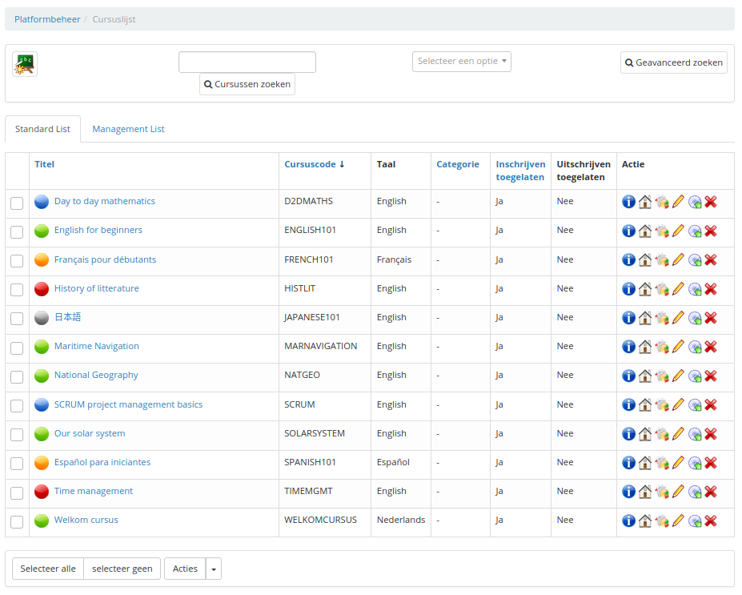
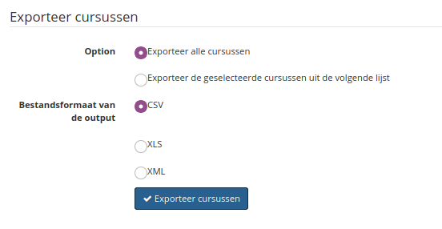
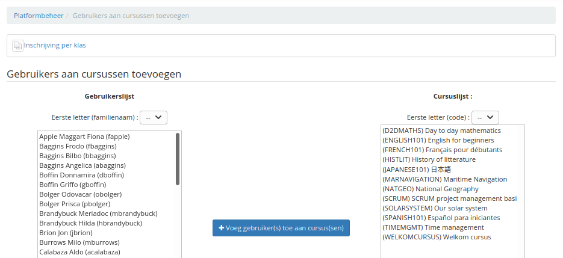

# Administrer les « Cours »

Les cours sont des **espaces** au sein desquels les enseignants génèrent du contenu en utilisant la vingtaine d'outils mis à leur disposition pour enseigner d'une façon mémorable, dynamique, multimédia et, dans la mesure du possible, ludique.

Illustration : Bloc d'administration des cours

Les cours peuvent être agrémentés d'une notion temporelle grâce à l'utilisation de **sessions** \(voir 4.4Administrer les « Sessions de formation » en page 72\).

La gestion des cours se fait avec des icônes déjà connues pour la plupart :

| Icônes | Fonctionnalités |
| :--- | :--- |
|  | Donne toutes les informations sur l'utilisation du cours et des utilisateurs |
|  | Donne le suivi détaillé des apprenants, du cours, et un rapport des ressources |
|  | Modifier les paramètres/informations d'un cours |
|  | Supprimer \(après demande de confirmation\) un cours |
|  | Générer ou importer une sauvegarde |
|  | Visualiser le sommaire du cours |

_Tableau 3: Administration - Icônes de gestion des cours_

## Liste des cours 

Cet outil permet de visualiser tous les cours que contient la plateforme.

Illustration : Administration - Liste des cours

Cette liste nous donne une grande quantité d'informations sur les cours. Notez la couleur des cercles préfixant les titres de cours : elles représentent la visibilité des cours en question :

* bleu : public
* vert : ouvert aux utilisateurs de la plateforme
* orange : privé, utilisateurs inscrits par des enseignants ou administrateurs
* rouge : fermé \(pour maintenance ou expiration, généralement\), le cours n'est disponible que pour les enseignants du cours et les administrateurs

Elle nous permet également de modifier des informations en un clic sur une icône dans la partie droite « Action ».

### Modifier les informations du cours 

Pour modifier le cours, il faut cliquer sur le « crayon » à droite. En tant qu'administrateur, il est possible de changer autant d'informations que l'enseignant créateur du cours dans les paramètres du cours.

Par contre, l'administrateur peut également mettre le cours en « Cours spécial », ce qui à pour effet de le rendre visible à tous les utilisateurs de la plateforme. Il peut aussi changer l'enseignant du cours et augmenter la taille disponible pour le cours.

### Le suivi et la sauvegarde 

Le suivi est le même menu pour l'administrateur que pour l’enseignant d'un cours dont il est responsable \(cf _tutoriel formateur_\). Idem pour la sauvegarde.

Ces icônes ne sont que des raccourcis qui renvoient l'administrateur vers l'onglet « Mes cours ».

## Créer un cours 

En tant qu'administrateur, lors de la création d'un cours, seul le titre est obligatoire.

Illustration : Création de cours

Outre ces champs obligatoires, en plus d'un enseignant, il est possible :

* d'assigner un responsable principal du cours,
* d'ajouter un ou plusieurs enseignants au cours,
* de donner un « Département du cours » et une « URL du département »,
* de gérer son accès directement,
* de gérer l'inscription et la désinscription.

Quelques paramètres se sont encore ajoutés à ceux-ci à partir de la version 1.10. Ils ont pour objectif d'étendre les possibilités du catalogue de cours de Chamilo.

Illustration : Champs de cours additionnels à partir de la 1.10

On y retrouve donc les deux champs suivants :

* tags
* URL de vidéo

Ces champs ne seront utiles **que** dans un cas d'utilisation du catalogue de sessions. Dans ce cas, et si l'on a veillé à inclure ce cours dans une session, on retrouvera un écran de présentation de session similaire au suivant :

Illustration : Écran de présentation de session

On y retrouve donc bien une pré-visualisation de la vidéo liée au cours, ainsi que les tags en bas à droite. On y trouve également des liens vers quelques réseaux sociaux, afin de faciliter la promotion de cette session. Nous reparlerons des sessions dans le chapitre suivant.

## Exporter les cours 

Cette fonction permet d'exporter tout ou partie de la liste des cours au format CSV.

Illustration : Administration - Export de cours

## Créer des cours par lot 

Cette fonction permet d'importer le fichier CSV exporté précédemment dans « Exporter les cours ». Attention, il faut avoir les mêmes catégories si l'export se fait dans une autre plateforme Chamilo \(le nom et le code de la catégorie\).

Illustration : Administration - Création de cours par lots

Une fois la liste importée, reste à ajouter les parcours au cours.

## Catégories de cours 

Ici, on peut créer, modifier ou supprimer les différentes catégories de cours souhaitées avec les icônes que nous avons déjà vues. Il est possible de créer de nombreuses catégories et sous-catégories.

Illustration : Administration - Catégories de cours

Il est aussi possible d'organiser ces catégories grâce aux flèches. Ces catégories ne sont pas traduites automatiquement et il n'est pas possible d'enregistrer des traductions pour chaque catégorie et chaque langue, ce qui veut dire que si vous disposez d'un portail multilingue, vous devrez trouver une formulation suffisamment claire pour que tous vos utilisateurs la comprennent.

## Inscrire des utilisateurs à un cours 

L'administrateur peut inscrire n'importe qui à n'importe quel cours :

* sélectionner une ou plusieurs personnes \(à l'aide des touches CTRL ou MAJuscule\),
* choisir le\(s\) cours au\(x\)quel\(s\) les inscrire,
* cliquez « inscrire à ce\(s\) cours ».

Illustration : Administration - Inscription d'utilisateurs à un cours

## Inscrire des utilisateurs par lot 

Cette fonction permet à l'administrateur, après avoir fait un export d'utilisateurs pour un cours, de les importer grâce à un fichier CSV ou XML.

Illustration : Administration - Inscription d'utilisateurs à un cours, par lots

Cet import permet d'effectuer deux actions qu'il suffit de cocher pour qu'elles soient prises en compte et que vous puissiez gérer la liste d'utilisateurs en fonction de l'import.

## Gérer les champs pour les cours 

Cette fonctionnalité est similaire à la gestion des champs de profil des apprenants. Bien que les champs additionnels de cours n'aient pas d'utilité immédiate dans une installation Chamilo de base, ils représentent un atout très puissant pour l'implémentation de nouveaux plugins ou l'utilisation de plugins existants qui étendent les fonctionnalités de cours.

