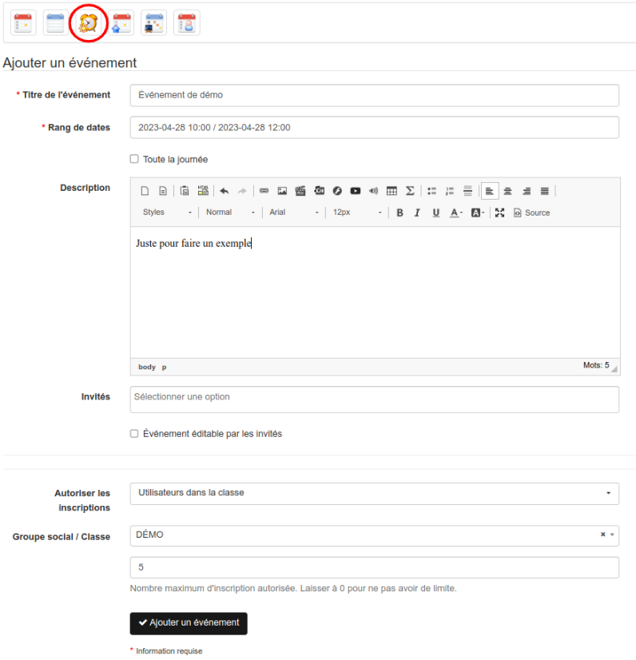
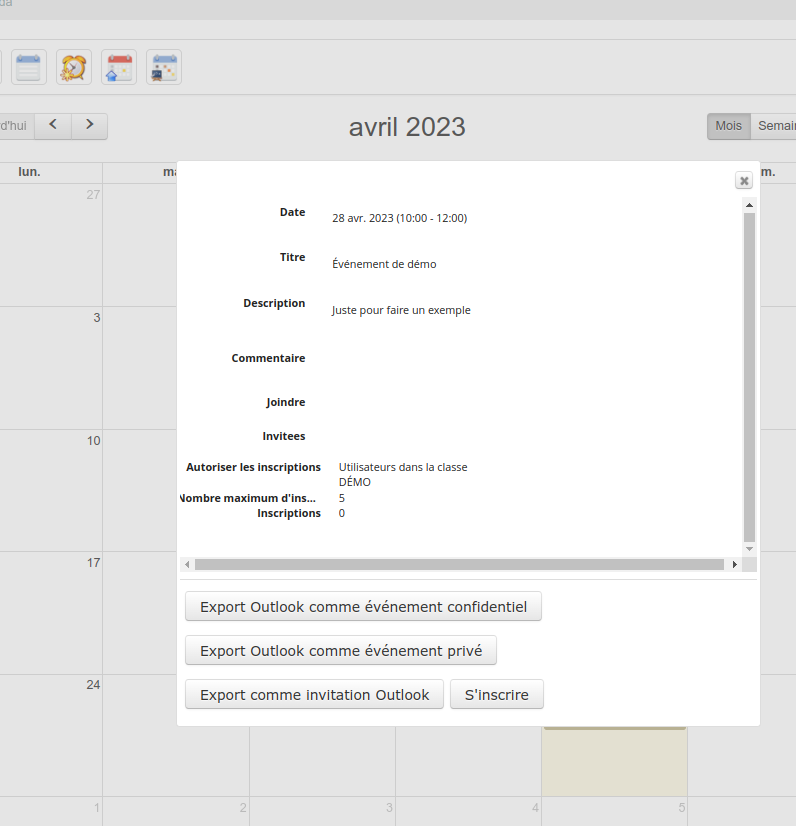
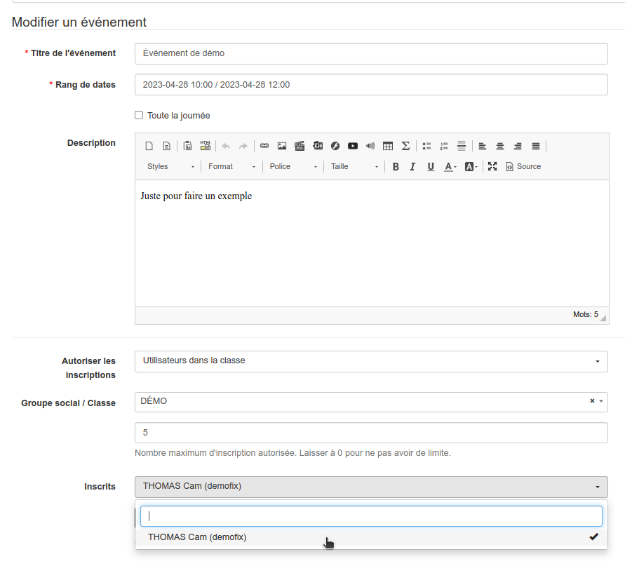

# Agenda : Permettre aux utilisateurs de s'inscrire à des évènements

Il existe dans Chamilo un agenda personnel auquel on peut accéder depuis le menu principa sour l'onglet Agenda.
Celui-ci montre les évènements personnel de l'utilisateur mais également les évènements de la plateforme et les évènements des cours et sessions dans lesquels l'utilisateur est inscrit.
Ici nous allons expliquer comment permettre aux administrateurs de Chamilo de créer des évènements qui seront visible par tous le monde ou uniquement à une classe spécifique et dans lequel les utilisateurs pourront s'inscrire pour indiquer qu'ils vont participer. On aura la possibilité de limiter le nombre maximum d'inscription.

## Activation de la fonctionnalité

Cette fonctionnalité a été rajouté dans la version 1.11.20 de Chamilo et nécessite une activation manuelle par l'administrateur de l'hébergement de votre Chamilo.
Il faut ajouter au fichier de configuration app/config/configuration.php les lignes suivantes et réalisé les actions indiquées dans ces lignes :
```
// It allows to send invitations to friends for an agenda event. Requires DB changes:
/*
CREATE TABLE agenda_event_invitee (id BIGINT AUTO_INCREMENT NOT NULL, invitation_id BIGINT DEFAULT NULL, user_id INT DEFAULT NULL, created_at DATETIME NOT NULL, updated_at DATETIME NOT NULL, INDEX IDX_4F5757FEA35D7AF0 (invitation_id), INDEX IDX_4F5757FEA76ED395 (user_id), PRIMARY KEY(id)) DEFAULT CHARACTER SET utf8 COLLATE `utf8_unicode_ci` ENGINE = InnoDB;
CREATE TABLE agenda_event_invitation (id BIGINT AUTO_INCREMENT NOT NULL, creator_id INT DEFAULT NULL, created_at DATETIME NOT NULL, updated_at DATETIME NOT NULL, INDEX IDX_52A2D5E161220EA6 (creator_id), PRIMARY KEY(id)) DEFAULT CHARACTER SET utf8 COLLATE `utf8_unicode_ci` ENGINE = InnoDB;
ALTER TABLE agenda_event_invitee ADD CONSTRAINT FK_4F5757FEA35D7AF0 FOREIGN KEY (invitation_id) REFERENCES agenda_event_invitation (id) ON DELETE CASCADE;
ALTER TABLE agenda_event_invitee ADD CONSTRAINT FK_4F5757FEA76ED395 FOREIGN KEY (user_id) REFERENCES user (id) ON DELETE SET NULL;
ALTER TABLE agenda_event_invitation ADD CONSTRAINT FK_52A2D5E161220EA6 FOREIGN KEY (creator_id) REFERENCES user (id) ON DELETE CASCADE;
ALTER TABLE personal_agenda ADD agenda_event_invitation_id BIGINT DEFAULT NULL, ADD collective TINYINT(1) NOT NULL;
ALTER TABLE personal_agenda ADD CONSTRAINT FK_D8612460AF68C6B FOREIGN KEY (agenda_event_invitation_id) REFERENCES agenda_event_invitation (id) ON DELETE CASCADE;
CREATE UNIQUE INDEX UNIQ_D8612460AF68C6B ON personal_agenda (agenda_event_invitation_id);
*/
// Then add the "@" symbol to AgendaEventInvitation and AgendaEventInvitee classes in the ORM\Entity() line.
// Then uncomment the "use EventCollectiveTrait;" line in the PersonalAgenda class.
$_configuration['agenda_collective_invitations'] = true;

// It allows to other users to subscribe for events.
// Requires enable agenda_collective_invitations before.
// Requires DB changes:
/*
ALTER TABLE personal_agenda ADD subscription_visibility INT DEFAULT 0 NOT NULL, ADD subscription_item_id INT DEFAULT NULL;
ALTER TABLE agenda_event_invitee ADD type VARCHAR(255) NOT NULL;
ALTER TABLE agenda_event_invitation ADD type VARCHAR(255) NOT NULL, ADD max_attendees INT DEFAULT 0;
UPDATE agenda_event_invitation SET type = 'invitation';
UPDATE agenda_event_invitee SET type = 'invitee';
*/
// Then uncomment the "use EventSubscribableTrait;" line in the PersonalAgenda class.
// Then add the "@" symbol in ORM\InheritanceType, ORM\DiscriminatorColumn and ORM\DiscriminatorMap lines in the AgendaEventInvitation class.
// Then add the "@" symbol in @ORM\Entity line in the AgendaEventSubscription class.
// Then add the "@" symbol in ORM\InheritanceType, ORM\DiscriminatorColumn and ORM\DiscriminatorMap lines in the AgendaEventInvitee class.
// Then add the "@" symbol in @ORM\Entity line in the AgendaEventSubscriber class.
$_configuration['agenda_event_subscriptions'] = true;
```

## Utilisation de la fonctionnalité

Nous considérons ici que vous avez un compte administrateur et que vous êtes connectés à Chamilo.

* Aller dans l'agenda perso en cliquant sur l'onglet correspondant du menu en haut de votre Chamilo.
* Cliquer sur l'icône "Ajouter un évènement"  pour arriver sur la page de création d'évènement
* Remplir les champs "Titre de l'évènement", "Rang de dates" et "Description".
* Pour le champs "Autoriser les inscriptions" il est sur "Non" par défaut et l'évènement est uniquement pour l'utilisateur en cours. On peut alors choisir une des deux autres options :
** "Tous les utilisateurs du portail" et dans ce cas tous les utilisateurs verront l'évènement apparaitre dans leur agenda et pourront s'y inscrire.
** "Utilisateurs dans la classe" dans ce cas l'évènement n'apparaitra que pour les utilisateurs de la classe sélectionnée en dessous.
* Le champs "Groupe social / Classe" permet sélectionner la classe dont les membres verront l'évènement.
* Le dernier champs permet de sélectionner le nombre maximum de participant à l'évènnement et bloquera automatiquement l'inscription dès que l'on aura atteint le nombre maximum d'inscrit.



Notre évènement est créé.

On se connecte maintenant comme un apprenant de la classe et dans l'agenda perso on voit l'évènement et si on clique dessus ça ouvre la fenêtre du détails de l'évènement dans laquelle on peut voir que l'inscription est autorisée pour les membres de la classe avec le bouton s'inscrire en bas de la fenêtre. Une fois inscrit le bouton "S'inscrire" devient "Se désinscrire" pour se retirer de l'événement.



On peut alors se reconnecter comme administrateur et quand on édite son évènement on peut voir le nom des inscrits et on peut les désélectionner du champs pour les désinscrire.



