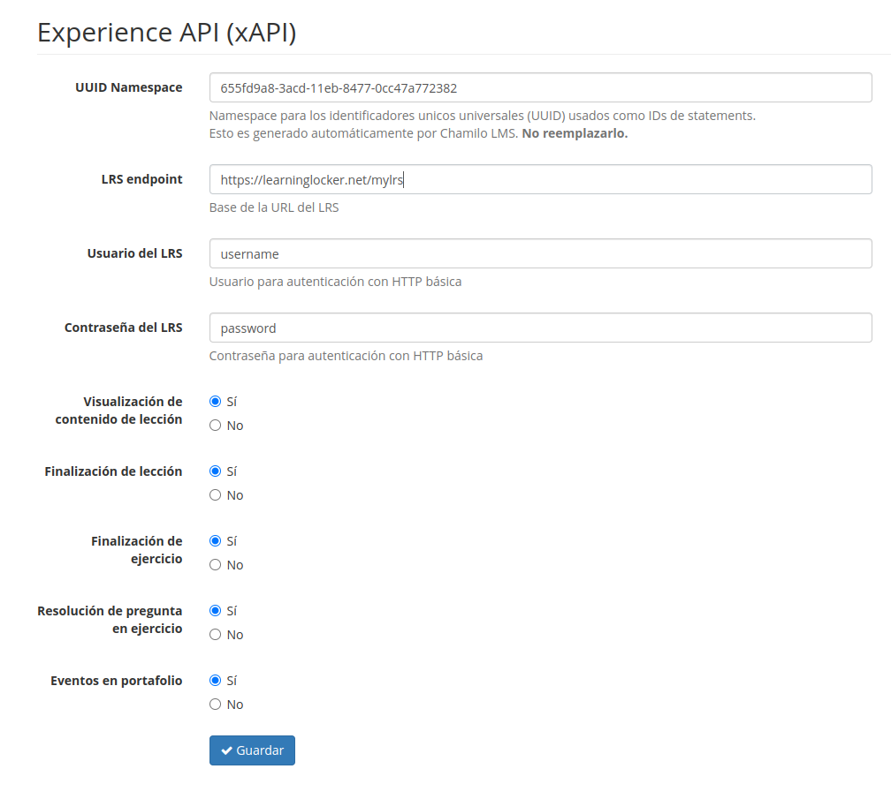
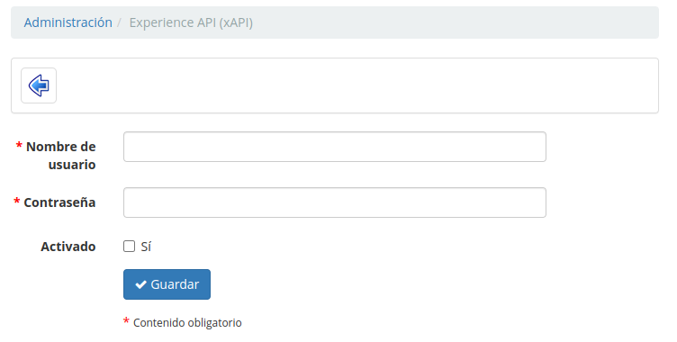
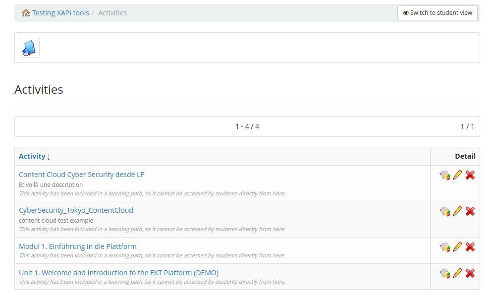
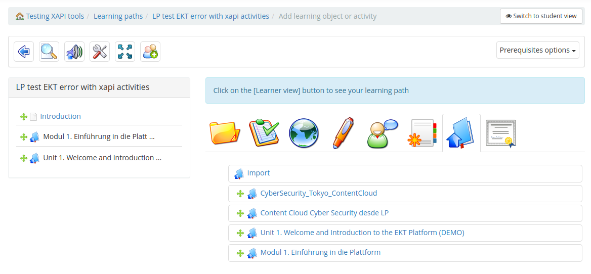
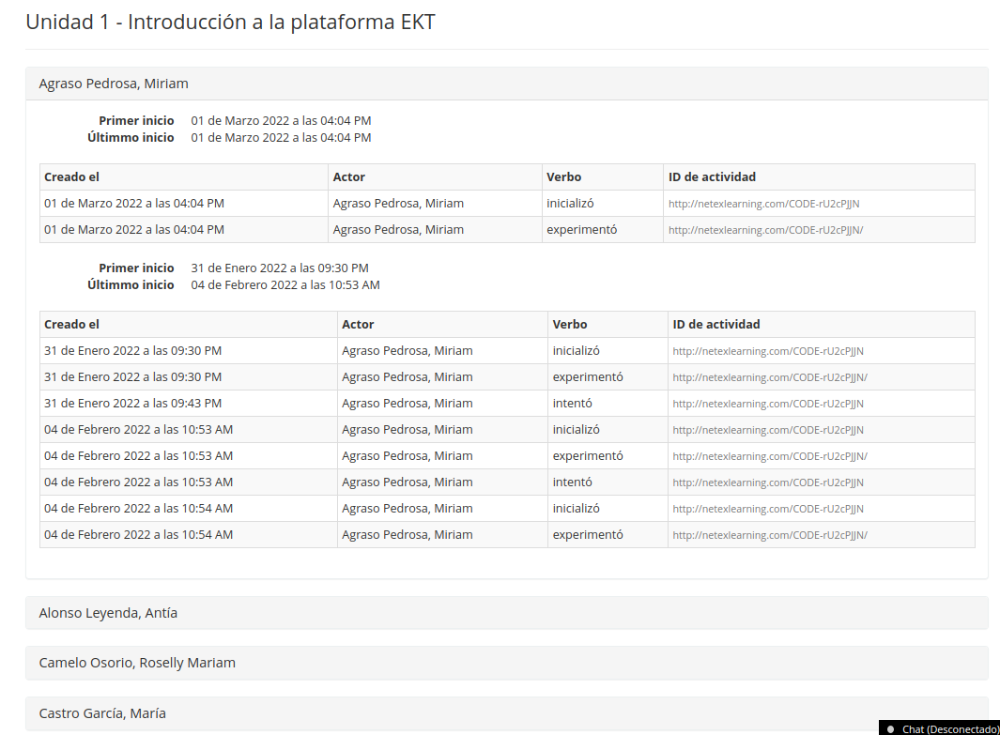

# Plugin xAPI

Le support de xAPI a été inclus dans Chamilo depuis la version 1.11.16 en tant que plugin et sera inclus dans le noyau plus tard.

L'activation du plugin active plusieurs fonctionnalités dans Chamilo

## Connexion à un LRS externe

L'activation du plugin permet d'abord d'envoyer une instruction xAPI à un LRS externe lors de l'exécution d'activités dans Chamilo.
Vous devez donc d'abord activer le plugin.

Dans la configuration, il faut indiquer les données du LRS externe et les activités que vous voulez suivre depuis Chamilo.

Lorsqu'il y a un événement qui doit générer une instruction xAPI se passe dans Chamilo alors l'information est enregistrée dans la table "xapi_shared_statement" afin que l'enregistrement ne prenne pas trop longtemps, car l'envoi à un LRS peut prendre du temps donc cet envoi au LRS se fait de manière asynchrone avec un cron qui appelle plugin/xapi/cron/send_statements.php toutes les heures par exemple. Ce script envoie 100 instructions à chaque fois qu'il est appelé, vous devez donc adapter la fréquence cron en fonction de l'utilisation de votre plate-forme.

A partir de ce moment, les déclarations des événements sélectionnés seront envoyées au LRS externe.

## Chamilo comme LRS

Chamilo peut être le LRS qui stocke les données de Chamilo ou d'autres applications externes.
C'est pourquoi sur la page d'administration de Chamilo un bloc Plugins apparaît avec un lien pour "Experience API (xAPI).

Sur cette page cliquez sur le + pour créer un nouveau compte pour vous connecter au LRS de votre Chamilo.

À partir de ce moment le LRS de votre Chamilo est disponible et peut être utilisé avec votre Chamilo ou avec tout outil compatible xAPI en indiquant les données utilisateur que vous venez de créer et l'URL de votre Chamilo avec /plugin/xapi/lrs.php à la fin.

## Importation de packages xAPI

L'activation du plugin xAPI ajoute un outil activité à chaque cours de Chamilo.
Dans cet outil, vous pouvez importer un package de contenu compatible xAPI.

Ces activités peuvent être lancées à partir de cet outil ou peuvent être incluses dans un élément de parcours de Chamilo.

Dans l'outil d'activité, l'enseignant peut voir ce qui a été enregistré à partir de l'activité xAPI.

