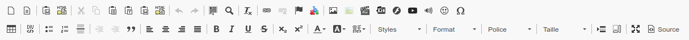

# Outils variables

La première chose importante à savoir est que la barre d'outils de l'éditeur WYSIWYG n'est volontairement pas complète en permanence. Afficher en permanence l'ensemble des 30 à 40 icônes rendrait l'interface très lourde. C'est pourquoi nous avons travaillé avec des professeurs de terrain pour tenter de proposer une visualisation de base qui soit satisfaisante pour une majorité de personnes dans chaque contexte spécifique de Chamilo.

Par exemple, dans la section d'introduction au cours, la barre d'outils apparaîtra comme une clef anglaise croisée d'un tournevis (icône ci-dessous), soit comme une clef anglaise en monochrome pour les toutes dernières versions.

On retrouve ici les boutons immédiatement essentiels à la création de l'introduction d'un cours. Il n'est \(généralement\) pas nécessaire d'avoir des options comme la rédaction de formules mathématiques dans l'introduction au cours.

Cela dit, conscients de la variété de circonstances particulières possibles, nous avons ajouté un mode “étendu” auquel on peut accéder au travers de la dernière icône \(4 flèches vers l'extérieur\) pour agrandir la zone d'édition à la page complète et ainsi avoir l'espace suffisant pour ajouter tous les outils dans la barre, comme on peut le voir ci-dessous.

En étendant la zone d'édition d'un simple clic, nous sommes passés de 30 icônes à plus de 50.

