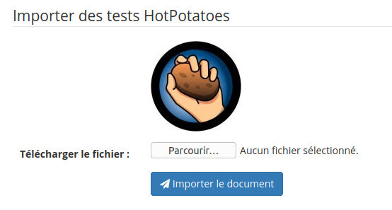
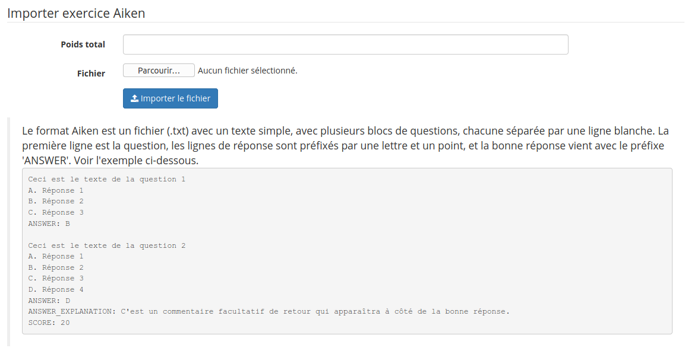
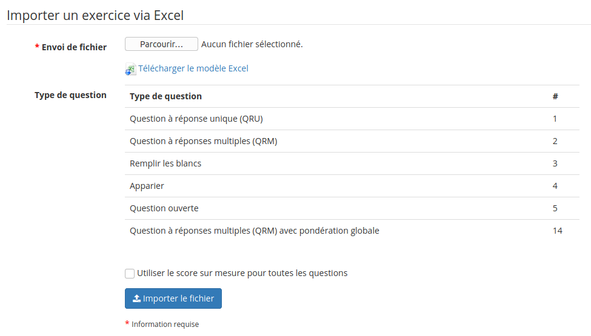

# Importer un exercice « Hotpotatoes », QTI2, Aiken ou Excel

Il est aussi possible d'importer des exercices réalisés avec «[ Hotpotatoes ](http://ecolestjeanb.free.fr/hot_potatoes/)», IMS/QTI2, ou au format Aiken ou XLS.

* cliquer sur l'une des icônes d'import,
* rechercher le fichier avec l'outil « Parcourir »,
* importer le document.

Illustration : Exercices - Import HotPotatoes

Illustration : Exercices - Import IMS/QTI2

Illustration : Exercices - Import Aiken

Illustration : Exercices - Import Excel

