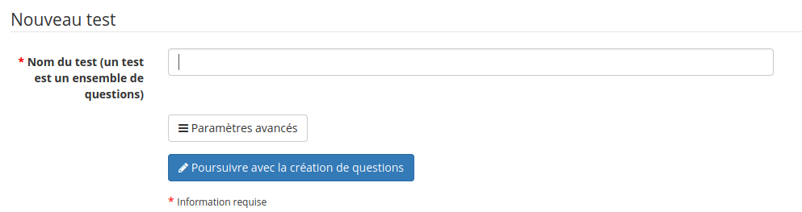

# Introduction

L'outil d'exercices est généralement la seconde incursion des enseignants classiques dans le monde de l'e-learning.

L'intérêt est clair : correction automatique des réponses des étudiants \(donc économie de temps pour l'enseignant qui peut dès lors se concentrer sur la qualité des questions\), possibilité pour l'étudiant de s'auto-évaluer de façon répétée, sans dépendre de la disponibilité de l'enseignant \(ses résultats lui sont affichés automatiquement\), réutilisation de questions d'un cours à l'autre, etc.

Un exercice bien élaboré peut constituer un outil d'une valeur inestimable pour augmenter la motivation des apprenants. L'enseignant peut définir des suggestions et commentaires pour la rétro-alimentation des apprenants, aussi détaillé que nécessaire, au travers de liens, de vidéos, etc.

L'outil d'exercice pourrait aussi bien être appelé outil d'examens, puisqu'il permet de générer des examens limités en temps, avec tirage aléatoire au sein d'une banque de questions, avec des questions classées par catégories etc.

L'outil vous permet de créer ou d'importer un questionnaire \(au format [HotPotatoes](http://fr.wikipedia.org/wiki/Hot_Potatoes), IMS/QTI2 ou XLS\).

Illustration : Exercices - Liste

La création d'un nouveau test est très simple. Cliquez sur la première icône à gauche et indiquez un titre, puis cliquez sur le bouton de confirmation.

Illustration : Exercices - Création simple

Comme il existe une grande quantité de types d'exercices différents, vous pourriez penser que les options par défaut que nous avons choisies ne vous conviennent pas entièrement. Qu'à cela ne tienne, l'option dépliante de _Paramètres avancés_ est là pour ça.

Ce questionnaire comporte de nombreuses options. Lors de la création du test \(et aussi lors de son édition\), vous pourrez choisir :

* le temps limité ou illimité \(_contrôle du temps_\) – un décompte en temps réel apparaîtra à l'utilisateur,
* le nombre d'essais du test, indéfini ou limité,
* si toutes les questions vont sur une page, ou seulement une question par page \(dernière option recommandée pour des questions de suivi\),
* l'ordre des questions \(aléatoire ou non\),
* etc.

Les questions posées peuvent être de différentes nature :

* choix multiple, réponse unique,
* choix multiple, réponses multiples,
* remplir les blancs ou le formulaire \(ou encore mots-croisés en se basant sur une table remplie de blancs\),
* apparier par listes déroulantes,
* question ouverte,
* question ouverte à réponse audio \(si activée\),
* zones sur image,
* combinaison exacte,
* réponse unique avec "ne sais pas",
* réponses multiples "vrai/faux/ne sais pas",
* réponses multiples "vrai/faux" avec degré de certitude,
* combinaison exacte "vrai/faux/ne sais pas",
* question à réponses multiples avec pondération globale (uniquement utile pour les grands volumes de questions),
* question calculée,
* sélection d'image,
* réordonner des mots dans une phrase,
* correspondance par glisser-déplacer \(version améliorée de "apparier"\),
* annotation,
* compréhension à la lecture

Les réponses à ce questionnaire sont rentrées lors de sa création, puis la correction est réalisée dans l'onglet « Résultats et corrections » lorsque les apprenants l'ont effectuée. Cet onglet leur permet aussi d'ajouter un commentaire puis d'exporter les résultats obtenus.

Un exercice rassemble un certain nombre de questions, pas nécessairement du même type, sous un thème commun.

