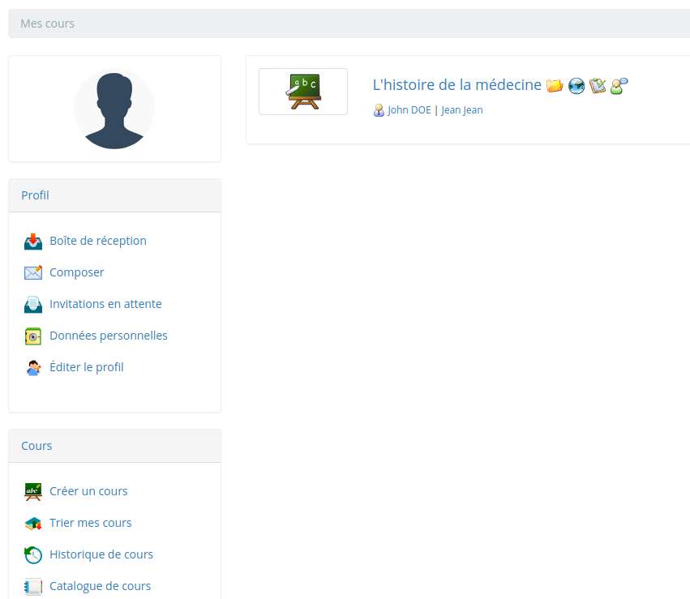
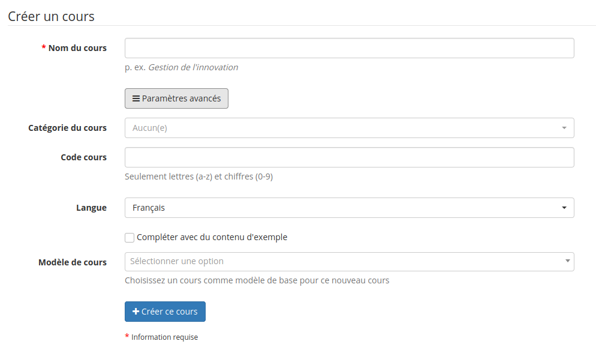

# Créer un cours

Illustration 10: Blocs de liste des cours

La création d'un cours est simple et rapide et se fait à partir de la page _Mes cours_.

Note : sur certains portails, les enseignants n'ont pas les permissions pour créer de nouveaux cours, et se voient simplement assigner des cours déjà créés par l'administrateur.

Cliquez sur « Créer un cours ». Remplissez les champs obligatoires \(voir illustration ci-dessous\). C'est terminé. Ce cours sera visible par le créateur et les personnes qui s'y seront inscrites. Par défaut, la personne qui crée le cours en est le responsable.

Pour le cours, il faut :

* un titre clair et détaillé,

Illustration 11: Créer un cours - version courte

Les options additionnelles \(et totalement facultatives\) disponibles en cliquant sur le lien _Paramètres avancés_ sont :

* une catégorie parmi celles proposées dans la liste déroulante,
* un code pour le cours \(faire en sorte de choisir un code évoquant l’intitulé du cours, associé à une classification numérique\). Même saisi en minuscules, le code du cours sera automatiquement transformé en majuscules par Chamilo \(les caractères -, \_ et espace seront éliminés du code\),
* la langue utilisée pour afficher l’environnement du cours \(rien n'interdit de choisir l’anglais, même si Chamilo est installé en français\). Le choix de la langue n’influence pas le contenu du cours, seulement l’environnement de travail dans lequel le contenu est affiché et éventuellement quelques contenus de base \(uniquement si l'option suivante est cochée\),
* si vous désirez remplir le cours avec quelques contenus d'exemple qui pourraient vous donner un peu d'inspiration \(typiquement un exercice, des forums et une section d'introduction\) ou si vous préférez le laisser entièrement vierge.

Illustration 12: Créer un cours - version étendue

Dépendant des versions de Chamilo, la création du cours peut :

* vous envoyer directement sur la page d'accueil du cours
* vous envoyer sur une page intermédiaire avec quelques outils mis en évidence
* vous proposer d'entrer directement dans le cours créé et d'en découvrir les outils \(en cliquant sur le titre du cours\),
* vous proposer de retourner à la liste des cours dont on est responsable.

La structure du premier cours est maintenant créée. En s'appuyant sur le matériel pédagogique mis à votre disposition \(documents texte ou multimédia, extraits sonores...\), il vous est possible d'enrichir cette structure, qui n’est pour le moment qu’un « contenant vide » proposant divers outils mais ne comportant aucun contenu.

