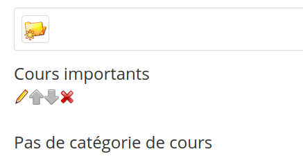

# Catégories personnelles

Il faut aller dans « Mes cours », « Catalogue de cours » pour accéder à la page des outils de gestion des cours, cliquer sur le lien « Créer une catégorie de cours », compléter le nom de la nouvelle catégorie personnelle à créer et, enfin, cliquer sur le bouton « Valider ».

Illustration 16: Trier mes cours

La catégorie personnelle créée apparaît dans une liste en bas de la page. Il est possible de créer plusieurs catégories personnelles.

Le lien « Trier mes cours » autorise la réorganisation des cours \(à l’aide des flèches Haut ou Bas\) et l’affectation d’une catégorie personnelle à un cours \(cliquer sur « Modifier » représenté par un crayon et choisir la catégorie personnelle\).

Dans la liste déroulante, sélectionner la catégorie personnelle à laquelle le cours est associé, puis cliquer sur « Valider ». Avec les cours ainsi triés et liés à une catégorie personnelle, la page d’accueil de sa propre liste de cours est plus lisible. Les cours, qui ne sont pas affectés à une catégorie personnelle, s’affichent en haut de la page.

Pour supprimer la catégorie, cliquer sur la croix rouge « Supprimer ».

Illustration 17: Catégories de cours

Il est possible de s'inscrire à d'autres cours que ceux qu'on administre. Ce sera un enregistrement comme utilisateur et non comme co-responsable à un cours proposé par un autre enseignant.

En cliquant sur le lien « Catalogue de cours », la liste générale de cours apparaît. Il est possible de trouver directement le cours dans les catégories proposées ou bien en la recherchant grâce à l'outil « Rechercher » avec tout ou partie du nom du cours \(mot-clé\).

Illustration 18: Catalogue de cours

Une fois le cours trouvé, cliquer sur l'icône vert pour s'inscrire. L'inscription donne le statut d’apprenant. Seuls les outils laissés à disposition des apprenants pourront être utilisés. Pour devenir enseignant à ce cours, il faut qu'un administrateur du cours rajoute la personne concernée dans la liste des enseignants.

