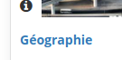

# Icônes de gestion des cours

| Icône | Fonctionnalité |
| :--- | :--- |
|  | Modifier un cours |
|  | Description du cours |
|  | Lien vers la page principale du cours \(disponible uniquement quand le cours est ouvert ou public\) |
|  | S'inscrire au cours |

