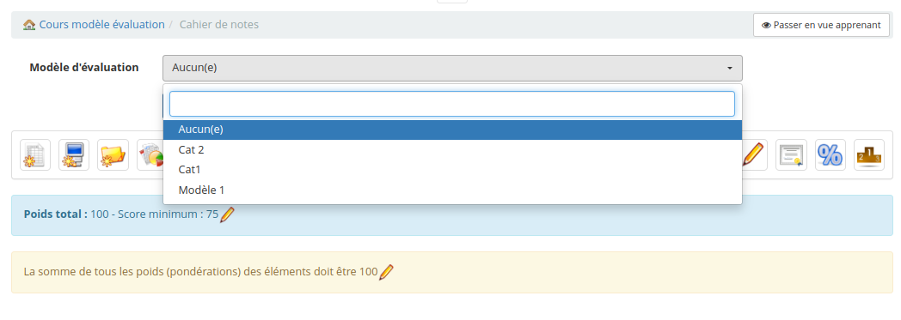
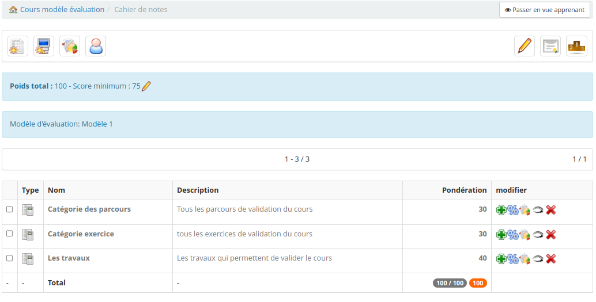

# Modèle d'évaluation de cahier de notes

Dans les options de configuration de la plateforme mettre l'option "Activé les modèles de carnets de notes" à "Oui".
Le commentaire associé indique "Autorise la création automatique de catégories à l'intérieur d'un cours en fonction des modèles du carnet de notes."

Une fois l'option activée on retrouve dans le bloc "Cours" de la page d'administration une nouvelle entrée "Modèle d'évaluation" qui renvoie vers la page main/admin/grade_models.php

En cliquant sur le bouton  on ouvre un formulaire de création du modèle.

Le nom en haut permet d'identifier le modèle pour le sélectionner plus tard.
Le bloque de description correspond à la description qui sera associé au cahier de notes dans l'outil.
En dessous on retrouve plusieurs lignes (une ligne par catégorie que l'on veut avoir dans notre modèle) avec 3 blocs à chaque fois :
* Le premier bloc correspond à la pondération que l'on veut donner à la catégorie.
* Le deuxième bloc correspond au nom qui sera associé à la catégorie.
* Le troisième bloc correspond à la description qui sera associée à la catégorie.

Pour pouvoir valider la création du modèle il faut que la somme de toutes les valeurs de la première colonne soit égale à 100 afin d'arriver à un total de 100%.

Une fois le modèle créé il est possible de l'éditer pour modifier les informations en cliquant sur le crayon jaune  ou de l'effacer en cliquant sur la croix rouge 

Une fois que tout est bon, on peut créer un nouveau cours et rentrer dans l'outil de cahier de notes.
On voit alors en haut de la page un sélecteur "Modèle d'évaluation" qui permet de choisir le modèle que l'on souhaite utiliser pour ce cours.

Une fois que l'on clique sur "Enregistrer" les catégories tel que prévu dans le modèle sont alors créées :

Il ne reste plus qu'à remplir les catégories avec les éléments du cours que l'on souhaite.

