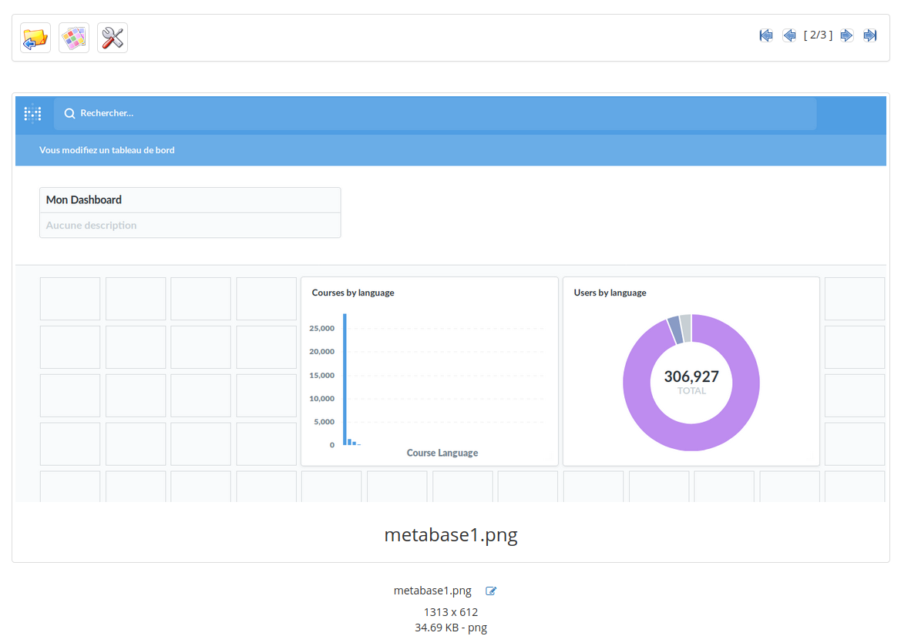

# Présenter des images

Si vous disposez de nombreuses images dans l'outil _Documents_ et que vous souhaitez les visualiser facilement, vous pouvez utiliser la fonctionnalité de galerie d'images  depuis le menu supérieur de la liste de documents.

Illustration 36: Documents - Vue présentation d'images

La seconde icône sur cette page permet également de visualiser plusieurs icônes d'un coup.

Illustration 37: Documents - Vue galerie d'images

