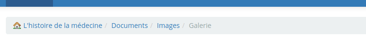
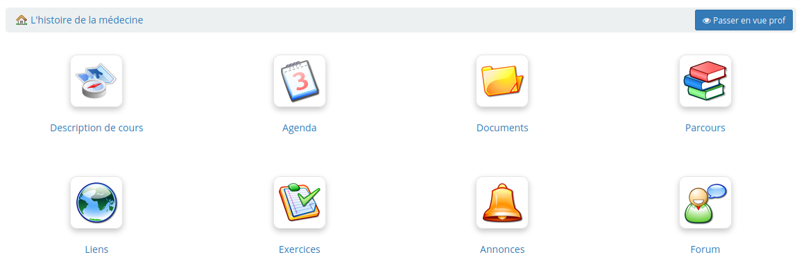

# S'y retrouver dans Chamilo

Les différentes pages de cours sont accessibles rapidement en utilisant la barre de navigation située en haut de l'écran :

Illustration : En-tête de Chamilo

Les onglets permettent d'accéder à la page d’accueil de la plateforme, la liste des cours, l’édition du profil et aux outils sociaux associés, l’agenda et aux outils de suivi ainsi qu'à se déconnecter.

La navigation dans un cours a la même arborescence que la hiérarchie des répertoires d'un ordinateur. Dans Chamilo, nous l'appelons souvent navigation _breadcrumb_, en référence au terme anglais pour _miettes de pain_, en référence, à son tour, au compte du Petit Poucet. Ce type de navigation permet de se situer et de retrouver son chemin jusqu'à son point de départ.

Le premier lien, à gauche, portant le nom du cours \(_Tutoriel_ dans l'exemple suivant\), permet de retourner directement à la page d’accueil du cours. Le ou les liens suivants permettent de naviguer au sein de l'outil dans lequel l'utilisateur se trouve.

Illustration : Navigation breadcrumb

Au sein d'un cours, la « Vue apprenant » permet à l'enseignant de visionner le cours comme un apprenant. Il suffit ensuite de cliquer sur le lien « Vue prof » pour revenir en vue normal :

Illustration : Vue apprenant

