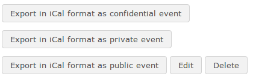

# Importeer en exporteer evenementen

De Chamilo Agenda-tool ondersteunt de import en export van standaard agendabestanden \(Outlook, iCal\). Om een Outlook-bestand te importeren, klikt u op het _Import Outlook_ -pictogram ![] (../../.gitbook/assets/graphics264.png) in de werkbalk in de cursus _Agenda_ en uploadt u het relevante bestand wanneer daarom wordt gevraagd. Keer dan terug naar de _Agenda_ met behulp van het _Agenda_ -pictogram .

Gebruikers kunnen gebeurtenissen exporteren als iCal vanuit het pop-upvenster dat verschijnt wanneer ze op een gebeurtenis klikken om details te bekijken. Ze kunnen het juiste iCal-formaat \(_vertrouwelijk, privé, openbaar_\) selecteren voor de export onder in het pop-upvenster, en docenten kunnen de gebeurtenis bewerken of verwijderen met de juiste knop in het pop-upvenster:

Afbeelding 144: een evenement exporteren, bewerken of verwijderen

\(**Opmerking**: docenten hebben alleen toegang tot de knoppen voor verwijderen/bewerken via de cursusagenda vanaf de startpagina van de cursus - niet via het tabblad Persoonlijke agenda, waar ze, net als studenten, alleen evenementen kunnen bekijken/exporteren\).

