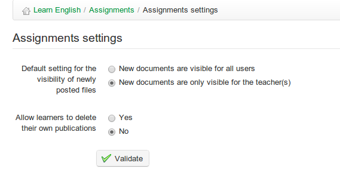

# Aufträge

Das Aufgabentool  \(von der Homepage aus zugänglich\) ermöglicht es einem Lernenden oder einer Gruppe von Teilnehmern, Dokumente hochzuladen, die der Lehrer überprüfen kann. Aufgaben können von anderen Lernenden eingesehen und heruntergeladen werden, sofern sie vom Lehrer nicht als unsichtbar \(\) konfiguriert wurden.

Aufgabendokumente sind in der Regel Hausaufgaben, die vom Lehrer festgelegt wurden, aber es können sich auch um Dateien handeln, die für andere von Interesse sind und die ein Lernender möglicherweise teilen möchte. Das Aufgaben-Tool kann daher verwendet werden, um individuelle oder kollektive Berichte zu erhalten, Antworten auf offene Fragen oder jede andere von den Lernenden entwickelte Form von Dokumenten zu sammeln.

Das Tool ermöglicht es dem Lehrer auch, die Standardsichtbarkeit der von den Lernenden gesendeten/geposteten Aufgaben zu ändern. Dadurch wird sichergestellt, dass die Schüler Dateien \(Übungen, Berichte, schriftliche Produktion,...\) datenschutzgemäß an den Kurs senden können, um sie vom Lehrer oder Kursteilnehmer zu bewerten. Klicken Sie auf der Seite „Zuweisungen“ auf \_Zuweisungseinstellungen :

_Illustration 92: Einstellungen für Zuweisung_

Wenn Sie Aufgaben standardmäßig für alle Benutzer sichtbar machen, können die Teilnehmer die Aufgaben des anderen überprüfen. Dies kann eine wertvolle Lerntechnik sein, da die Schüler viel lernen können, indem sie die Arbeit des anderen teilen, aber sie muss natürlich sorgfältig eingesetzt werden; nicht alle Lernenden sind nicht bereit, so viel Freiheit zu erhalten! Die Wahl zwischen _private_ \(nur für die Lehrer sichtbar\) oder _public_ Aufgaben \(alle Teilnehmer können Aufgaben von anderen sehen\) kann durch Klicken auf die entsprechenden Sichtbarkeitseinstellungen getroffen werden. Der Lehrer kann jeden Beitrag für andere Lernende sichtbar oder unsichtbar machen, indem er das  oder  -Symbol neben dem entsprechenden Eintrag in der Liste der Teilnehmerbeiträge für eine bestimmte Aufgabe ankreuzen.

> **Hinweis**: Eine signifikante Verbesserung in 1.9 besteht darin, dass Aufgaben jetzt auch direkt innerhalb des Aufgabenwerkzeugs geschrieben und eingereicht werden können, anstatt als Dokumente hochgeladen zu werden.

